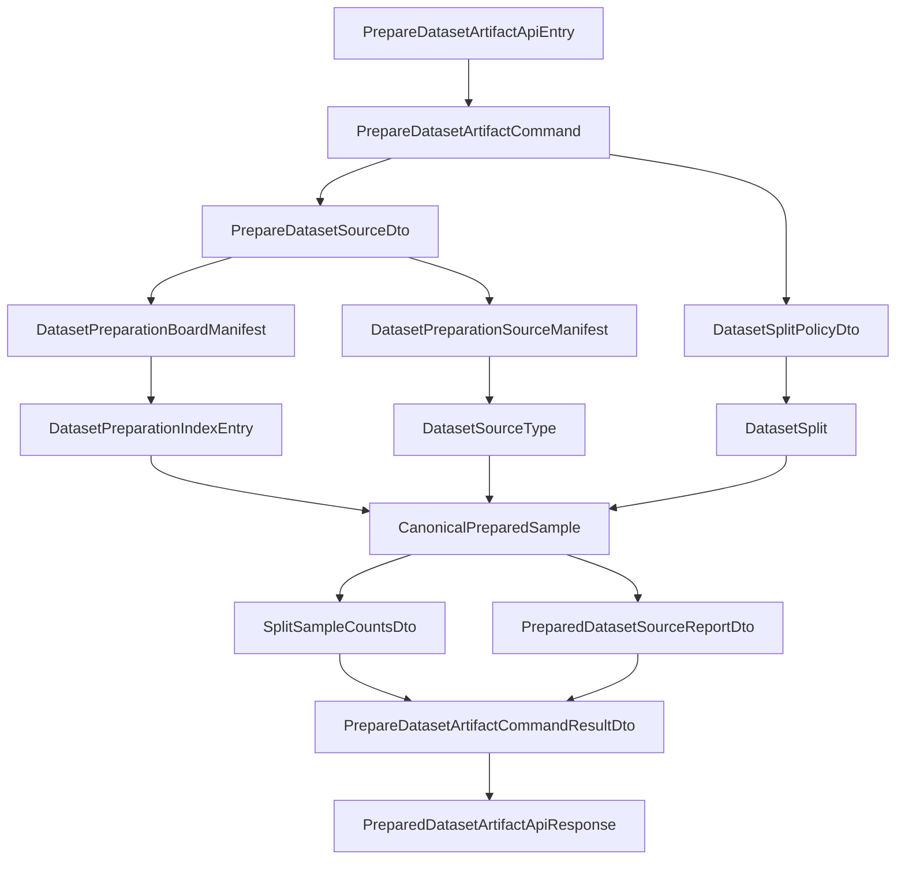
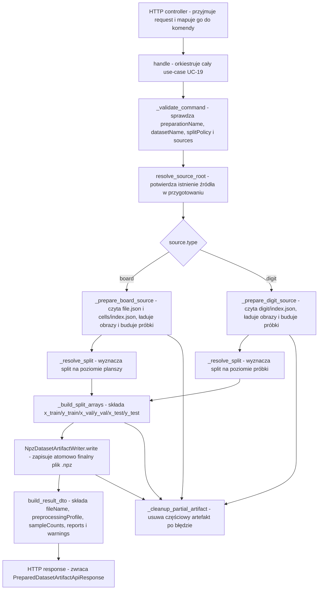

# UC-19 ML - Plan implementacyjny (`POST /ml/datasets/prepare`)

## 1. Przeznaczenie endpointa
- Endpoint wewnętrzny `POST /ml/datasets/prepare` jest wywoływany tylko przez `Backend`.
- Celem endpointa w `UC-19` jest zbudowanie finalnego artefaktu `{datasetName}.npz` wyłącznie z danych zapisanych wcześniej przez `UC-17` i opcjonalnie oczyszczonych przez `UC-18`.
- Endpoint nie wraca już do danych `raw`.
- Endpoint nie wykonuje ponownie:
  - skanowania par `.jpg + .dat`,
  - ładowania źródeł `IDX`,
  - detekcji planszy,
  - korekcji perspektywy,
  - ekstrakcji siatki `9x9`,
  - generowania starego preview jako źródła danych.
- Wynik biznesowy ma pozostać zgodny z wcześniejszym workflow:
  - jeden finalny plik `{datasetName}.npz`,
  - liczniki próbek per split,
  - raporty per źródło,
  - format zgodny z treningiem z `UC-06`.
- Plan dotyczy wyłącznie części `ML`.

## 2. Główne założenia planu
- Plan opiera się na:
  - `.ai/prd.md`,
  - `.ai/feature/uc-19-overview.md`,
  - `.cursor/rules/architecture_ml.mdc`,
  - `.ai/DokumentacjaDeployuRuntimeSerwera.md`,
  - wcześniejszych kontraktach i ograniczeniach z `UC-06`, `UC-12`, `UC-17`, `UC-18`.
- Nie projektujemy rozwiązania pod aktualny stan `FE` ani `BE`, poza respektowaniem wcześniej ustalonych kontraktów nazw i payloadów.
- `Application` zawiera walidację i logikę use-case'u.
- `Infrastructure` zawiera wyłącznie implementacje I/O, OpenCV, NumPy i filesystem.
- `Models` pozostają neutralne i nie znają HTTP.
- `API` pozostaje cienkie.
- Jeżeli jakiś adapter infrastrukturalny już istnieje, należy go reuse'ować albo rozszerzyć; nie wolno tworzyć równoległych, endpointowych duplikatów.
- Jeżeli jednak czegoś realnie brakuje, nowy adapter w `Infrastructure` ma być generyczny i możliwy do ponownego użycia w kolejnych historyjkach.

## 3. Obowiązkowy guardrail z `UC-06` - usunięcie semantyki stałych `8` kroków
- Ten plan dotyczy `UC-19`, ale trzeba jawnie utrzymać regułę obowiązującą już po stronie treningu:
  - `ML` nie może wysyłać do `BE` sztucznej, stałej liczby kroków mocka.
  - Liczba eventów `progress` ma wynikać z realnej liczby epok.
  - Jeśli profil ma `epochs = N`, to poprawny progres to `N` eventów epokowych, a nie `8`.
- W praktyce dla prac dotykających wspólnych komponentów, testów albo dokumentacji należy:
  - usunąć wszelkie pozostałości założenia `8 steps`,
  - nie dokładać nowych testów, logów ani dokumentów, które odtwarzają tę starą semantykę,
  - utrzymać zgodność z aktualnym kontraktem `UC-06`, gdzie progres wynika z epok.
- To nie zmienia kontraktu `POST /ml/datasets/prepare`, ale jest obowiązkowym ograniczeniem implementacyjnym dla całego obszaru ML.

## 4. Kontrakt `BE -> ML`

### 4.1 Request
- Dla `UC-19` wejście ma wskazywać logiczne źródła z przygotowania, a nie źródła `raw`.
- Należy utrzymać istniejącą nazwę endpointu i nazwy klas, ale zrefaktoryzować pola requestu do semantyki `preparation -> npz`.
- Proponowany request:

```json
{
  "preparationName": "preparation-001",
  "datasetName": "digits-dataset-v2",
  "splitPolicy": {
    "mode": "ratio",
    "groupBy": "sourceType",
    "ratios": {
      "train": 0.8,
      "val": 0.1,
      "test": 0.1
    }
  },
  "sources": [
    {
      "name": "v1_training",
      "type": "board",
      "splits": ["mix"]
    },
    {
      "name": "mnist_train",
      "type": "digit",
      "splits": ["train", "val"]
    }
  ]
}
```

### 4.2 Znaczenie pól requestu
- `preparationName`:
  - wskazuje istniejące przygotowanie z `UC-17`.
- `datasetName`:
  - nazwa finalnego artefaktu `.npz`,
  - plik wynikowy ma być zapisany jako `{datasetName}.npz`.
- `splitPolicy`:
  - techniczna polityka splitu ustalona przez `Backend`,
  - `ML` nie zgaduje ratio samodzielnie.
- `sources[].name`:
  - dokładna nazwa folderu źródła w przygotowaniu.
- `sources[].type`:
  - `board` albo `digit`.
- `sources[].splits`:
  - dozwolony zakres splitów dla danego źródła,
  - `["mix"]` oznacza rozdział zgodnie z ratio,
  - pojedynczy split oznacza przypisanie wszystkiego do jednego bucketu,
  - wiele splitów bez `mix` oznacza rozdział tylko do podanego podzbioru bucketów.

### 4.3 Response
- Response ma zachować wcześniejszą semantykę techniczną i nazwy pól:

```json
{
  "datasetName": "digits-dataset-v2",
  "fileName": "digits-dataset-v2.npz",
  "preprocessingProfile": "default-28x28-v1",
  "sampleCounts": {
    "train": 9657,
    "val": 2657,
    "test": 1000
  },
  "sources": [
    {
      "name": "v1_training",
      "requestedType": "board",
      "detectedType": "board",
      "processedSampleCount": 8100,
      "includedSampleCount": 3314,
      "emptyCellCount": 4772,
      "rejectedSampleCount": 14,
      "warnings": []
    }
  ],
  "warnings": []
}
```

### 4.4 Uwagi kontraktowe
- `PreparedDatasetArtifactApiResponse` pozostaje istniejącym modelem odpowiedzi.
- `fileName` powinno być zawsze wyliczane jako `{datasetName}.npz`.
- `preprocessingProfile` w aktualnym MVP może być zwracany jako stałe `default-28x28-v1`, bo przygotowanie zapisuje już gotowe obrazy `28x28` i obecny runtime wspiera ten profil.
- Nie wolno zmieniać nazw pól JSON ani klas transportowych, jeśli da się utrzymać zgodność przez refaktor wnętrza use-case'u.

### 4.5 Błędy HTTP
- `422 Unprocessable Content`:
  - niepoprawny request,
  - brak przygotowania,
  - brak źródła w przygotowaniu,
  - niepoprawny układ plików przygotowania,
  - błędne `splits`,
  - brak jakichkolwiek próbek nadzorowanych po złożeniu datasetu.
- `500 Internal Server Error`:
  - błąd zapisu `.npz`,
  - błąd finalnego cleanupu artefaktu częściowego,
  - nieobsłużony wyjątek techniczny.
- Model błędu pozostaje wspólny:

```json
{
  "errorType": "dataset_preparation_layout_invalid",
  "message": "Przygotowanie datasetu ma niepoprawny układ plików."
}
```

## 5. Zachowanie warstwowe

### 5.1 API
- Przyjmuje `PrepareDatasetArtifactApiEntry`.
- Mapuje request do `PrepareDatasetArtifactCommand`.
- Wywołuje handler aplikacyjny.
- Mapuje wynik do `PreparedDatasetArtifactApiResponse`.
- Mapuje wyjątki aplikacyjne na `422`.
- Mapuje błędy techniczne zapisu na `500`.
- Nie:
  - czyta manifestów przygotowania,
  - nie ładuje obrazów,
  - nie składa tablic `NumPy`,
  - nie wykonuje splitu.

### 5.2 Application
- Waliduje request.
- Waliduje semantykę `sources[].splits`.
- Dla każdego źródła:
  - weryfikuje, że źródło istnieje w przygotowaniu,
  - czyta manifesty i indeksy przez porty,
  - wyznacza split na podstawie `splitPolicy` i `splits`,
  - buduje kanoniczne próbki wejściowe do `.npz`.
- Składa finalne tablice `x_*`, `y_*`, `class_names`.
- Buduje raporty per source.
- Zapisuje jeden finalny artefakt `.npz`.
- Czyści artefakt częściowy po błędzie.
- Nie:
  - używa `cv2.imread` bezpośrednio,
  - nie czyta plików przez `Path.read_text`,
  - nie zna layoutu stagingu poza portami,
  - nie implementuje filesystemowego cleanupu sama.

### 5.3 Domain / Models
- Trzyma neutralne modele opisujące:
  - manifest źródeł przygotowania,
  - manifest plansz,
  - wpis indeksu `fileName + label`,
  - split,
  - typ źródła,
  - kanoniczną próbkę do finalnego datasetu.
- Nie zna:
  - FastAPI,
  - Pydantic,
  - OpenCV,
  - `numpy.savez_compressed`,
  - ścieżek konfiguracyjnych runtime.

### 5.4 Infrastructure
- Implementuje odczyt struktury przygotowania:
  - `folders.json`,
  - `file.json`,
  - `cells/index.json`,
  - `digit/index.json`,
  - obrazów `.png`.
- Implementuje deterministyczny split helper już istniejący dla hash bucketów.
- Implementuje zapis `.npz`.
- Implementuje cleanup częściowo zapisanego artefaktu.
- Nie:
  - nie interpretuje biznesowo `UC-19`,
  - nie decyduje sama, które `splits` są dozwolone,
  - nie waliduje logiki use-case'u wykraczającej poza integralność danych wejściowych.

## 6. Reuse, update, new - pliki w zakresie `UC-19`

### 6.1 API (`src/MachineLearning/api`)
- `[UPDATE]` `api/controllers/datasets_controller.py`
  - utrzymać `POST /ml/datasets/prepare`,
  - zmapować nowy request oparty o `preparationName`,
  - logować start/sukces/porażkę bez logowania per próbka.
- `[UPDATE]` `api/models/prepare_dataset_artifact_api_entry.py`
  - dodać `splitPolicy`,
  - usunąć z requestu semantykę `raw`,
  - nie przenosić już `preprocessingProfile` z poprzedniego flow jako wejścia.
- `[UPDATE]` `api/models/prepare_dataset_source_api_entry.py`
  - zmienić model z `splitPolicy per source` na `splits`,
  - utrzymać nazwę klasy.
- `[REUSE]` `api/models/dataset_split_policy_api_entry.py`
  - model technicznej polityki splitu z `ratios`.
- `[UPDATE]` `api/models/prepared_dataset_artifact_api_response.py`
  - utrzymać kontrakt odpowiedzi,
  - dopilnować mapowania pól z wyniku handlera.
- `[REUSE]` `api/models/prepared_dataset_source_report_api_response.py`
  - response raportu per source.
- `[REUSE]` `api/models/split_sample_counts_api_response.py`
  - response liczników splitów.
- `[UPDATE]` `api/dependencies.py`
  - złożyć handler z readerów przygotowania zamiast z adapterów `raw`,
  - usunąć z konstrukcji handlera zależności preview i `raw` scannerów dla tego use-case'u.
- `[REUSE]` `api/config/runtime_settings.py`
  - obecne pola `dataset_preparations_directory_path` i `temp_datasets_directory_path` już wystarczają.
- `[REUSE]` `api/config/environment.py`
  - bez drugiego systemu konfiguracji,
  - korzystać z obecnego ładowania `.env` i overlay.
- `[REUSE]` `api/.env`
  - baza lokalnych domyślnych ustawień.
- `[REUSE]` `api/.env.local`
  - lokalne ścieżki wpisane na sztywno.
- `[REUSE]` `api/.env.production`
  - produkcyjne ścieżki runtime dostarczane przez workflow.

### 6.2 Application (`src/MachineLearning/application/features/datasets`)
- `[UPDATE]` `commands/prepare_dataset_artifact/prepare_dataset_artifact_command.py`
  - komenda ma zawierać:
    - `preparation_name`,
    - `dataset_name`,
    - `split_policy`,
    - `sources`.
- `[MAJOR UPDATE]` `commands/prepare_dataset_artifact/prepare_dataset_artifact_command_handler.py`
  - usunąć logikę opartą o `raw`,
  - usunąć tworzenie preview z tego use-case'u,
  - wprowadzić pełny flow `preparation -> arrays -> npz`.
- `[UPDATE]` `commands/prepare_dataset_artifact/prepare_dataset_artifact_command_result_dto.py`
  - dopisać pola:
    - `dataset_name`,
    - `file_name`,
    - `preprocessing_profile`,
  - utrzymać:
    - `sample_counts`,
    - `sources`,
    - `warnings`.
- `[UPDATE]` `dto/prepare_dataset_source_dto.py`
  - źródło ma zawierać `name`, `type`, `splits`.
- `[REUSE]` `dto/dataset_split_policy_dto.py`
  - techniczny model ratio.
- `[REUSE]` `dto/canonical_prepared_sample_dto.py`
  - wspólny kanoniczny model próbki do budowy tablic.
- `[REUSE]` `dto/prepared_dataset_source_report_dto.py`
  - raport per source.
- `[REUSE]` `dto/split_sample_counts_dto.py`
  - liczniki `train/val/test`.
- `[UPDATE]` `ports/processed_dataset_artifact_ports.py`
  - usunąć porty związane z `raw` i preview,
  - utrzymać tylko porty potrzebne do czytania przygotowania, splitu, zapisu `.npz` i cleanupu.
- `[UPDATE]` `errors/dataset_preparation_errors.py`
  - utrzymać istniejące błędy `PrepareDatasetArtifactCommandError`,
  - dodać brakujące wyjątki używane już przez readery:
    - `DatasetPreparationNotFoundError`,
    - `DatasetPreparationSourceNotFoundError`,
    - `DatasetPreparationLayoutInvalidError`,
    - `DatasetSourceInvalidError`,
  - nie tworzyć osobnego pliku błędów dla tego samego obszaru.
- `[LEGACY - NIE ROZBUDOWYWAĆ]` `dto/prepared_board_artifact_dto.py`
  - nie używać jako osi nowego flow `UC-19`, jeśli jest artefaktem starej ścieżki.
- `[LEGACY - NIE ROZBUDOWYWAĆ]` `dto/prepared_digit_artifact_dto.py`
  - analogicznie nie budować na nim nowego kontraktu use-case'u.

### 6.3 Models (`src/MachineLearning/models`)
- `[REUSE]` `models/dataset_preparation_source_manifest.py`
  - neutralny model listy źródeł zapisanych w `folders.json`.
- `[REUSE]` `models/dataset_preparation_board_manifest.py`
  - neutralny model listy `boardFolderName` z `file.json`.
- `[REUSE]` `models/dataset_preparation_index_entry.py`
  - neutralny wpis `fileName + label`.
- `[REUSE]` `models/dataset_split.py`
  - enum splitów.
- `[REUSE]` `models/dataset_source_type.py`
  - enum typów źródeł.
- `[REUSE]` `models/canonical_prepared_sample.py`
  - neutralny model próbki po stronie domenowej.
- `[LEGACY - NIE UŻYWAĆ W UC-19]` `models/dataset_preview_index.py`
  - model starego preview,
  - nie może już być źródłem budowy `.npz`.

### 6.4 Infrastructure (`src/MachineLearning/infrastructure`)
- `[REUSE]` `infrastructure/storage/dataset_preparation_source_reader.py`
  - waliduje istnienie źródła w przygotowaniu i rozwiązuje root source.
- `[UPDATE]` `infrastructure/storage/dataset_preparation_manifest_reader.py`
  - reuse głównej logiki,
  - dopilnować komunikatów błędów i pełnej walidacji layoutu dla `UC-19`.
- `[REUSE]` `infrastructure/storage/dataset_preparation_image_reader.py`
  - czyta gotowe obrazy `28x28` i waliduje rozmiar.
- `[REUSE]` `infrastructure/storage/dataset_preparations_path_provider.py`
  - provider ścieżek przygotowania.
- `[REUSE]` `infrastructure/datasets/sample_split_assigner.py`
  - deterministyczny hash bucket dla splitu.
- `[REUSE]` `infrastructure/storage/npz_dataset_artifact_writer.py`
  - atomowy zapis finalnego `.npz`.
- `[REUSE]` `infrastructure/storage/temp_dataset_path_provider.py`
  - wylicza ścieżkę `{datasetName}.npz`.
- `[REUSE]` `infrastructure/reporting/preparation_report_builder.py`
  - buduje raport source dla odpowiedzi endpointu.
- `[NEW]` `infrastructure/storage/processed_dataset_artifact_cleanup.py`
  - generyczny cleanup częściowo zapisanego pliku `.npz`,
  - tylko dla finalnego artefaktu processed dataset,
  - bez mieszania z cleanupem `preparation`.
- `[LEGACY - ODPIĄĆ OD UC-19]` `infrastructure/storage/dataset_preview_path_provider.py`
  - nie jest potrzebny do nowego flow.
- `[LEGACY - ODPIĄĆ OD UC-19]` `infrastructure/storage/dataset_preview_index_writer.py`
  - nie jest potrzebny do nowego flow.
- `[REUSE, ALE NIE DO UC-19]` `infrastructure/storage/dataset_preparation_artifact_cleanup.py`
  - zostaje dla `UC-17`,
  - nie mieszać z cleanupem finalnego `.npz`.

### 6.5 Testy (`src/MachineLearning/tests`)
- `[REWRITE]` `tests/unit/test_prepare_dataset_artifact_command_handler.py`
  - usunąć założenia preview,
  - testować build z `preparation`.
- `[UPDATE]` `tests/integration/test_datasets_controller.py`
  - przepisać integrację `POST /ml/datasets/prepare` na setup przygotowania zamiast `raw`.
- `[NEW]` `tests/unit/test_dataset_preparation_manifest_reader.py`
  - brakująca, celowana walidacja manifestów i layoutu.
- `[NEW]` `tests/unit/test_dataset_preparation_image_reader.py`
  - brak obrazu, zły rozmiar, błędny plik.
- `[NEW]` `tests/unit/test_processed_dataset_artifact_cleanup.py`
  - jeśli powstanie nowy cleanup adapter.

## 7. Docelowy przepływ w obrębie ML
1. `API` odbiera request i mapuje go do `PrepareDatasetArtifactCommand`.
2. `Application` waliduje `preparationName`, `datasetName`, `splitPolicy` i `sources`.
3. Dla każdego źródła handler:
   - sprawdza typ,
   - rozwiązuje root źródła w przygotowaniu,
   - czyta manifest źródłowy.
4. Dla `board` handler:
   - czyta `board/{sourceName}/file.json`,
   - iteruje po `boardFolderName`,
   - wyznacza split na poziomie planszy,
   - czyta `cells/index.json`,
   - ładuje wskazane obrazy `28x28`,
   - dopisuje próbki do odpowiednich bucketów.
5. Dla `digit` handler:
   - czyta `digit/{sourceName}/index.json`,
   - dla każdej pozycji wyznacza split na poziomie próbki,
   - ładuje obraz `28x28`,
   - dopisuje próbkę do bucketu.
6. Handler buduje:
   - `x_train`, `y_train`,
   - `x_val`, `y_val`,
   - `x_test`, `y_test`,
   - `class_names`.
7. `Infrastructure` zapisuje atomowo `{datasetName}.npz`.
8. Handler zwraca raport source i liczniki per split.
9. W razie błędu handler wykonuje best-effort cleanup częściowego artefaktu `.npz`.

## 8. Główne funkcje do zaimplementowania lub przepięcia
- `PrepareDatasetArtifactCommandHandler.handle(command)`
  - punkt wejścia use-case'u.
- `PrepareDatasetArtifactCommandHandler._validate_command(command)`
  - walidacja requestu i kontraktu use-case'u.
- `PrepareDatasetArtifactCommandHandler._resolve_source_selection(source, split_policy)`
  - normalizacja `splits`.
- `PrepareDatasetArtifactCommandHandler._prepare_board_source(...)`
  - złożenie próbek `board` z przygotowania.
- `PrepareDatasetArtifactCommandHandler._prepare_digit_source(...)`
  - złożenie próbek `digit` z przygotowania.
- `PrepareDatasetArtifactCommandHandler._resolve_split(...)`
  - wyznaczenie docelowego splitu dla planszy lub próbki.
- `PrepareDatasetArtifactCommandHandler._build_split_arrays(samples)`
  - konwersja do finalnych tablic `NumPy`.
- `PrepareDatasetArtifactCommandHandler._build_class_names()`
  - jawna lista klas kompatybilna z treningiem.
- `PrepareDatasetArtifactCommandHandler._cleanup_partial_artifact(...)`
  - cleanup po błędzie.
- `DatasetPreparationManifestReader.read_source_manifest(...)`
  - odczyt `folders.json`.
- `DatasetPreparationManifestReader.read_board_manifest(...)`
  - odczyt `file.json`.
- `DatasetPreparationManifestReader.read_board_cells_index(...)`
  - odczyt `cells/index.json`.
- `DatasetPreparationManifestReader.read_digit_index(...)`
  - odczyt `digit/index.json`.
- `DatasetPreparationImageReader.read_board_cell(...)`
  - odczyt obrazu komórki planszy.
- `DatasetPreparationImageReader.read_digit_sample(...)`
  - odczyt obrazu próbki digit.
- `NpzDatasetArtifactWriter.write(...)`
  - atomowy zapis `.npz`.

## 9. Pseudokod kluczowej logiki

### 9.1 Główny use-case
```text
handle(command):
  validate_command(command)
  all_samples = []
  source_reports = []
  warnings = []
  output_path = temp_dataset_path_provider.for_name(command.dataset_name)

  try:
    for source in command.sources:
      validate_source_selection(source.splits)
      source_root = source_reader.resolve_source_root(
        command.preparation_name,
        source.name,
        source.type
      )

      if source.type == "board":
        prepared_samples, source_report = prepare_board_source(
          command.preparation_name,
          source.name,
          source.splits,
          command.split_policy
        )
      else:
        prepared_samples, source_report = prepare_digit_source(
          command.preparation_name,
          source.name,
          source.splits,
          command.split_policy
        )

      all_samples.extend(prepared_samples)
      source_reports.append(source_report)
      warnings.extend(source_report.warnings)

    if no supervised samples:
      raise PrepareDatasetArtifactCommandError("no_samples_prepared", ...)

    split_arrays = build_split_arrays(all_samples)
    npz_writer.write(output_path, split_arrays...)

  except Exception:
    cleanup_partial_artifact(output_path)
    raise

  return result_dto(
    dataset_name=command.dataset_name,
    file_name=f"{command.dataset_name}.npz",
    preprocessing_profile="default-28x28-v1",
    sample_counts=...,
    sources=source_reports,
    warnings=warnings
  )
```

### 9.2 Rozdział splitu z `sources[].splits`
```text
resolve_split(stable_key, allowed_splits, split_policy):
  normalized = normalize(allowed_splits)

  if normalized == ["mix"]:
    return hash_bucket(stable_key, split_policy.ratios over train/val/test)

  if normalized has exactly one split:
    return that split

  if normalized contains subset of train/val/test:
    effective_ratios = renormalize(split_policy.ratios only for allowed subset)
    return hash_bucket(stable_key, effective_ratios)

  raise PrepareDatasetArtifactCommandError("invalid_request", ...)
```

## 10. Wyjątki i fallbacki
- `invalid_request`
  - pusty `preparationName`,
  - pusty `datasetName`,
  - puste `sources`,
  - duplikaty źródeł,
  - nieobsługiwany `type`,
  - niepoprawne `splits`.
- `dataset_preparation_not_found`
  - brak katalogu przygotowania.
- `dataset_preparation_source_not_found`
  - źródło nie istnieje w `folders.json`.
- `dataset_preparation_layout_invalid`
  - brak `folders.json`, `file.json`, `index.json`,
  - niepoprawny JSON,
  - niepoprawne `fileName`,
  - etykieta poza zakresem `1..9`,
  - więcej niż `81` wpisów dla jednej planszy.
- `dataset_source_invalid`
  - brak pliku obrazu,
  - obraz nie daje się odczytać,
  - obraz nie ma rozmiaru `28x28`.
- `no_samples_prepared`
  - po złożeniu wszystkich źródeł brak jakichkolwiek próbek nadzorowanych.
- `dataset_artifact_write_failed`
  - nie udało się zapisać `.npz`.
- Fallbacki:
  - cleanup częściowego `.npz` jest best-effort,
  - błąd cleanupu nie maskuje błędu głównego,
  - dla pojedynczych uszkodzonych elementów można zbierać warningi tylko tam, gdzie kontrakt przygotowania nadal pozwala złożyć poprawny dataset,
  - jeśli integralność manifestu jest naruszona globalnie, handler ma przerwać request zamiast zgadywać dane.

## 11. Logowanie
- Dodać logi `info`:
  - start requestu,
  - liczba źródeł,
  - start przetwarzania source,
  - zakończenie source z licznikami,
  - zapis `.npz`,
  - sukces końcowy.
- Dodać logi `warning`:
  - pominięte pojedyncze elementy tylko wtedy, gdy to naprawdę użyteczny sygnał diagnostyczny,
  - nie logować każdego poprawnego obrazu ani każdej próbki.
- Dodać logi `exception`:
  - tylko dla błędu kończącego cały request.
- Nie logować:
  - per próbka przy ścieżce sukcesu,
  - pełnych payloadów obrazowych,
  - całych tablic `NumPy`.

## 12. Workflow i konfiguracja
- Ten use-case nie wymaga drugiego systemu konfiguracji.
- Obowiązuje wyłącznie loader z `api/config/environment.py`.
- Lokalnie ścieżki pozostają wpisane na sztywno w `api/.env.local`.
- Produkcja pozostaje oparta o `api/.env.production`, a `ml-cd` ustawia `ML_ENVIRONMENT=production` podczas przygotowania release'u.
- Na ten moment nie trzeba dodawać nowego kroku do `.github/workflows/ml-cd.yml`, jeśli:
  - dalej używamy `ML_DATASET_PREPARATIONS_DIRECTORY_PATH`,
  - dalej zapisujemy artefakt wynikowy w `ML_TEMP_DATASETS_DIRECTORY_PATH`.
- Jeśli podczas implementacji okaże się, że potrzebna jest nowa zmienna środowiskowa, to:
  - dodać ją do `api/.env`,
  - dodać ją do `api/.env.local`,
  - dodać ją do `api/.env.production`,
  - nie generować jej osobnym mechanizmem poza workflow.

## 13. Kolejność implementacji
1. Zrefaktoryzować kontrakt requestu i DTO w `API` oraz `Application`.
2. Uzupełnić brakujące wyjątki i porty dla czytania przygotowania.
3. Przepiąć `api/dependencies.py`, aby handler korzystał wyłącznie z readerów przygotowania.
4. Przepisać `PrepareDatasetArtifactCommandHandler` na flow `preparation -> npz`.
5. Dodać generyczny cleanup finalnego artefaktu, jeśli nadal go brakuje.
6. Usunąć z use-case'u wszystkie zależności preview i `raw`.
7. Zaktualizować testy unit i integration pod nowy kontrakt.
8. Na końcu zrobić lekki cleanup legacy, ale tylko tam, gdzie nie naruszy to innych historyjek migracyjnych.

## 14. Guardraile implementacyjne
- Nie wolno mieszać logiki `UC-17` i `UC-19` w jednym adapterze cleanupu.
- Nie wolno utrzymywać nowego flow na modelach starego preview.
- Nie wolno przywracać czytania `raw` jako fallbacku dla brakującego przygotowania.
- Nie wolno hardcodować ścieżek produkcyjnych w kodzie.
- Nie wolno przenosić logiki splitu do `Infrastructure`.
- Nie wolno dublować readerów, writerów i providerów, które już istnieją.
- Nie wolno zmieniać nazw klas i pól kontraktowych bez konieczności wymuszonej przez `UC-19`.
- Nie wolno dodawać ciężkiego logowania per próbka.
- Nie wolno odtwarzać starej semantyki `8` kroków w żadnym miejscu dotkniętym przez te prace.

## 15. Zależności między historyjkami
- `UC-17`
  - dostarcza strukturę przygotowania:
    - `board/folders.json`,
    - `board/{sourceName}/file.json`,
    - `board/{sourceName}/{boardFolderName}/cells/index.json`,
    - `digit/folders.json`,
    - `digit/{sourceName}/index.json`.
- `UC-18`
  - może usuwać elementy przygotowania,
  - `UC-19` musi ufać aktualnemu stanowi manifestów po czyszczeniu i nie może sam rekonstruować usuniętych danych.
- `UC-12`
  - pozostawia kontrakt końcowego `.npz`, który ma zostać zachowany.
- `UC-06`
  - konsumuje finalny `.npz`, więc format i semantyka klas nie mogą się zmienić,
  - dodatkowo obowiązuje guardrail per-epoch progress zamiast stałych `8` kroków.
- `UC-16`
  - stare preview jest migracyjne i nie może już być technicznym źródłem builda w `UC-19`.

## 16. Inne istotne reguły
- `board` jest splitowany na poziomie całej planszy, nie pojedynczej komórki.
- `digit` jest splitowany na poziomie pojedynczego `fileName`.
- `corrected-board.png` nie bierze udziału w budowie `.npz`.
- `cells/index.json` oraz `digit/index.json` są jedynym źródłem etykiet podczas `UC-19`.
- Puste komórki z `board` nie istnieją w indeksie przygotowania i nie powinny być sztucznie odtwarzane.
- `ML` nie staje się właścicielem metadanych biznesowych datasetu; tworzy tylko techniczny artefakt i raport wykonania.

## 17. Mermaid - modele


## 18. Mermaid - logika aplikacji


## 19. Definition of done dla ML
- `POST /ml/datasets/prepare` buduje `.npz` wyłącznie z przygotowania.
- Handler nie importuje już adapterów `raw` ani modeli preview dla tego use-case'u.
- Finalny `.npz` zachowuje format zgodny z treningiem.
- Testy jednostkowe i integracyjne pokrywają:
  - `board`,
  - `digit`,
  - brak przygotowania,
  - błędny layout,
  - częściowy cleanup,
  - poprawne liczniki splitów.
- W żadnym dotkniętym elemencie ML nie utrwalamy semantyki stałych `8` kroków mocka.
