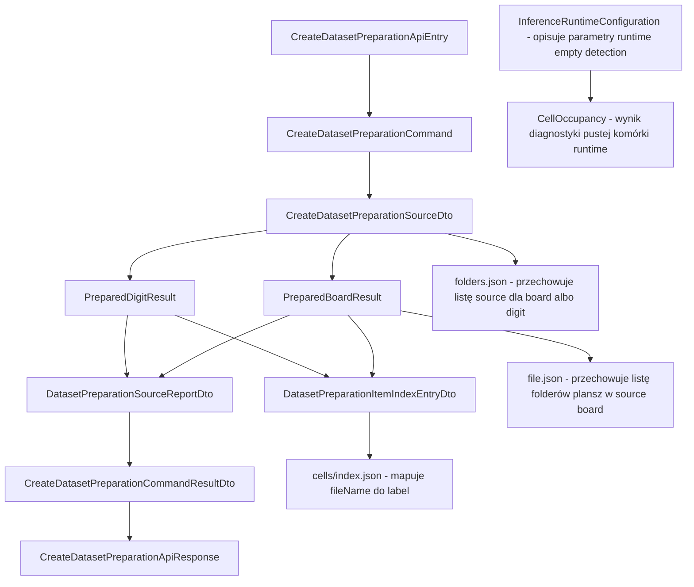
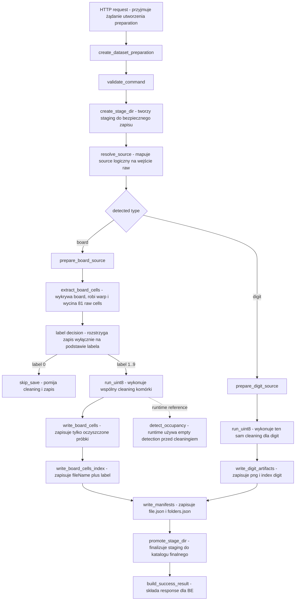

# UC-21 ML - Plan implementacyjny (`POST /ml/datasets/preparations`)

## 1. Przeznaczenie endpointa
- Plan dotyczy wyłącznie części `ML`.
- Endpoint wewnętrzny `POST /ml/datasets/preparations` pozostaje wywoływany tylko przez `Backend`.
- `UC-21` nie dodaje nowego endpointu i nie zmienia publicznego workflow `BE`.
- Celem `UC-21` jest doprecyzowanie semantyki już istniejącego przygotowania datasetu dla danych `board`:
  - do `cells/` zapisujemy wyłącznie oczyszczoną kanoniczną próbkę pod model,
  - cleaning jest współdzielony z runtime inferencji cyfry,
  - decyzja o zapisie komórki wynika z labela `1..9`, nie z runtime `empty detection`.

## 2. Główne założenia planu
- Plan bazuje na:
  - `.ai/prd.md`,
  - `.ai/feature/uc-21-overview.md`,
  - `.ai/feature/uc-empty-cell-cleaning-refactor-notes.md`,
  - `.cursor/rules/architecture_ml.mdc`,
  - `.ai/DokumentacjaDeployuRuntimeSerwera.md`,
  - wcześniejszych kontraktach z `UC-17`, `UC-19`, `UC-20` oraz aktualnym runtime inferencji.
- Nie projektujemy rozwiązania pod aktualny stan `FE` ani `BE`; trzymamy się kontraktów historyjek i odpowiedzialności warstw.
- `Application` ma decydować:
  - kiedy uruchomić cleaning,
  - co wolno zapisać,
  - kiedy request kończy się warningiem,
  - kiedy request ma się wywalić.
- `Infrastructure` ma wyłącznie implementować:
  - operacje obrazu,
  - OpenCV / NumPy,
  - zapis artefaktów,
  - odczyt źródeł,
  - staging i cleanup.
- `Models` pozostają neutralne i nie znają HTTP.
- `API` pozostaje cienkie.

## 3. Jawne odniesienie do materiału referencyjnego
- Należy wprost oprzeć implementację cleaningu na wnioskach z:
  - `src/MachineLearning/draft/FinalApi/final_api_uc04_uc06_preview.ipynb`,
  - `.ai/feature/uc-empty-cell-cleaning-refactor-notes.md`.
- Notebook potwierdza oczekiwany produkcyjny kierunek:
  - `CellPreprocessingPipeline.run_uint8(...)` daje kanoniczną próbkę `uint8`,
  - `CellPreprocessingPipeline.run(...)` daje wariant `float32`,
  - cleaning jest osobnym etapem względem ekstrakcji `raw_cells`.
- Notatka refaktoryzacyjna wymaga rozdzielenia:
  - `empty cell detection`,
  - `cell cleaning for classification/training`.
- `UC-21` wdraża przede wszystkim drugi z tych etapów po stronie przygotowania datasetu.

## 4. Kontrakt `BE -> ML`

### 4.1 Status kontraktu
- Kontrakt endpointu pozostaje bez zmiany nazwy:
  - `POST /ml/datasets/preparations`
- `UC-21` nie dodaje nowych pól request/response tylko po to, żeby opisać cleaning.
- Zmiana jest semantyczna i dotyczy tego, jaki obraz trafia do `cells/`.

### 4.2 Model API wejściowy
- `CreateDatasetPreparationApiEntry`
  - `preparationName: string`
  - `sources: CreateDatasetPreparationSourceApiEntry[]`
- `CreateDatasetPreparationSourceApiEntry`
  - `name: string`
  - `type: string` (`board` | `digit`)

### 4.3 Model API wyjściowy
- `CreateDatasetPreparationApiResponse`
  - `preparationName: string`
  - `createdAtUtc: string`
  - `status: string`
  - `sourceReports: DatasetPreparationSourceReportApiResponse[]`
  - `warnings: string[]`
- `DatasetPreparationSourceReportApiResponse`
  - `name: string`
  - `type: string`
  - `preparedItemsCount: number`
  - `rejectedItemsCount: number`
  - `emptyCellCount: number`
- `ErrorApiResponse`
  - `errorType: string`
  - `message: string`

### 4.4 Ważna reguła kontraktowa
- `emptyCellCount` w raporcie nadal może oznaczać liczbę komórek z labelem `0` dla źródeł `board`.
- Nie wolno zmieniać znaczenia istniejących pól JSON bez jawnej, osobnej decyzji kontraktowej.

## 5. Zachowanie warstw

### 5.1 API
- Przyjmuje request i mapuje go do komendy.
- Nie wykonuje cleaningu obrazu.
- Nie decyduje, czy komórka jest pusta.
- Nie zapisuje artefaktów.
- Mapuje błędy aplikacyjne na `422`.
- Mapuje błędy techniczne zapisu/finalizacji na `500`.

### 5.2 Application
- Waliduje request use-case'u.
- Dla `board` rozstrzyga flow:
  - `raw cell -> label decision -> cleaning -> save`.
- Dla `digit` utrzymuje wspólny cleaning profilowy.
- Oddziela decyzję biznesową od techniki:
  - label `0` -> brak zapisu,
  - label `1..9` -> cleaning i zapis.
- Nie używa runtime `empty detection` jako bramki decyzyjnej dla datasetu.

### 5.3 Domain / Models
- Przechowuje neutralne modele wyników i raportów.
- Nie zna:
  - FastAPI,
  - Pydantic,
  - OpenCV,
  - filesystemu.
- Utrzymuje spójne nazwy i kształty wyników z `UC-17`.

### 5.4 Infrastructure
- Implementuje:
  - ekstrakcję boarda i `raw_cells`,
  - cleaning komórki,
  - runtime `empty detection`,
  - zapis `corrected-board.png`, `cells/*.png`, `index.json`, `folders.json`, `file.json`.
- Nie podejmuje decyzji biznesowej, czy komórkę wolno zapisać.
- Nowe usługi dokładamy dopiero wtedy, gdy faktycznie brakuje generycznego adaptera.

## 6. Co już istnieje i musi zostać reuse'owane

### 6.1 Reuse obowiązkowy
- `src/MachineLearning/api/controllers/datasets_controller.py`
  - istniejący endpoint `POST /ml/datasets/preparations`.
- `src/MachineLearning/application/features/datasets/commands/create_dataset_preparation/create_dataset_preparation_command_handler.py`
  - istniejąca orkiestracja `UC-17`.
- `src/MachineLearning/infrastructure/vision/cell_preprocessing_pipeline.py`
  - istniejący wspólny pipeline cleaningu komórki.
- `src/MachineLearning/infrastructure/vision/cell_cleaning.py`
  - istniejące niskopoziomowe funkcje cleaningu obrazu.
- `src/MachineLearning/application/features/inference/commands/infer_cell_digit/infer_cell_digit_command_handler.py`
  - istniejąca kolejność runtime:
    - foreground mask,
    - empty detection,
    - cleaning,
    - inferencja.
- `src/MachineLearning/infrastructure/inference/cell_occupancy_detector.py`
  - istniejąca implementacja `empty detection`.
- `src/MachineLearning/infrastructure/storage/dataset_preparation_artifact_writer.py`
  - zapis artefaktów dataset preparation.
- `src/MachineLearning/infrastructure/storage/dataset_preparation_manifest_writer.py`
  - zapis manifestów.
- `src/MachineLearning/infrastructure/storage/dataset_preparation_workspace_manager.py`
  - staging i finalizacja.
- `src/MachineLearning/infrastructure/storage/dataset_preparations_path_provider.py`
  - layout katalogów preparation.

### 6.2 Reuse referencyjny, nie produkcyjny 1:1
- `src/MachineLearning/draft/FinalApi/final_api_uc04_uc06_preview.ipynb`
  - źródło wiedzy o oczekiwanym cleaningu, nie moduł runtime.
- `src/MachineLearning/draft/raw_line_family_only/search_empty_cell/core.py`
  - referencja dla diagnostyki pustej komórki.
- `src/MachineLearning/draft/raw_line_family_only/search_empty_cell/grid.py`
  - referencja dla flow batchowego i preview.
- `src/MachineLearning/draft/raw_line_family_only/search_empty_cell/models.py`
  - referencja dla modeli diagnostycznych.

### 6.3 Wniosek architektoniczny
- Dla `UC-21` nie tworzymy równoległego modułu cleaningu tylko dlatego, że story dotyczy dataset preparation.
- Jeżeli czegoś brakuje, rozszerzamy istniejący wspólny `CellPreprocessingPipeline` albo dokładamy generyczny adapter obok niego.

## 7. Pliki w zakresie story per warstwa

### 7.1 API (`src/MachineLearning/api`)
- `[REUSE]` `api/controllers/datasets_controller.py`
  - utrzymuje endpoint i mapowanie wyjątków,
  - ewentualnie tylko doprecyzować logi i komentarze.
- `[REUSE]` `api/models/create_dataset_preparation_api_entry.py`
  - model requestu bez zmian kontraktowych.
- `[REUSE]` `api/models/create_dataset_preparation_source_api_entry.py`
  - model pojedynczego źródła.
- `[REUSE]` `api/models/create_dataset_preparation_api_response.py`
  - model odpowiedzi sukcesu.
- `[REUSE]` `api/models/dataset_preparation_source_report_api_response.py`
  - raport per source.
- `[REUSE]` `api/models/error_api_response.py`
  - wspólny model błędu.
- `[REUSE/UPDATE]` `api/dependencies.py`
  - spina handler preparation z tym samym cleaningiem, którego używa runtime,
  - jeśli zabraknie wspólnej fabryki cleaningu, tu jest miejsce na jej podłączenie.

### 7.2 Application (`src/MachineLearning/application`)
- `[REUSE]` `application/features/datasets/commands/create_dataset_preparation/create_dataset_preparation_command.py`
  - komenda use-case'u.
- `[UPDATE]` `application/features/datasets/commands/create_dataset_preparation/create_dataset_preparation_command_handler.py`
  - główne miejsce wdrożenia `UC-21`,
  - musi jasno rozdzielić:
    - label-based decision,
    - shared cleaning,
    - zapis artefaktów.
- `[REUSE]` `application/features/datasets/commands/create_dataset_preparation/create_dataset_preparation_command_result_dto.py`
  - wynik zwracany do API.
- `[REUSE]` `application/features/datasets/dto/create_dataset_preparation_source_dto.py`
  - DTO wejściowego source.
- `[REUSE]` `application/features/datasets/dto/dataset_preparation_source_report_dto.py`
  - DTO raportu per source.
- `[REUSE]` `application/features/datasets/dto/dataset_preparation_item_index_entry_dto.py`
  - DTO wpisu `fileName + label`.
- `[REUSE/UPDATE]` `application/features/datasets/ports/dataset_preparation_ports.py`
  - port cleaningu pozostaje abstrakcją aplikacyjną,
  - jeśli nazwa `CellPreprocessingPipelinePort` jest wystarczająca, nie zmieniamy jej.
- `[REUSE]` `application/features/datasets/errors/dataset_preparation_errors.py`
  - istniejące błędy preparation.
- `[REUSE/REFERENCE]` `application/features/inference/commands/infer_cell_digit/infer_cell_digit_command_handler.py`
  - referencyjny runtime flow, który `UC-21` ma respektować dla części cleaningowej.

### 7.3 Domain / Models (`src/MachineLearning/models`)
- `[REUSE]` `models/dataset_preparation_status.py`
  - status odpowiedzi endpointu.
- `[REUSE]` `models/dataset_preparation_index_entry.py`
  - neutralny wpis `fileName + label`.
- `[REUSE]` `models/prepared_board_result.py`
  - neutralny wynik przygotowanej planszy.
- `[REUSE]` `models/prepared_digit_result.py`
  - neutralny wynik przygotowanych próbek `digit`.
- `[REUSE]` `models/dataset_preparation_source_report.py`
  - neutralny raport per source.
- `[REUSE]` `models/dataset_preparation_board_manifest.py`
  - model manifestu plansz źródła `board`.
- `[REUSE]` `models/dataset_preparation_source_manifest.py`
  - model `folders.json`.
- `[REUSE/REFERENCE]` `models/inference_runtime_configuration.py`
  - kontrakt ustawień runtime inferencji.
- `[REUSE/REFERENCE]` `models/cell_occupancy.py`
  - wynik `empty detection`.

### 7.4 Infrastructure (`src/MachineLearning/infrastructure`)
- `[REUSE]` `infrastructure/vision/cell_preprocessing_pipeline.py`
  - wspólny cleaning `raw cell -> uint8` i `raw cell -> float32`.
- `[REUSE/UPDATE]` `infrastructure/vision/cell_cleaning.py`
  - niskopoziomowe funkcje cleaningu,
  - rozszerzać tylko jeśli brakuje generycznego kroku dla wspólnego pipeline'u.
- `[REUSE/REFERENCE]` `infrastructure/inference/cell_occupancy_detector.py`
  - runtime `empty detection`, bez roli decyzyjnej dla dataset preparation.
- `[REUSE]` `infrastructure/vision/engine_board_dataset_cell_extractor.py`
  - ekstrakcja `corrected_board + 81 raw_cells`.
- `[REUSE]` `infrastructure/storage/dataset_preparation_artifact_writer.py`
  - zapis obrazów przygotowania.
- `[REUSE]` `infrastructure/storage/dataset_preparation_manifest_writer.py`
  - zapis `folders.json`, `file.json`, `index.json`.
- `[REUSE]` `infrastructure/storage/dataset_preparation_workspace_manager.py`
  - create stage, promote, cleanup.
- `[REUSE]` `infrastructure/storage/dataset_preparations_path_provider.py`
  - wszystkie ścieżki layoutu preparation.
- `[REUSE]` `infrastructure/reporting/dataset_preparation_report_builder.py`
  - składanie raportu per source.
- `[REUSE]` `infrastructure/datasets/board_dat_parser.py`
  - parsowanie labeli planszy.
- `[REUSE]` `infrastructure/datasets/board_dataset_scanner.py`
  - skan `.jpg + .dat`.
- `[REUSE]` `infrastructure/datasets/idx_dataset_loader.py`
  - ładowanie `digit`.
- `[REUSE]` `infrastructure/datasets/board_folder_name_resolver.py`
  - stabilne nazwy folderów plansz.

### 7.5 Testy (`src/MachineLearning/tests`)
- `[UPDATE]` `tests/unit/test_create_dataset_preparation_command_handler.py`
  - najważniejsze testy `UC-21`.
- `[REUSE/UPDATE]` `tests/unit/test_cell_preprocessing_pipeline.py`
  - kontrakt wspólnego cleaningu.
- `[REUSE/UPDATE]` `tests/unit/test_cell_occupancy_detector.py`
  - kontrakt oddzielenia diagnostyki pustej komórki od cleaningu.
- `[REUSE/UPDATE]` `tests/integration/test_datasets_controller.py`
  - integracja endpointu bez zmiany kontraktu.
- `[NEW opcjonalnie]` `tests/unit/test_dataset_preparation_board_cleaning_semantics.py`
  - tylko jeśli obecne testy handlera staną się zbyt nieczytelne.

## 8. Docelowe zachowanie endpointa
1. `API` odbiera `CreateDatasetPreparationApiEntry`.
2. `Application` waliduje request.
3. Dla każdego źródła `board`:
   - skanuje pary `.jpg + .dat`,
   - parsuje siatkę labeli,
   - wykrywa board i wycina `81 raw_cells`,
   - iteruje po komórkach w kolejności deterministycznej,
   - dla labela `0` nic nie zapisuje,
   - dla labela `1..9` uruchamia wspólny cleaning,
   - zapisuje wyłącznie wynik cleaningu jako `cells/*.png`,
   - zapisuje `cells/index.json`.
4. Dla każdego źródła `digit`:
   - stosuje ten sam cleaning profilowy,
   - zachowuje istniejące zasady walidacji i zapisu.
5. `Infrastructure` zapisuje `corrected-board.png`, manifesty i indeksy.
6. `WorkspaceManager` finalizuje staging.
7. `API` zwraca ten sam kontrakt odpowiedzi co w `UC-17`.

## 9. Kluczowa specyfika logiki
- Dla `board` źródłem prawdy o zapisie próbki jest label.
- Runtime `empty detection`:
  - może pozostać diagnostyczne,
  - może być użyte w testach lub walidacji jakości,
  - nie może decydować o zapisie do `cells/`.
- Do `cells/` nie zapisujemy:
  - `raw cell`,
  - `center composite`,
  - overlayów segmentów,
  - obrazów diagnostycznych,
  - numeracji planszy.
- Wariant trwały to `uint8`.
- Wariant `float32` pozostaje technicznym wariantem do inferencji i dalszego pipeline'u, bez trwałego zapisu w preparation.

## 10. Wyjątki, błędy i fallbacki

### 10.1 Błędy `422`
- `invalid_request`
  - niepoprawny `preparationName`,
  - puste `sources`,
  - duplikaty `sources`,
  - niedozwolony typ.
- `raw_dataset_not_found`
  - brak źródła wejściowego.
- `raw_dataset_type_mismatch`
  - źródło wykryte jako inny typ.
- `dataset_source_invalid`
  - uszkodzony `.dat`,
  - uszkodzone `IDX`,
  - niespójne etykiety,
  - nieczytelny obraz.
- `board_not_found`
  - żadna plansza nie przeszła preprocessingu.
- `no_items_prepared`
  - po przetworzeniu nie zapisano żadnej próbki nadzorowanej.

### 10.2 Błędy `500`
- `dataset_preparation_write_failed`
  - błąd zapisu artefaktów.
- `dataset_preparation_finalize_failed`
  - błąd finalizacji stagingu.
- `internal_server_error`
  - nieobsłużony wyjątek.

### 10.3 Fallbacki kontrolowane
- Uszkodzona pojedyncza plansza `board`
  - odrzucić planszę,
  - dodać warning,
  - kontynuować source.
- Uszkodzona pojedyncza próbka `digit`
  - odrzucić próbkę,
  - zwiększyć `rejectedItemsCount`,
  - kontynuować source.
- Label `0`
  - nie traktować jako błąd,
  - nie uruchamiać cleaningu,
  - nie tworzyć wpisu `index.json`.
- Błąd cleanupu
  - logować `WARNING`,
  - nie przykrywać błędu głównego.

## 11. Pseudokod krytycznej logiki

```python
def prepare_board_source(board_pair):
    labels = board_dat_parser.parse(board_pair.label_path)
    corrected_board, raw_cells = board_extractor.extract(board_image)
    flattened_labels = labels.flatten()
    flattened_cells = flatten_cells(raw_cells)

    index_entries = []
    cleaned_cells = []

    for cell_image, label in zip(flattened_cells, flattened_labels):
        if label == 0:
            continue

        if label < 1 or label > 9:
            raise DatasetSourceInvalidError("Label spoza zakresu 0..9.")

        cleaned_uint8 = cell_preprocessing_pipeline.run_uint8(cell_image)
        cleaned_cells.append(cleaned_uint8)
        index_entries.append(build_index_entry(label=label))

    write_corrected_board(corrected_board)
    write_board_cells(cleaned_cells)
    write_board_cells_index(index_entries)
```

## 12. Główne funkcje
- `CreateDatasetPreparationCommandHandler.handle()`
  - orkiestracja całego requestu.
- `CreateDatasetPreparationCommandHandler._prepare_board_source()`
  - przygotowanie jednego źródła `board`.
- `CreateDatasetPreparationCommandHandler._prepare_single_board()`
  - przygotowanie jednej planszy i decyzja `label -> cleaning -> save`.
- `CellPreprocessingPipeline.run_uint8()`
  - produkcyjny cleaning do trwałego zapisu.
- `CellPreprocessingPipeline.run()`
  - wariant `float32` zgodny z inferencją.
- `CellPreprocessingPipeline.build_foreground_mask()`
  - krok wspólny dla cleaningu i runtime occupancy flow.
- `CellOccupancyDetector.detect()`
  - diagnostyka pustej komórki tylko dla runtime.

## 13. Przepływ w obrębie ML
1. `FastAPI` odbiera request.
2. `datasets_controller` tworzy komendę.
3. Handler tworzy staging preparation.
4. Dla źródeł `board` pobiera label i `raw_cells`.
5. Handler rozstrzyga zapis na podstawie labela.
6. `Infrastructure` czyści obraz przez wspólny pipeline.
7. `Infrastructure` zapisuje oczyszczone `cells/*.png`.
8. `Infrastructure` zapisuje manifesty i finalizuje katalog.
9. `API` zwraca raport.

## 14. Kolejność implementacji
1. Potwierdzić, że docelowym wspólnym cleaningiem pozostaje `CellPreprocessingPipeline` z notebooka referencyjnego.
2. Przejrzeć `CreateDatasetPreparationCommandHandler` i usunąć wszelkie niejawne zależności sugerujące decyzję occupancy po stronie dataset preparation.
3. Dopracować w handlerze jasny helper w stylu:
   - `_should_save_board_cell(label)`,
   - `_clean_labeled_board_cell(cell_image)`.
4. Utrzymać lub rozszerzyć port cleaningu w `dataset_preparation_ports.py` bez zmiany istniejących nazw kontraktowych, jeśli nie jest to konieczne.
5. Zweryfikować, czy `CellPreprocessingPipeline` nadal daje identyczny wynik dla:
   - runtime inferencji,
   - preparation `board`,
   - preparation `digit`.
6. Dodać testy semantyki:
   - label `0` nie wywołuje cleaningu,
   - label `1..9` wywołuje cleaning i zapis.
7. Dopiero na końcu rozważyć minimalne porządki w logach i dokumentacji.

## 15. Workflow, deploy i konfiguracja

### 15.1 Co jest wymagane teraz
- Bazowo `UC-21` nie wymaga nowego endpointu ani nowej ścieżki deploymentowej.
- Jeżeli cleaning pozostaje oparty o obecny profil `default-28x28-v1`, workflow `ml-cd.yml` nie wymaga obowiązkowej zmiany.

### 15.2 Co wolno zrobić, jeśli zajdzie potrzeba nowych ustawień
- Jeżeli trzeba wystawić nowe parametry wspólnego cleaningu do runtime config:
  - dodajemy je wyłącznie przez `api/config/environment.py`,
  - dodajemy je do `api/.env`,
  - w `api/.env.local` ustawiamy lokalne wartości na sztywno,
  - w `api/.env.production` ustawiamy wartości produkcyjne,
  - workflow `ml-cd.yml` ma tylko przygotować produkcyjny overlay.
- Nie tworzymy drugiego systemu konfiguracji obok `.env*`.

### 15.3 Guardrail workflow
- Workflow nie może przenosić runtime state do release.
- Workflow nie może nadpisywać `data/processed/preparations`.
- Workflow ma jedynie dostarczać kod i produkcyjne `.env*`.

## 16. Zależności między historyjkami
- `UC-17`
  - baza kontraktowa i storage dla preparation.
- `UC-18`
  - konsumuje zapisane `cells/*.png`, więc `UC-21` nie może zmienić layoutu preparation.
- `UC-19`
  - konsumuje `index.json` i przygotowane próbki, więc `UC-21` nie może zmienić semantyki labeli ani formatu plików.
- `UC-20`
  - dostarcza aktualny kierunek ekstrakcji i runtime preprocessingu obrazowego.
- `UC-06`
  - końcowy trening musi dostać ten sam typ próbki, który `UC-21` zapisuje do preparation.
- `UC-22`
  - jeśli runtime empty detection będzie dalej refaktoryzowane, `UC-21` ma reuse'ować wspólny cleaning, ale nie przejmować jego logiki decyzyjnej.

## 17. Logging i diagnostyka

### 17.1 `INFO`
- start requestu:
  - `preparationName`,
  - liczba sources,
  - typy sources.
- start i koniec per source.
- liczba zapisanych próbek per source.
- finalizacja stagingu.

### 17.2 `WARNING`
- pominięta plansza `board`,
- pominięta próbka `digit`,
- plansza bez żadnej zapisanej komórki `1..9`,
- cleanup best-effort nieudany.

### 17.3 `ERROR`
- zapis artefaktów nieudany,
- finalizacja stagingu nieudana,
- nieobsłużony wyjątek requestu.

### 17.4 Guardrail logów
- Nie logować każdej komórki osobno przy dużych datasetach.
- Nie logować macierzy NumPy.
- Nie logować diagnostycznych obrazów w base64.
- Log ma pomagać odtworzyć błąd, nie spamować dysku.

## 18. Guardraile implementacyjne
- Nie zmieniać nazw istniejących klas i pól z `UC-17`, jeśli nie ma twardej potrzeby kontraktowej.
- Nie dodawać nowego endpointu tylko dla cleaningu.
- Nie używać runtime `empty detection` do decyzji o zapisie w preparation.
- Nie przenosić logiki OpenCV do `Application`.
- Nie dublować cleaningu:
  - jeden wspólny pipeline,
  - wiele miejsc użycia.
- Nie zapisywać diagnostyki jako produkcyjnej próbki.
- Nie zmieniać layoutu katalogów preparation.
- Nie hardcodować ścieżek produkcyjnych w kodzie.

## 19. Inne istotne reguły
- JSON pozostaje w `camelCase`.
- Modele HTTP mają suffix `ApiEntry` i `ApiResponse`.
- DTO aplikacyjne mają suffix `Dto`.
- `Application` steruje logiką use-case'u.
- `Infrastructure` implementuje technikę.
- Kolejność w `index.json`, `file.json` i `folders.json` ma pozostać deterministyczna.

## 20. Mermaid - flowchart modeli


## 21. Mermaid - flowchart logiki aplikacji


## 22. Minimalny plan testów
- Unit `test_create_dataset_preparation_command_handler.py`
  - label `0` nie zapisuje próbki,
  - label `1..9` zapisuje oczyszczoną próbkę,
  - cleaning jest wywoływany tylko dla komórek zapisywanych,
  - błędny label spoza `0..9` kończy request błędem.
- Unit `test_cell_preprocessing_pipeline.py`
  - `run()` i `run_uint8()` pozostają spójne,
  - pusta komórka daje pusty canvas, ale nie staje się błędem cleaningu.
- Unit `test_cell_occupancy_detector.py`
  - diagnostyka pustej komórki pozostaje niezależna od cleaningu.
- Integration `test_datasets_controller.py`
  - kontrakt HTTP pozostaje bez zmian,
  - response i mapowanie błędów są zgodne z `UC-17`.

## 23. Finalna rekomendacja implementacyjna
- `UC-21` należy wdrożyć jako doprecyzowanie semantyki istniejącego `UC-17`, a nie jako nowy endpoint ani nowy równoległy pipeline.
- Najważniejsza decyzja architektoniczna brzmi:
  - runtime i dataset preparation współdzielą jeden `cell cleaning`,
  - runtime `empty detection` pozostaje osobnym etapem decyzyjnym tylko dla inferencji.
- Jeżeli obecny `CellPreprocessingPipeline` pokrywa oczekiwany cleaning z notebooka, główny zakres prac dotyczy:
  - doprecyzowania handlera,
  - testów,
  - logów,
  - pilnowania guardraili kontraktowych.
