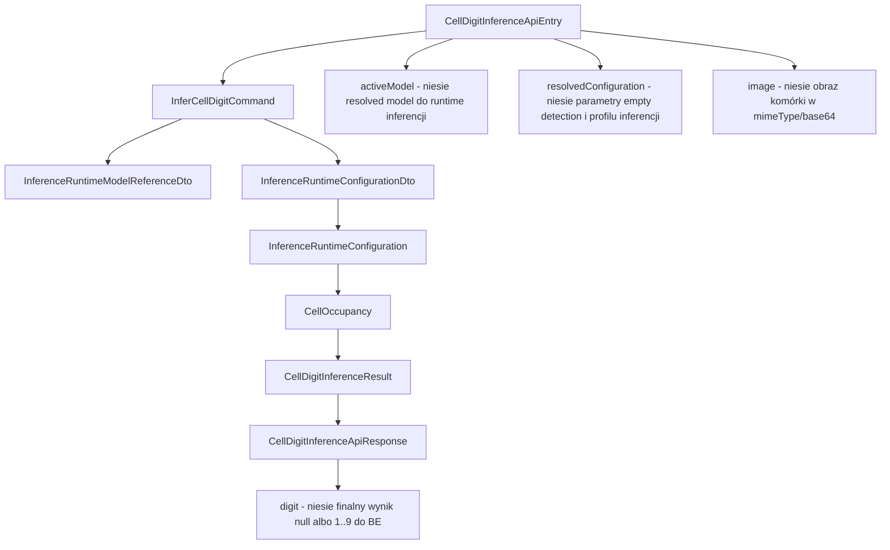
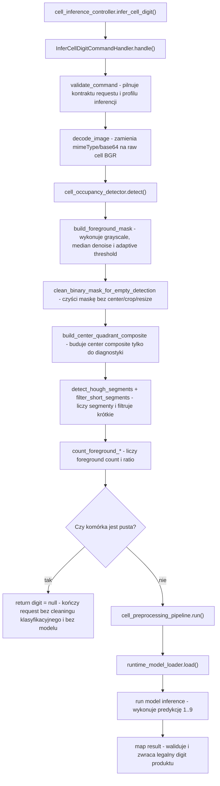

# UC-22 ML - Plan implementacyjny (`PUT /ml/cells/inference`)

## 1. Przeznaczenie endpointa
- Plan dotyczy wyłącznie części `ML`.
- Endpoint wewnętrzny `PUT /ml/cells/inference` pozostaje wywoływany przez `Backend` w runtime `UC-05`.
- Celem `UC-22` nie jest zbudowanie nowego endpointu ani zmiana semantyki odpowiedzi, tylko doprecyzowanie i utwardzenie kolejności:
  - `raw cell BGR -> empty detection -> cleaning klasyfikacyjny -> digit inference`.
- Wynik biznesowy pozostaje bez zmian:
  - `{ "digit": 1..9 }` dla komórki niepustej,
  - `{ "digit": null }` dla komórki pustej.
- `ML` nie buduje `recognizedGrid`, nie uruchamia solvera, nie zapisuje systemowych rekordów workflow i nie staje się `source of truth`.

## 2. Zakres i główna decyzja architektoniczna
- `UC-22` jest refaktoryzacją istniejącego runtime inferencji komórki.
- Najważniejsza decyzja:
  - `empty detection` działa na `raw cell BGR`,
  - cleaning pod klasyfikator uruchamia się dopiero po decyzji `non-empty`,
  - artefakt diagnostyczny `empty detection` nie może zostać pomylony z finalnym samplem dla klasyfikatora.
- Implementacja musi wprost respektować wymagania:
  1. `empty detection` pracuje na `raw cell BGR`,
  2. wspólny etap to:
     - `grayscale`,
     - `median denoise`,
     - `adaptive threshold`,
  3. potem osobny cleanup maski dla `empty detection`:
     - usunięcie małych białych komponentów,
     - opcjonalne usunięcie artefaktów przy brzegu,
     - bez centrowania,
     - bez cropu do bounding box,
     - bez resize do rozmiaru modelu,
  4. na takiej masce budowany jest `center composite`,
  5. na `center composite` liczone są:
     - `Hough segments`,
     - `filtered segment count`,
     - `foreground pixel count`,
     - `foreground pixel ratio`,
  6. decyzja `empty/non-empty` zapada przed cleaningiem klasyfikacyjnym,
  7. dopiero dla `non-empty` uruchamiany jest `clean_cell_binary(...)` albo równoważny helper końcowej próbki modelowej,
  8. diagnostyka `empty detection` i finalny sample klasyfikatora pozostają rozdzielone.

## 3. Źródła i ograniczenia planu
- Plan bazuje na:
  - `.ai/prd.md`,
  - `.ai/feature/uc-22-overview.md`,
  - `.ai/feature/uc-empty-cell-cleaning-refactor-notes.md`,
  - `.ai/DokumentacjaDeployuRuntimeSerwera.md`,
  - `.cursor/rules/architecture_ml.mdc`,
  - wcześniejszych historyjkach `UC-05A`, `UC-14`, `UC-17`, `UC-21`.
- Nie projektujemy pod aktualny stan `FE` ani `BE`; trzymamy się ustalonych kontraktów i nazw.
- Nie wolno zrywać nazw klas i pól już wprowadzonych przez wcześniejsze story.
- Jeżeli w `Infrastructure` istnieje już generyczny komponent, należy go reuse'ować lub rozszerzyć zamiast tworzyć duplikat.

## 4. Stan obecny, rozjazdy z notebookiem i wniosek dla UC-22
- Endpoint `PUT /ml/cells/inference` już istnieje, podobnie jak główne helpery `cell_cleaning.py`, `cell_occupancy_detector.py` i `cell_preprocessing_pipeline.py`.
- To jednak nie oznacza jeszcze zgodności 1:1 z `draft/FinalApi/final_api_uc04_uc06_preview.ipynb`.
- Najważniejsze jawne rozjazdy, które plan musi uwzględnić:
  - w notebooku `inner_margin_ratio` działa przez `apply_inner_margin(...)`, czyli crop wewnętrznego obszaru maski; w aktualnym runtime `empty_cell_inner_margin_ratio` jest mapowane na `border_clearance_px` i usuwa komponenty dotykające brzegu, co nie jest tą samą operacją,
  - notebook referencyjny używa konfiguracji diagnostycznej `inner_margin_ratio=0.0`, `hough_threshold=8`, `hough_min_line_length_ratio=0.20`, `hough_max_line_gap_ratio=0.10`, `min_segment_length_px=15`, `filtered_segment_count_threshold=5`, `pixel_ratio_threshold=0.15`, `decision_mode="pixels_or_segments"`,
  - aktualny runtime w testach endpointu operuje na innych wartościach wejściowych, m.in. `emptyCellInnerMarginRatio=0.12`, `emptyCellDarkPixelRatioThreshold=0.02`, `emptyCellMinSegmentLengthPx=6`, `emptyCellFilteredSegmentCountThreshold=2`,
  - pola kontraktowe `centerAreaRatio`, `lineArtifactMinSpanRatio` i `lineArtifactMaxThicknessRatio` są obecnie walidowane, ale nie biorą udziału w decyzji `is_empty`,
  - notebook wspiera `pixel_count_threshold` i `decision_mode`, a aktualny runtime nie ma osobnego `pixel_count_threshold` i w praktyce działa jak stałe `pixels_or_segments`.
- Wniosek:
  - `UC-22` trzeba opisać nie jako "obecny kod robi to samo co notebook", tylko jako domknięcie parytetu algorytmicznego między notebookiem a runtime,
  - obowiązkowym krokiem implementacyjnym ma być porównanie tych samych `raw cell BGR` w notebooku i w runtime wraz z logowaniem metryk: `foreground_pixel_count`, `foreground_pixel_ratio`, `filtered_segment_count`, `accept_by_pixels`, `accept_by_segments`, `is_empty`.

## 5. Relacja do innych historyjek
### 5.1 Wejściowe zależności
- `UC-05A`
  - ustanawia sam endpoint `PUT /ml/cells/inference`,
  - wprowadza kontrakt `digit = null | 1..9`,
  - daje aktualny handler, modele API i loader modelu.
- `UC-14`
  - dostarcza parametry runtime inferencji komórki przekazywane dalej do `ML`,
  - `UC-22` nie powinno wymuszać zmiany odpowiedzi, a jedynie respektować wejściową konfigurację.
- `UC-17`
  - ustanawia preparation workflow,
  - wprowadza zasadę, że `ML` nie jest biznesowym źródłem prawdy o datasetach.
- `UC-21`
  - ustanawia wspólny cleaning komórki dla runtime i dataset preparation,
  - wyraźnie oddziela runtime `empty detection` od cleaningu próbki do modelu.

### 5.2 Zależności wyjściowe
- `UC-05B` i kolejne etapy solve
  - konsumują nadal tylko `digit` albo `null`.
- `UC-21`
  - dalej reuse'uje wspólny cleaning,
  - ale nie przejmuje runtime logiki decyzyjnej `empty detection`.
- Przyszłe story diagnostyczne
  - mogą reuse'ować `center composite` i segmenty jako artefakt pomocniczy,
  - ale bez zmiany kontraktu produkcyjnego.

## 6. Kontrakt `BE -> ML`
### 6.1 Endpoint
- `PUT /ml/cells/inference`
- wewnętrzny `BE -> ML`

### 6.2 Request
- `CellDigitInferenceApiEntry`
  - `image`
    - `mimeType`
    - `base64`
  - `activeModel`
    - `name`
    - `manifestPath`
    - `primaryArtifactPath`
    - `inputProfile`
  - `resolvedConfiguration`
    - `inferenceProfileName`
    - `emptyCellInnerMarginRatio`
    - `emptyCellDarkPixelRatioThreshold`
    - `centerAreaRatio`
    - `minComponentAreaRatio`
    - `lineArtifactMinSpanRatio`
    - `lineArtifactMaxThicknessRatio`
    - `emptyCellMinSegmentLengthPx`
    - `emptyCellFilteredSegmentCountThreshold`

### 6.3 Response sukcesu
- `CellDigitInferenceApiResponse`
  - `digit: int | null`

### 6.4 Response błędu
- `ErrorApiResponse`
  - `errorType`
  - `message`

### 6.5 Reguły kontraktowe UC-22
- Nie zmieniamy nazwy endpointu.
- Nie zmieniamy semantyki `digit = null`.
- Nie usuwamy ani nie przemianowujemy istniejących pól requestu.
- Pola już istniejące, ale niewykorzystywane bezpośrednio przez aktualną wersję algorytmu:
  - `centerAreaRatio`,
  - `lineArtifactMinSpanRatio`,
  - `lineArtifactMaxThicknessRatio`
  muszą pozostać kompatybilne kontraktowo; `UC-22` nie jest historią do ich usuwania.

## 7. Zachowanie warstw
### 7.1 API
- Odbiera `CellDigitInferenceApiEntry`.
- Mapuje request do `InferCellDigitCommand`.
- Wywołuje handler use-case.
- Mapuje wynik na `CellDigitInferenceApiResponse`.
- Mapuje wyjątki na `ErrorApiResponse`.
- Nie wykonuje:
  - OpenCV,
  - Hough,
  - cleaningu,
  - inferencji modelowej,
  - doboru fallbacków algorytmicznych.

### 7.2 Application
- Waliduje spójność requestu i kontraktu modelu.
- Buduje `InferenceRuntimeConfiguration`.
- Orkiestruje kolejność:
  1. decode obrazu,
  2. `empty detection` na `raw cell BGR`,
  3. szybki return `digit = null` dla `empty`,
  4. cleaning klasyfikacyjny wyłącznie dla `non-empty`,
  5. ładowanie modelu,
  6. inferencja cyfry,
  7. walidacja wyniku `1..9`.
- Decyzja biznesowa o tym, czy uruchomić model, należy do `Application`.
- `Application` nie implementuje techniki OpenCV i nie powinno zawierać procedur przetwarzania obrazu.

### 7.3 Domain / Models
- Przechowują neutralne modele:
  - `InferenceRuntimeConfiguration`,
  - `CellOccupancy`,
  - `CellDigitInferenceResult`.
- Pilnują inwariantów:
  - poprawny zakres progów,
  - `digit` tylko `null` albo `1..9`,
  - liczby segmentów i foregroundu nieujemne.
- Modele domenowe nie znają HTTP i `.env`.

### 7.4 Infrastructure
- Implementuje technikę:
  - dekodowanie obrazu,
  - binaryzację,
  - cleanup maski,
  - budowę `center composite`,
  - Hough i liczenie metryk,
  - cleaning pod model,
  - ładowanie modelu i inferencję.
- `Infrastructure` ma być generyczne:
  - helper `clean_binary_mask_for_empty_detection(...)` jest reusable i powinien pozostać osobny,
  - `clean_cell_binary(...)` pozostaje etapem klasyfikacyjnym,
  - nie przenosimy do `Infrastructure` decyzji biznesowej typu "kiedy kończyć request `digit = null`".

## 8. Pliki w zakresie story per warstwa
### 8.1 API (`src/MachineLearning/api`)
- `[REUSE]` `api/controllers/cell_inference_controller.py`
  - utrzymuje router `PUT /ml/cells/inference`,
  - mapuje błędy i loguje request.
- `[REUSE]` `api/models/cell_digit_inference_api_entry.py`
  - top-level request `BE -> ML`.
- `[REUSE]` `api/models/active_model_reference_api_entry.py`
  - kontrakt aktywnego modelu runtime.
- `[REUSE/UPDATE]` `api/models/cell_inference_configuration_api_entry.py`
  - utrzymuje istniejące pola konfiguracji,
  - dokumentuje i waliduje pola używane przez `UC-22`.
- `[REUSE]` `api/models/cell_digit_inference_api_response.py`
  - odpowiedź `{ digit }`.
- `[REUSE]` `api/models/error_api_response.py`
  - wspólny model błędu.
- `[REUSE/UPDATE]` `api/dependencies.py`
  - kompozycja handlera inferencji,
  - ewentualne dopięcie nowych ustawień lub helperów `Infrastructure`.
- `[REUSE/UPDATE]` `api/config/runtime_settings.py`
  - typed settings inferencji,
  - tylko jeśli zajdzie potrzeba wewnętrznych tunables środowiskowych dla detektora.
- `[REUSE/UPDATE]` `api/config/environment.py`
  - jedyne źródło `.env`,
  - tylko jeśli dojdą nowe zmienne środowiskowe dla `ML`.
- `[REUSE/UPDATE opcjonalnie]` `api/.env`
  - baza configu.
- `[REUSE/UPDATE opcjonalnie]` `api/.env.local`
  - wartości lokalne wpisane jawnie.
- `[REUSE/UPDATE opcjonalnie]` `api/.env.production`
  - overlay produkcyjny dostarczany w release.

### 8.2 Application (`src/MachineLearning/application/features/inference`)
- `[REUSE]` `application/features/inference/commands/infer_cell_digit/infer_cell_digit_command.py`
  - komenda use-case.
- `[UPDATE]` `application/features/inference/commands/infer_cell_digit/infer_cell_digit_command_handler.py`
  - najważniejsze miejsce `UC-22`,
  - ma jawnie utrzymać kolejność:
    - decode,
    - occupancy,
    - early return `null`,
    - cleaning,
    - model inference.
- `[REUSE]` `application/features/inference/commands/infer_cell_digit/infer_cell_digit_command_result_dto.py`
  - DTO odpowiedzi handlera.
- `[REUSE]` `application/features/inference/dto/inference_runtime_configuration_dto.py`
  - DTO konfiguracji runtime przekazanej przez `API`.
- `[REUSE]` `application/features/inference/dto/inference_runtime_model_reference_dto.py`
  - DTO aktywnego modelu.
- `[REUSE]` `application/features/inference/dto/cell_digit_inference_result_dto.py`
  - DTO wyniku `digit`.
- `[REUSE/UPDATE]` `application/features/inference/errors/cell_digit_inference_errors.py`
  - klasy wyjątków use-case,
  - ewentualne doprecyzowanie komunikatów i typów błędów.
- `[REFERENCE]` `application/features/inference/commands/test_digit_inference/test_digit_inference_command_handler.py`
  - źródło reuse dla ładowania modelu, ale poza kontraktem produkcyjnym.

### 8.3 Domain / Models (`src/MachineLearning/models`)
- `[REUSE/UPDATE]` `models/inference_runtime_configuration.py`
  - utrzymuje inwarianty konfiguracji runtime,
  - może wymagać doprecyzowania komentarzy lub walidacji zakresów.
- `[REUSE]` `models/cell_occupancy.py`
  - neutralny wynik `empty detection`.
- `[REUSE]` `models/cell_digit_inference_result.py`
  - neutralny wynik inferencji końcowej.
- `[REFERENCE]` `models/preprocessing_image.py`
  - model techniczny dekodowanego obrazu.

### 8.4 Infrastructure (`src/MachineLearning/infrastructure`)
- `[REUSE/UPDATE]` `infrastructure/vision/cell_cleaning.py`
  - kluczowy moduł niskopoziomowy,
  - ma utrzymać osobne helpery:
    - `build_foreground_mask(...)`,
    - `clean_binary_mask_for_empty_detection(...)`,
    - `build_center_quadrant_composite(...)`,
    - `detect_hough_segments(...)`,
    - `filter_short_segments(...)`,
    - `clean_cell_binary(...)`.
- `[REUSE/UPDATE]` `infrastructure/inference/cell_occupancy_detector.py`
  - implementacja runtime `empty detection`,
  - pracuje na `raw cell BGR`,
  - nie może używać centrowania, cropu do bounding box ani resize do rozmiaru modelu.
- `[REUSE/UPDATE]` `infrastructure/vision/cell_preprocessing_pipeline.py`
  - cleaning pod próbkę modelową,
  - uruchamiany tylko po decyzji `non-empty`.
- `[REUSE]` `infrastructure/inference/runtime_model_loader.py`
  - ładowanie modelu i transformacji.
- `[REUSE]` `infrastructure/training/model/model_manifest_reader.py`
  - odczyt manifestu modelu.
- `[REUSE]` `infrastructure/training/model/model_factory.py`
  - budowa modelu.
- `[REUSE]` `infrastructure/training/model/model_artifact_loader.py`
  - ładowanie wag.
- `[REUSE]` `infrastructure/training/data/input_transform_factory.py`
  - transformacja wejścia dla modelu.
- `[REUSE]` `infrastructure/vision/vision_image_codec.py`
  - decode MIME/base64 do obrazu.

### 8.5 Testy (`src/MachineLearning/tests`)
- `[UPDATE]` `tests/unit/test_cell_occupancy_detector.py`
  - główny test separacji `empty detection` od cleaningu klasyfikacyjnego.
- `[UPDATE]` `tests/unit/test_cell_preprocessing_pipeline.py`
  - potwierdza, że cleaning modelowy ma osobny wynik i rozmiar.
- `[UPDATE]` `tests/unit/test_infer_cell_digit_command_handler.py`
  - sprawdza wczesny return `digit = null` bez uruchamiania modelu.
- `[UPDATE]` `tests/integration/test_cell_inference_controller.py`
  - pilnuje kontraktu endpointu i scenariuszy `digit/null`.
- `[REUSE/UPDATE opcjonalnie]` `tests/unit/test_runtime_model_loader.py`
  - tylko jeśli refaktor model loadera będzie potrzebny.

## 9. Docelowe zachowanie endpointa
1. `API` odbiera `CellDigitInferenceApiEntry`.
2. `Application` waliduje request i buduje `InferenceRuntimeConfiguration`.
3. `ImageCodec` dekoduje `base64` do `raw cell BGR`.
4. `CellOccupancyDetector.detect(...)` wykonuje:
   - `grayscale`,
   - `median denoise`,
   - `adaptive threshold`,
   - cleanup maski dla `empty detection`,
   - `center composite`,
   - Hough i metryki foreground.
5. Jeśli wynik to `is_empty = true`, handler zwraca `digit = null`.
6. Jeśli wynik to `is_empty = false`, dopiero wtedy `CellPreprocessingPipeline.run(...)` tworzy finalny sample modelowy.
7. `RuntimeModelLoader` ładuje model i transformację.
8. Model zwraca klasę mapowaną na `1..9`.
9. `API` zwraca `CellDigitInferenceApiResponse`.

## 10. Kluczowa specyfika logiki
- `empty detection` ma być czułe na ślad cyfry, a nie na potrzeby normalizacji próbki modelowej.
- `clean_cell_binary(...)` służy do próbki klasyfikacyjnej, więc:
  - centruje,
  - robi crop do bounding box,
  - robi resize do `output_size`,
  - dlatego nie może być użyte jako diagnostyka `empty detection`.
- `clean_binary_mask_for_empty_detection(...)` ma służyć tylko do lekkiego cleanupu maski:
  - zachowuje oryginalny rozmiar,
  - nie centruje,
  - nie skaluje,
  - nie produkuje finalnej próbki modelowej.
- `center composite` jest artefaktem diagnostyczno-decyzyjnym:
  - nie trafia do klasyfikatora,
  - nie jest zapisywany jako sample runtime czy datasetowy.

## 11. Główne funkcje
- `infer_cell_digit()`
  - endpoint FastAPI.
- `InferCellDigitCommandHandler.handle()`
  - orkiestracja całego use-case.
- `InferCellDigitCommandHandler._detect_occupancy()`
  - uruchamia decyzję `empty/non-empty`.
- `CellOccupancyDetector.detect()`
  - wykonuje pełną analizę `empty detection`.
- `build_foreground_mask()`
  - wspólny etap `grayscale -> median -> adaptive threshold`.
- `clean_binary_mask_for_empty_detection()`
  - cleanup maski dla occupancy.
- `build_center_quadrant_composite()`
  - buduje centralny obraz analityczny z 4 ćwiartek skierowanych do środka.
- `detect_hough_segments()`
  - wykrywa segmenty Hough.
- `filter_short_segments()`
  - odrzuca segmenty krótsze od progu.
- `count_foreground_pixels()`
  - liczy foreground.
- `count_foreground_pixel_ratio()`
  - liczy ratio foregroundu.
- `CellPreprocessingPipeline.run()`
  - produkuje finalny sample `float32` pod model.
- `CellPreprocessingPipeline.run_uint8()`
  - produkuje wersję `uint8` tego samego cleaningu.
- `clean_cell_binary()`
  - klasyfikacyjny cleanup końcowy.

## 12. Wyjątki, błędy i fallbacki
### 12.1 Błędy `422`
- `invalid_request`
  - brak wymaganych pól,
  - błędne zakresy progów,
  - niepoprawne ścieżki modelu.
- `invalid_image_payload`
  - niepoprawny `mimeType` albo `base64`.
- `unsupported_input_profile`
  - niewspierany profil wejściowy.
- `input_profile_mismatch`
  - `activeModel.inputProfile` nie zgadza się z `inferenceProfileName`.
- `cell_image_not_processable`
  - nie udało się wykonać occupancy albo cleaningu.
- `model_manifest_not_found`
- `model_manifest_invalid`
- `model_artifact_not_found`
- `inference_model_not_allowed`
- `invalid_inference_result`
- `inference_runtime_failed`

### 12.2 Błędy `500`
- `internal_server_error`
  - nieobsłużony wyjątek poza zmapowanym zakresem.

### 12.3 Fallbacki dozwolone
- Dozwolony wyłącznie fallback techniczny urządzenia, jeśli już istnieje semantyka `auto -> cpu`.

### 12.4 Fallbacki niedozwolone
- Brak cichego użycia innego modelu.
- Brak cichego zwracania `digit = null` przy błędzie systemowym.
- Brak użycia cleaningu klasyfikacyjnego jako substytutu `empty detection`.
- Brak zapisu artefaktów diagnostycznych jako wyniku produkcyjnego.

## 13. Pseudokod krytycznej logiki

```python
def handle(command):
    runtime_configuration = build_runtime_configuration(command)
    validate_command(command, runtime_configuration)

    raw_cell_bgr = decode_image(command.image)

    occupancy = cell_occupancy_detector.detect(
        cell_image=raw_cell_bgr,
        runtime_configuration=runtime_configuration,
    )

    if occupancy.is_empty:
        return CellDigitInferenceResultDto(digit=None)

    model_sample = cell_preprocessing_pipeline.run(raw_cell_bgr)

    runtime_model = runtime_model_loader.load(
        manifest_path=command.active_model.manifest_path,
        artifact_path=command.active_model.primary_artifact_path,
        input_profile=command.active_model.input_profile,
        inference_profile_name=runtime_configuration.inference_profile_name,
    )

    input_tensor = runtime_model.input_transform(model_sample).unsqueeze(0)
    predicted_digit = run_model_and_map_to_digit(input_tensor, runtime_model)
    ensure_digit_in_range(predicted_digit)

    return CellDigitInferenceResultDto(digit=predicted_digit)
```

### 13.1 Pseudokod `empty detection`

```python
def detect(cell_image_bgr, runtime_configuration):
    foreground_mask = build_foreground_mask(
        cell_image_bgr,
        median_kernel_size=5,
        adaptive_block_size=11,
        adaptive_c=2,
    )

    cleaned_mask = clean_binary_mask_for_empty_detection(
        foreground_mask,
        min_component_area_ratio=runtime_configuration.min_component_area_ratio,
        border_clearance_px=resolve_border_clearance_px(
            runtime_configuration.empty_cell_inner_margin_ratio
        ),
    )

    center_composite = build_center_quadrant_composite(cleaned_mask)
    segments = detect_hough_segments(center_composite)
    filtered_segments = filter_short_segments(
        segments,
        runtime_configuration.empty_cell_min_segment_length_px,
    )

    foreground_pixel_count = count_foreground_pixels(center_composite)
    foreground_pixel_ratio = count_foreground_pixel_ratio(center_composite)

    accept_by_pixels = (
        foreground_pixel_ratio
        > runtime_configuration.empty_cell_dark_pixel_ratio_threshold
    )
    accept_by_segments = (
        len(filtered_segments)
        >= runtime_configuration.empty_cell_filtered_segment_count_threshold
    )

    return CellOccupancy(
        is_empty=not (accept_by_pixels or accept_by_segments),
        foreground_pixel_count=foreground_pixel_count,
        foreground_pixel_ratio=foreground_pixel_ratio,
        filtered_segment_count=len(filtered_segments),
        accept_by_pixels=accept_by_pixels,
        accept_by_segments=accept_by_segments,
    )
```

## 14. Workflow, konfiguracja i deploy
### 14.1 Zasady
- Jedynym źródłem konfiguracji runtime ML pozostają:
  - `api/config/environment.py`,
  - `api/.env`,
  - `api/.env.{ML_ENVIRONMENT}`.
- W `local` wartości ustawiamy jawnie w `.env.local`.
- W `production` overlay przygotowuje workflow `ml-cd.yml`.

### 14.2 Co zmienia się dla UC-22
- Jeśli `UC-22` pozostaje oparty na parametrach przychodzących w request, workflow nie wymaga zmiany strukturalnej.
- Jeśli trzeba dodać nowe wewnętrzne tunables detektora:
  - dodajemy je tylko przez `environment.py` i `runtime_settings.py`,
  - wpisujemy je do `.env.local` oraz `.env.production`,
  - workflow dalej tylko pakuje kod i overlay, bez nowego systemu konfiguracji.

### 14.3 Guardrail workflow
- `.github/workflows/ml-cd.yml` już ustawia `ML_ENVIRONMENT=production`; to należy zachować.
- Workflow nie może przenosić runtime state do release.
- Workflow nie może nadpisywać:
  - `models/registry`,
  - `models/active`,
  - `trainings`,
  - `data`,
  - `examples`.

## 15. Logging
### 15.1 `INFO`
- przyjęcie requestu,
- `modelName`,
- `inputProfile`,
- `inferenceProfileName`,
- wynik occupancy:
  - `is_empty`,
  - `foregroundPixelCount`,
  - `foregroundPixelRatio`,
  - `filteredSegmentCount`,
  - `acceptByPixels`,
  - `acceptBySegments`,
- wynik końcowy `digit` albo `null`.

### 15.2 `WARNING`
- błędny payload obrazu,
- błąd occupancy,
- błąd cleaningu komórki,
- wynik modelu spoza kontraktu,
- błędny manifest lub brak artefaktu.

### 15.3 `ERROR`
- błąd ładowania modelu,
- błąd inferencji,
- nieobsłużony wyjątek endpointu.

### 15.4 Guardrail logów
- Nie logować `base64`.
- Nie logować pełnego payloadu.
- Nie logować całych macierzy NumPy.
- Nie logować każdego kroku per piksel.
- Log ma pomagać diagnozować, ale nie spamować dysku.

## 16. Kolejność implementacji
1. Potwierdzić w kodzie i testach, że `empty detection` pracuje na `raw cell BGR`, a nie na wyniku `CellPreprocessingPipeline`.
2. Utwardzić `cell_occupancy_detector.py` jako jedyne miejsce decyzji `empty/non-empty`.
3. Zachować `clean_binary_mask_for_empty_detection(...)` jako osobny helper i nie scalać go z `clean_cell_binary(...)`.
4. Doprecyzować `infer_cell_digit_command_handler.py`, aby cleaning klasyfikacyjny był uruchamiany wyłącznie po `non-empty`.
5. Zweryfikować, czy `cell_inference_configuration_api_entry.py` i DTO utrzymują pełną zgodność z wcześniejszym kontraktem.
6. Rozszerzyć testy jednostkowe detektora:
   - brak resize,
   - brak centrowania,
   - brak cropu do bounding box.
7. Rozszerzyć testy handlera:
   - `digit = null` nie ładuje modelu,
   - `digit = null` nie uruchamia cleaningu klasyfikacyjnego.
8. Rozszerzyć test integracyjny endpointu.
9. Dopiero na końcu rozważyć ewentualne kosmetyczne zmiany konfiguracji `.env*`.

## 17. Testy minimum dla UC-22
- Unit `test_cell_occupancy_detector.py`
  - pusta komórka daje `is_empty = true`,
  - cyfra w centrum daje `is_empty = false`,
  - cienki ślad akceptowany segmentami mimo niskiego pixel ratio,
  - `clean_binary_mask_for_empty_detection(...)` zachowuje oryginalny rozmiar maski,
  - occupancy nie używa resize do `28x28`,
  - occupancy nie używa centrowania,
  - occupancy nie używa cropu do bounding box.
- Unit `test_cell_preprocessing_pipeline.py`
  - `run()` i `run_uint8()` pozostają spójne,
  - cleaning klasyfikacyjny nadal daje rozmiar modelu,
  - cleaningu klasyfikacyjnego nie należy używać jako artefaktu diagnostycznego.
- Unit `test_infer_cell_digit_command_handler.py`
  - `empty -> digit = null`,
  - `empty -> brak wywołania runtime_model_loader`,
  - `empty -> brak cleaningu klasyfikacyjnego`,
  - `non-empty -> cleaning i model inference`,
  - `invalid_image_payload`,
  - `invalid_inference_result`.
- Integration `test_cell_inference_controller.py`
  - `200` z cyfrą,
  - `200` z `null`,
  - `422` dla złego requestu,
  - `422` dla złego modelu,
  - `500` dla nieobsłużonej awarii.

## 18. Zależności między historyjkami
- `UC-05A`
  - dostarcza fundament endpointu i klas runtime inferencji.
- `UC-14`
  - dostarcza parametryzację konfiguracji inferencji.
- `UC-17`
  - dostarcza szerszy workflow danych, ale nie jest źródłem decyzji runtime `empty`.
- `UC-21`
  - współdzieli cleaning klasyfikacyjny,
  - nie współdzieli bramki decyzyjnej o emptiness.
- `UC-22`
  - domyka refaktor runtime i stabilizuje zachowanie dla `UC-05`.

## 19. Guardraile implementacyjne
- Nie zmieniać nazw istniejących klas i pól kontraktowych.
- Nie usuwać istniejących pól requestu tylko dlatego, że nie są kluczowe dla tej iteracji.
- Nie przenosić logiki OpenCV do `Application`.
- Nie używać `clean_cell_binary(...)` do `empty detection`.
- Nie używać `clean_binary_mask_for_empty_detection(...)` jako finalnego sample'a modelowego.
- Nie mieszać obrazu diagnostycznego z obrazem pod klasyfikator.
- Nie tworzyć drugiego równoległego pipeline'u cleaningu.
- Nie hardcodować ścieżek produkcyjnych.
- Nie rozbudowywać workflow `ml-cd.yml`, jeśli wystarczy reuse istniejącego overlayu `.env.production`.

## 20. Inne istotne reguły
- JSON pozostaje w `camelCase`.
- Modele HTTP zachowują sufiksy `ApiEntry` i `ApiResponse`.
- DTO aplikacyjne zachowują sufiks `Dto`.
- `Application` steruje use-case'em.
- `Infrastructure` implementuje technikę.
- `ML` pozostaje usługą wewnętrzną i stateless względem systemowego workflow.

## 21. Mermaid - flowchart modeli


## 22. Mermaid - flowchart logiki aplikacji


## 23. Finalna rekomendacja implementacyjna
- `UC-22` należy wdrożyć jako utwardzenie istniejącego endpointu `PUT /ml/cells/inference`.
- Najważniejsza decyzja do zapisania w kodzie i testach brzmi:
  - `empty detection` ma osobny helper cleanupu i osobny artefakt diagnostyczny,
  - `clean_cell_binary(...)` pozostaje etapem pod klasyfikator,
  - oba etapy nie mogą zostać połączone.
- Jeśli obecne helpery w `cell_cleaning.py` pokrywają wymagania, główny zakres prac powinien dotyczyć:
  - doprecyzowania handlera,
  - utwardzenia `cell_occupancy_detector.py`,
  - testów,
  - logów,
  - zachowania kompatybilności kontraktowej.
