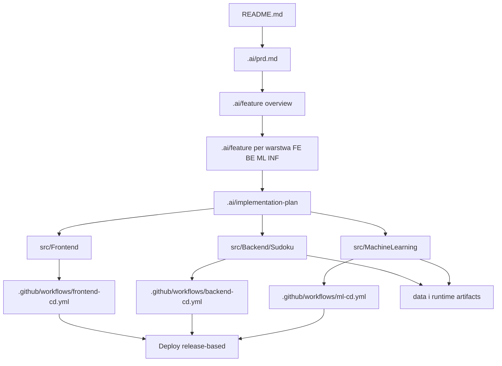
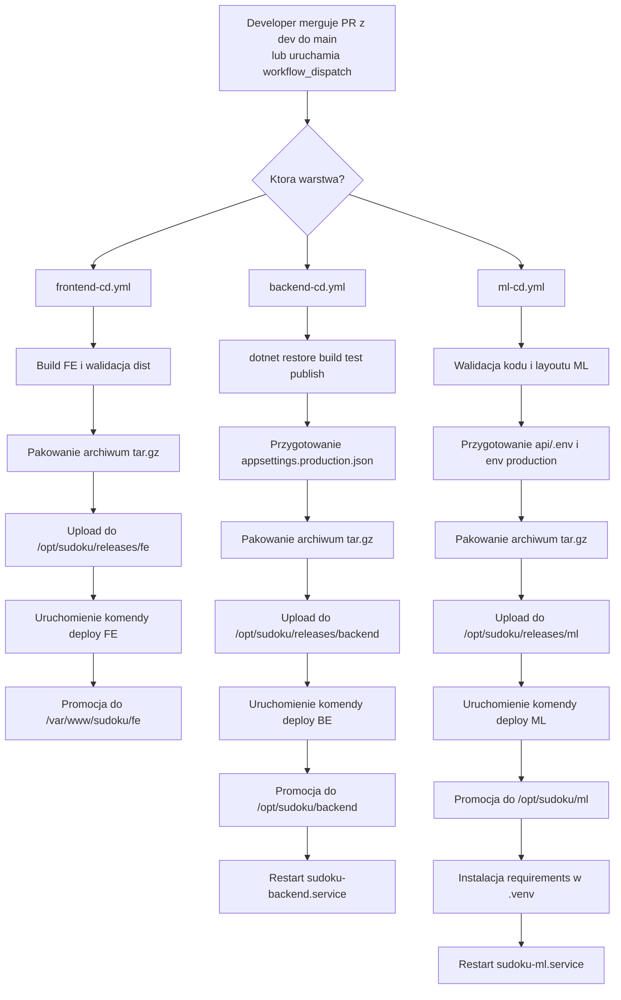
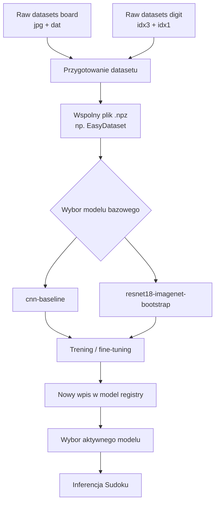
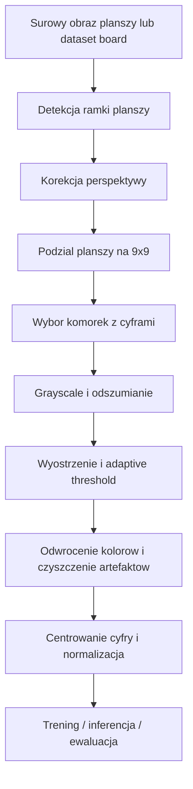

# Sudoku Vision

System webowy do rozpoznawania i rozwiązywania Sudoku ze zdjęcia. Projekt składa się z trzech głównych warstw: `Frontend`, `Backend` oraz `MachineLearning`. Oprócz ścieżki solve aplikacja obejmuje również operacje administracyjne związane z datasetami, treningami i wyborem aktywnego modelu.

## Skład zespołu

- **Wojtek** - `Backend`, `MachineLearning`, `DevOps`
- **Adam** - `Frontend`
- **Michał** - `Doradctwo`, `ML`

## Cel projektu

Celem projektu było stworzenie systemu, który potrafi odczytać sudoku ze zdjęcia i rozwiązać je automatycznie.

Program ma znaleźć planszę na obrazie. Ma wyprostować perspektywę i podzielić planszę na `81` pól. Ma rozpoznać cyfry w komórkach albo wykryć, że pole jest puste.

Na podstawie rozpoznanego układu system ma zbudować macierz `9x9`. Następnie ma rozwiązać sudoku algorytmem backtrackingu. Na końcu ma przygotować czytelny wynik dla użytkownika, także w formie obrazu z naniesionym rozwiązaniem.

Projekt obejmuje również pełny pipeline pracy z danymi i modelami. Zawiera przygotowanie datasetów `.npz`, trening modeli, inferencję, ewaluację jakości oraz wybór aktywnego modelu używanego przez system.

## Architektura warstwowa

System działa w modelu trójwarstwowym:

- **FE** - `Frontend` w React/Vite, publicznie dostępny przez `nginx`
- **BE** - `Backend` w ASP.NET Core / .NET 10, wystawia publiczne API i jest głównym `source of truth`
- **ML** - wewnętrzna usługa Python / FastAPI odpowiedzialna za CV, inferencję, przygotowanie danych i trening

### Zasady komunikacji

Dozwolona komunikacja:

- `Przeglądarka -> nginx -> FE`
- `Przeglądarka -> nginx -> BE` przez `/api/...`
- `BE -> ML` przez `http://127.0.0.1:8000`

Niedozwolona komunikacja:

- `FE -> ML` bezpośrednio
- `Internet -> ML` bezpośrednio
- `Internet -> BE` z pominięciem `nginx`

### Odpowiedzialność warstw

- **Frontend** odpowiada za UI, formularze, nawigację, wizualizację wyników, monitoring sesji i treningów.
- **Backend** odpowiada za publiczne API, walidację, autoryzację, workflow, rekordy systemowe, statusy procesów i integrację z ML.
- **MachineLearning** odpowiada za wykrycie planszy, preprocessing komórek, inferencję, solver, overlay, przygotowanie datasetów i trening modeli.

### Aktualnie funkcjonujące warstwy aplikacyjne

- `src/Frontend` - interfejs użytkownika
- `src/Backend/Sudoku` - warstwa API i orkiestracji
- `src/MachineLearning` - warstwa ML / CV / trening
- `nginx` - publiczna brama wejściowa na serwerze
- `systemd` - uruchamianie i restart usług `BE` oraz `ML`

### Główne pipeline'y systemu

Poniższy diagram pokazuje trzy główne przepływy biznesowe w systemie: ścieżkę `solve`, przygotowanie datasetu oraz trening i publikację modelu.


## Najważniejsze funkcje systemu

- upload i przegląd przykładów Sudoku,
- preprocessing planszy i komórek,
- rozpoznawanie cyfr i rozwiązywanie Sudoku,
- live solve z eventami czasu rzeczywistego,
- logowanie administracyjne prostym tokenem,
- przegląd surowych datasetów,
- przygotowanie jednego artefaktu `{name}.npz`,
- uruchamianie treningów i śledzenie postępu przez `SignalR`,
- przegląd modeli i wybór aktywnego modelu,
- diagnostyczny podgląd przygotowanego datasetu i artefaktów preview.

## Jak poruszać się po repozytorium

Najwygodniej czytać repo od dokumentów do implementacji:

1. zacznij od `README.md`, żeby zrozumieć architekturę, warstwy i runtime,
2. przejdź do `/.ai/prd.md`, żeby zobaczyć pełny zakres produktu, backlog i definicje `UC-*`,
3. potem czytaj dokumenty w `/.ai/feature/`, gdzie opisane są overview oraz podział na `FE`, `BE`, `ML`, `INF`,
4. następnie wejdź do `/.ai/implementation-plan/`, gdzie są bardziej techniczne plany wdrożenia konkretnych endpointów i kroków,
5. dopiero potem schodź do kodu w `src/`, zależnie od warstwy, nad którą pracujesz.

### Główne katalogi repo

- `src/Frontend` - aplikacja frontendowa React/Vite.
- `src/Backend/Sudoku` - backend .NET z podziałem na `Models`, `Application`, `Infrastructure` i projekt startowy `Sudoku`.
- `src/MachineLearning` - warstwa Python/FastAPI, preprocessing, inferencja, trening i testy ML.
- `.ai` - dokumentacja produktowa, techniczna, backlog, feature overview, implementation plan, bugi i eksperymenty.
- `.github/workflows` - workflow CI/CD i reguły przejścia `dev -> main`.
- `data` - lokalne artefakty runtime i testowe, np. przetworzone datasety, modele, raporty treningowe, metadata i preview.
- `README.md` - skrót architektury, odpowiedzialności, runtime i wdrożenia.

### Co zawiera `.ai`

Katalog `.ai` jest roboczym centrum wiedzy o projekcie. Najważniejsze części:

- `.ai/prd.md` - główny dokument produktu, cele, zakres, user journeys, `FR`, `NFR` i backlog `UC-*`.
- `.ai/feature/` - opis funkcjonalności z perspektywy produktu i warstw; są tu zarówno overview, jak i osobne pliki dla `fe`, `be`, `ml`, `inf`.
- `.ai/implementation-plan/` - plany implementacyjne krok po kroku dla konkretnych use case'ów i endpointów.
- `.ai/bug/` - opisane błędy i regresje znalezione podczas pracy.
- `.ai/exp/` - eksperymenty i techniczne ścieżki pomocnicze poza głównym produktem.
- `.ai/DokumentacjaDeployuRuntimeSerwera.md` - docelowy model deployu, runtime serwera, katalogów i workflow.

### Gdzie są historyjki

Historyjki i use case'y są rozproszone warstwowo, ale mają czytelny układ:

- główny backlog i lista `UC-*` są w `/.ai/prd.md`,
- overview historyjek są w plikach typu `/.ai/feature/uc-05-overview.md`, `/.ai/feature/uc-06-overview.md`,
- rozpisanie per warstwa jest w `/.ai/feature/fe/`, `/.ai/feature/be/`, `/.ai/feature/ml/`, `/.ai/feature/inf/`,
- techniczne wykonanie danej historyjki jest w `/.ai/implementation-plan/...`.

Praktycznie oznacza to, że dla jednego use case'u zwykle czytasz dokumenty w tej kolejności:

`prd -> feature overview -> feature per warstwa -> implementation plan -> kod`

### Jak czytać kod po warstwach

- Jeśli pracujesz nad `FE`, zwykle zaczynasz od `/.ai/feature/fe/...`, potem przechodzisz do `src/Frontend`.
- Jeśli pracujesz nad `BE`, zaczynasz od `/.ai/feature/be/...` i `/.ai/implementation-plan/be/...`, a potem schodzisz do `src/Backend/Sudoku`.
- Jeśli pracujesz nad `ML`, zaczynasz od `/.ai/feature/ml/...` i `/.ai/implementation-plan/ml/...`, a potem przechodzisz do `src/MachineLearning`.
- Jeśli temat dotyczy wdrożenia, infrastruktury albo release, sprawdzasz `/.ai/DokumentacjaDeployuRuntimeSerwera.md` oraz `.github/workflows`.

### Ogólny flow pracy w repo

Poniższy diagram pokazuje typowy przepływ od dokumentacji do implementacji i wdrożenia:




## Podział odpowiedzialności i historyjki

Poniższa ramka służy do wpisania odpowiedzialności zespołu za konkretne historyjki. Tam, gdzie dana warstwa nie bierze udziału, pozostawiono `—`.

Skróty:

- `INFRA` - serwer, deploy, runtime, dokumentacja, workflow, jakość
- `FE` - frontend i interfejs użytkownika
- `BE` - backend C# / ASP.NET Core i workflow aplikacyjny
- `ML` - Computer Vision, inferencja, datasety i trening


| ID       | Zakres                                                           | INFRA             | FE       | BE       | ML                |
| -------- | ---------------------------------------------------------------- | ----------------- | -------- | -------- | ----------------- |
| `INF-01` | Szkielet repo, README, przykłady do demo                         | `do uzupełnienia` | —        | —        | —                 |
| `INF-02` | Uruchomienie lokalne całego systemu                              | `do uzupełnienia` | —        | —        | —                 |
| `INF-03` | Środowisko serwerowe, domena, SSL, reverse proxy, layout runtime | `do uzupełnienia` | —        | —        | —                 |
| `INF-04` | Standardy jakości i zasady pracy                                 | `do uzupełnienia` | —        | —        | —                 |
| `INF-05` | Opcjonalny Jupyter / środowisko eksperymentalne                  | `do uzupełnienia` | —        | —        | `Wojtek`          |
| `INF-06` | Opcjonalne CI na PR                                              | `do uzupełnienia` | `Wojtek` | `Wojtek` | `Wojtek`          |
| `INF-07` | CD / deploy na serwer                                            | `do uzupełnienia` | `Wojtek` | `Wojtek` | `Wojtek`          |
| `INF-08` | Bootstrap rejestru modeli i manifestów                           | `do uzupełnienia` | —        | `Wojtek` | `Wojtek`          |
| `UC-00`  | Smoke test `FE -> BE -> ML`                                      | —                 | `Wojtek` | `Wojtek` | `Wojtek`          |
| `UC-01`  | Upload pliku Sudoku do `examples`                                | —                 | `Adam`   | `Wojtek` | —                 |
| `UC-02`  | Lista dostępnych przykładów Sudoku                               | —                 | `Adam`   | `Wojtek` | —                 |
| `UC-03`  | Pobierz wybrany plik przykładowy                                 | —                 | `Adam`   | -        | —                 |
| `UC-04`  | Wybór przykładu i wstępna obróbka                                | —                 | `Adam`   | `Wojtek` | `Wojtek`/`Michał` |
| `UC-05`  | Rozpoznanie cyfr, solve i prezentacja wyniku                     | —                 | `Wojtek` | `Wojtek` | `Wojtek`          |
| `UC-06`  | Uruchomienie treningu na `.npz`                                  | —                 | `Adam`   | `Wojtek` | `Wojtek`          |
| `UC-07`  | Postęp treningu i status zakończenia                             | —                 | `Adam`   | `Wojtek` | `Wojtek`          |
| `UC-08`  | Lista treningów i modeli                                         | —                 | `Adam`   | `Wojtek` | `Wojtek`          |
| `UC-09`  | Szczegóły treningu i metryki                                     | —                 | `Adam`   | `Wojtek` | `Wojtek`          |
| `UC-10`  | Wybór aktywnego modelu do inferencji                             | —                 | `Adam`   | `Wojtek` | `Wojtek`          |
| `UC-11`  | Lista surowych datasetów                                         | —                 | `Adam`   | `Wojtek` | —                 |
| `UC-12`  | Przygotowanie datasetu `.npz`                                    | —                 | `Adam`   | `Wojtek` | `Wojtek`          |
| `UC-13`  | Prosta autoryzacja administracyjna                               | —                 | `Adam`   | `Wojtek` | —                 |
| `UC-14`  | Parametryzacja funkcjonalności z UI                              | —                 | `Wojtek` | `Wojtek` | `Wojtek`          |
| `UC-15`  | Spowolnienie live solve                                          | —                 | `Wojtek` | `Wojtek` | —                 |
| `UC-16`  | Przegląd przygotowanego datasetu i preview                       | —                 | -        | -        | `Wojtek`          |


### Podział pracy w formie osobowej

Aktualny podział osobowy:

- **Adam** - `FE`
- **Wojtek** - `BE`/`ML`/`INF`/`FE`/`Dokumentacja`
- **Infrastruktura / DevOps** - `Doractwo`/`ML`

## Layout runtime i katalogi serwera

Schemat katalogów runtime i deployu powinien być rozumiany według docelowego layoutu serwera, a nie 1:1 według struktury repo.

```text
/opt/sudoku/
├── backend/                   # aktywna wersja BE
├── ml/                        # aktywna wersja ML
├── releases/
│   ├── backend/               # wrzutnia release'ów BE
│   ├── ml/                    # wrzutnia release'ów ML
│   └── fe/                    # wrzutnia release'ów FE
├── shared/
│   ├── data/
│   │   ├── raw/
│   │   │   ├── boards/
│   │   │   └── digits/
│   │   ├── processed/
│   │   └── benchmark/
│   ├── models/
│   │   ├── active/
│   │   │   └── inference.json
│   │   └── registry/
│   │       └── {modelName}/
│   │           ├── model.json
│   │           └── artifacts/
│   ├── trainings/
│   │   ├── runs/
│   │   ├── reports/
│   │   └── metadata/
│   ├── examples/
│   │   ├── uploads/
│   │   └── generated/
│   └── tmp/
└── scripts/

/var/www/sudoku/fe             # aktywny frontend dla nginx
/etc/sudoku/                   # konfiguracja systemowa / dodatki
/var/log/sudoku/               # logi
```

### Znaczenie katalogów runtime

- `/opt/sudoku/backend` - aktywny publish `Backendu`
- `/opt/sudoku/ml` - aktywny kod `MachineLearning`
- `/opt/sudoku/releases/...` - wrzutnia artefaktów release
- `/opt/sudoku/shared/...` - trwały stan systemu, który żyje dłużej niż pojedynczy release
- `/var/www/sudoku/fe` - statyczny build `Frontendu`

### Kluczowa zasada runtime

Deploy nie może czyścić ani nadpisywać katalogów współdzielonych runtime, takich jak:

- `shared/data`
- `shared/models`
- `shared/trainings`
- `shared/examples`

To jest stan systemu, a nie zawartość pojedynczego release'u.

## Deploy i model wdrożenia

Projekt zakłada deploy **release-based**:

1. workflow buduje artefakt,
2. artefakt trafia do katalogu `releases`,
3. uruchamiany jest odpowiedni skrypt deployowy,
4. release jest promowany do katalogu aktywnego,
5. usługa jest restartowana.

### Deploy Frontendu

- build wykonywany jest w CI/CD,
- wynik statyczny trafia do `/opt/sudoku/releases/fe/`,
- deploy kopiuje build do `/var/www/sudoku/fe`,
- `nginx` serwuje pliki statyczne,
- ta warstwa nie wymaga restartu osobnej usługi aplikacyjnej.

### Deploy Backendu

- workflow wykonuje `dotnet restore`, `dotnet build`, testy i `dotnet publish`,
- release zawiera `appsettings.json` i `appsettings.production.json`,
- artefakt trafia do `/opt/sudoku/releases/backend/`,
- deploy promuje go do `/opt/sudoku/backend`,
- po wdrożeniu restartowana jest usługa `sudoku-backend.service`.

### Deploy warstwy ML

- workflow pakuje kod, `requirements.txt` i `api/.env`,
- artefakt trafia do `/opt/sudoku/releases/ml/`,
- deploy promuje go do `/opt/sudoku/ml`,
- na serwerze utrzymywane jest `.venv`,
- deploy wykonuje `pip install -r requirements.txt`,
- po wdrożeniu restartowana jest usługa `sudoku-ml.service`.

### Niezależność wdrożeń

`FE`, `BE` i `ML` powinny móc być wdrażane niezależnie osobnymi workflow.

### Workflow GitHub i krótki model wdrożenia

Repo korzysta z osobnych workflow dla każdej warstwy oraz z dodatkowej kontroli gałęzi:

- `only-dev-to-main.yml` pilnuje, żeby pull request do `main` pochodził z `dev`,
- `frontend-cd.yml` buduje frontend, pakuje statyczny build i wysyła go do katalogu release FE,
- `backend-cd.yml` wykonuje `restore`, `build`, testy i `publish`, przygotowuje `appsettings.production.json`, a następnie wysyła release backendu,
- `ml-cd.yml` waliduje układ źródeł ML, przygotowuje pliki `.env`, pakuje release i wysyła go na serwer.

Wspólny model jest `release-based`: po merge `dev -> main` albo po ręcznym `workflow_dispatch` na `main` workflow buduje archiwum `.tar.gz`, wysyła je przez `SSH/SCP` do `/opt/sudoku/releases/...`, a następnie uruchamia komendę deployową na serwerze. Skrypt deployowy promuje najnowszy release do katalogu aktywnego i restartuje właściwą usługę, jeśli dana warstwa tego wymaga.

Kluczowa zasada operacyjna pozostaje taka sama: deploy nie nadpisuje katalogów współdzielonych runtime, takich jak `shared/data`, `shared/models`, `shared/trainings` i `shared/examples`, bo to jest trwały stan systemu, a nie część pojedynczego release'u.




## Runtime sieciowy

### Publiczne porty

Na zewnątrz powinny być wystawione tylko:

- `80/tcp`
- `443/tcp`
- `22/tcp`

### Porty wewnętrzne

- `BE` - `127.0.0.1:5000`
- `ML` - `127.0.0.1:8000`

Oznacza to, że `Backend` i `ML` słuchają tylko na `localhost`.

## Konfiguracja

### Backend

Backend korzysta z:

- `appsettings.json`
- `appsettings.{environment}.json`
- zmiennych środowiskowych
- argumentów procesu

W środowisku lokalnym wykorzystywany jest `SUDOKU_ENVIRONMENT=local`. W środowisku serwerowym deploy powinien wskazywać `SUDOKU_ENVIRONMENT=production`.

### MachineLearning

Warstwa ML korzysta z:

- `api/.env`
- `requirements.txt`

Konfiguracja runtime jest dostarczana razem z release'em.

## Uruchomienie lokalne

Uruchom aplikację w trzech terminalach.

### Backend

```bash
cd src/Backend/Sudoku/Sudoku
dotnet restore
dotnet run --launch-profile Sudoku
```

### MachineLearning

```bash
cd src/MachineLearning
python -m venv .venv
source .venv/bin/activate
pip install -r requirements.txt
python main.py
```

### Frontend

```bash
cd src/Frontend
npm install
npm run dev
```

### Smoke test

```bash
curl http://127.0.0.1:8000/ml/ping
curl http://127.0.0.1:5000/api/ping
```

## Najważniejsze endpointy

Backend:

- `POST /api/auth/login`
- `GET /api/examples`
- `POST /api/examples`
- `PUT /api/examples/{name}/preprocess/board`
- `PUT /api/examples/preprocess/cells`
- `GET /api/datasets/raw-candidates`
- `POST /api/datasets/processed`
- `GET /api/datasets/processed`
- `GET /api/models/registry`
- `GET /api/models/active`
- `PUT /api/models/active`
- `POST /api/trainings`
- `GET /api/trainings`
- `GET /api/trainings/{runName}`
- `GET /api/trainings/active`
- `POST /api/trainings/{runName}/cancel`
- `PUT /api/sudoku/cells/inference`
- `POST /api/sudoku/solve`

Kanały realtime:

- `/ws/trainings/{runName}`
- `/ws/sudoku/solving/{solveSessionId}`

ML:

- `GET /ml/ping`
- `GET /ml/health`
- `PUT /ml/preprocess/board`
- `PUT /ml/preprocess/cells`
- `PUT /ml/cells/inference`
- `POST /ml/datasets/prepare`
- `POST /ml/trainings`

## Dane, modele i artefakty

### Jakich modeli używamy

W projekcie używamy obecnie dwóch głównych wariantów modeli bazowych do treningu i porównań:

- `cnn-baseline` - własny mały model `custom-cnn-v1`, pracujący na wejściu `1x28x28`, traktowany jako lekki baseline do klasyfikacji cyfr,
- `resnet18-imagenet-bootstrap` - model `ResNet18` inicjalizowany wagami `torchvision`, używany jako wariant transfer learning / fine-tuning.

Oba modele są utrzymywane w rejestrze modeli i mogą być dalej trenowane na przygotowanych datasetach `.npz`. Rejestr jest rozszerzalny, więc architektur można dodać więcej, ale aktualnie główny wybór w projekcie opiera się na tych dwóch rodzinach: `CNN` i `ResNet18`.

W praktyce modele końcowe do inferencji są wpisami powstałymi po treningu, np.:

- `train-20260527-141336-cnn-baseline-easydataset` - model po treningu na bazie `cnn-baseline`,
- `train-20260527-142013-resnet18-imagenet-bootstrap-easydataset` - model po treningu na bazie `resnet18-imagenet-bootstrap`.

Przykładowo dla `EasyDataset` zapisane runy osiągnęły około:

- `CNN baseline` - accuracy `98.22%`, macro F1 `98.23%`,
- `ResNet18` - accuracy `99.14%`, macro F1 `99.15%`.

Warto też zaznaczyć, że klasyfikator działa na `10` klasach cyfr, natomiast puste pole Sudoku jest wykrywane osobną heurystyką przed klasyfikacją modelową, więc inferencja użytkowa nadal odpowiada semantyce `1-9` albo `puste`.

### Surowe datasety

Surowe dane są dostarczane poza UI do katalogów runtime:

- `board` - katalogi z parami `.jpg` + `.dat`
- `digit` - pary `*.idx3-ubyte` + `*.idx1-ubyte`

### Jak dataset jest sparowany i składany

Projekt korzysta z dwóch typów danych wejściowych:

- `board` - każda próbka planszy jest sparowana jako para plików `.jpg` + `.dat` o tej samej nazwie bazowej; obraz zawiera planszę, a plik `.dat` przechowuje etykiety gridu,
- `digit` - każda paczka cyfr jest sparowana jako `*.idx3-ubyte` + `*.idx1-ubyte` o wspólnym prefiksie, np. `train` albo `t10k`.

Na etapie przygotowania datasetu oba typy źródeł są ujednolicane do jednego wspólnego formatu treningowego. Dla `board` system najpierw wykrywa planszę, tnie ją na komórki i odrzuca puste lub nieczytelne elementy, a dla `digit` od razu bierze gotowe próbki cyfr. Wynikiem całego procesu jest pojedynczy plik `{name}.npz`, który może scalać wiele źródeł jednocześnie.

Aktualny przykładowy dataset `EasyDataset` łączy źródła `board` i `digit`, w tym m.in. `v1_training`, `v1_test`, `v2_train`, `v2_test`, `mixed`, `mixed 2`, `train` i `t10k`.



### Dataset przetworzony

Każde przygotowanie kończy się jednym plikiem `{name}.npz`.

### Wspólny preprocessing dla treningu, inferencji i ewaluacji

Jedna z ważniejszych zasad projektu jest taka, że dane do treningu mają możliwie przechodzić ten sam typ pipeline'u, który później pojawia się w inferencji i ewaluacji. Chodzi o to, żeby model nie uczył się na zupełnie innych danych niż te, które zobaczy w runtime.

Wspólny schemat wygląda następująco:

1. najpierw wyszukiwana jest ramka planszy Sudoku i wykonywana korekcja perspektywy,
2. potem plansza jest dzielona na siatkę `9x9`,
3. z planszy wybierane są pojedyncze komórki zawierające cyfry,
4. dla każdej komórki wykonywany jest preprocessing obrazu: grayscale, odszumianie, wyostrzenie, progowanie adaptacyjne z odwróceniem kolorów, czyszczenie artefaktów przy krawędziach, centrowanie cyfry i normalizacja do wejścia modelu,
5. dopiero taki wynik trafia do treningu, inferencji albo ewaluacji.

W implementacji oznacza to m.in. użycie wspólnego profilu preprocessingu `default-28x28-v1`, preprocessingu planszy opartego o grayscale + blur + adaptive threshold oraz preprocessingu komórek obejmującego sharpen, binary inverse, czyszczenie foregroundu i centrowanie znaku w docelowym rozmiarze.



### Rejestr modeli

Każdy model jest osobnym wpisem:

```text
/opt/sudoku/shared/models/registry/{modelName}/
├── model.json
└── artifacts/
```

Aktywny model inferencyjny wskazuje:

```text
/opt/sudoku/shared/models/active/inference.json
```

### Treningi

Każdy `runName` ma:

- rekord metadanych w `trainings/metadata`,
- artefakty techniczne w `trainings/runs`,
- raporty i metryki w `trainings/reports`.

## Testy

### Backend

```bash
dotnet test src/Backend/Sudoku/Application.Tests/Application.Tests.csproj
```

### MachineLearning

```bash
cd src/MachineLearning
source .venv/bin/activate
pytest tests
```

## Ograniczenia

- jakość rozpoznania zależy od jakości zdjęcia i warunków oświetlenia,
- prosta autoryzacja administracyjna nie jest pełnym systemem IAM,
- skuteczność solve zależy od jakości aktywnego modelu,
- dane treningowe mogą różnić się domeną od rzeczywistych zdjęć użytkownika,
- część zakresu z PRD nadal ma charakter rozwojowy.

## Zasady pracy w repozytorium

- każdy członek zespołu powinien mieć minimum `3` commity,
- commit messages powinny być opisowe,
- README powinno odzwierciedlać realny stan architektury, runtime i deployu.

