# Sudoku Vision

`Sudoku Vision` to system webowy do rozpoznawania i rozwiązywania Sudoku ze zdjęcia oraz do prowadzenia pełnego workflow danych i modeli: od surowych datasetów, przez `dataset preparation`, aż po trening i wybór aktywnego modelu inferencyjnego.

## Szybkie linki

- instalacja i lokalne uruchomienie: `INSTALL.md`
- technologie i zależności projektowe: `TECH-STACK.md`
- zakres produktu i backlog `UC-*`: `.ai/prd.md`
- opisy funkcjonalności i rozpiski per warstwa: `.ai/feature/`
- plany implementacyjne: `.ai/implementation-plan/`
- zasady architektury backendu: `.cursor/rules/architecture_backend.mdc`
- zasady architektury ML: `.cursor/rules/architecture_ml.mdc`
- workflow GitHub i release: `.github/workflows/`
- deploy i runtime serwera: `.ai/DokumentacjaDeployuRuntimeSerwera.md`

## Skład zespołu

- **Wojtek** - `analiza i architektura`, `Backend`, `MachineLearning`, `Frontend` `DevOps`, `testy`, `dokumentacja`
- **Adam** - `Frontend`, `udostępnienie zasobów sprzętowych`
- **Michał** - `Doradztwo`, `ML`

## Cel projektu

Celem projektu jest zbudowanie systemu, który:
- przyjmie zdjęcie lub obraz planszy Sudoku,
- wykryje ramkę planszy i skoryguje perspektywę,
- podzieli planszę na siatkę `9x9`,
- rozpozna cyfry oraz odróżni puste pola od niepustych,
- rozwiąże Sudoku algorytmicznie,
- pokaże wynik użytkownikowi,
- pozwoli rozwijać i poprawiać jakość rozpoznawania przez workflow datasetowy i treningowy.

Projekt obejmuje więc dwa główne obszary:
- ścieżkę użytkownika końcowego `solve`,
- ścieżkę administracyjno-ML: dane, przygotowanie datasetów, trening, modele i aktywny runtime.

## Architektura warstwowa

System działa w modelu, w którym `Backend` jest publicznym API i `source of truth` dla workflow:

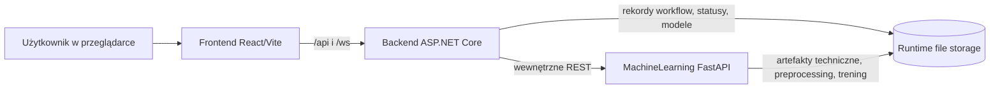

### Zasady komunikacji

Dozwolona komunikacja:
- `Przeglądarka -> Frontend`
- `Przeglądarka -> Backend` przez `/api/...`
- `Backend -> MachineLearning`

Niedozwolona komunikacja:
- `Frontend -> MachineLearning` bezpośrednio
- publiczne wystawienie `MachineLearning` jako głównego API produktu

### Odpowiedzialność warstw

- `Frontend` odpowiada za UI, formularze, wizualizację wyników, ekrany admina, monitoring treningów i realtime.
- `Backend` odpowiada za publiczne API, autoryzację, walidację, workflow, rekordy systemowe, statusy procesów i integrację z `ML`.
- `MachineLearning` jest wewnętrznym wystawcą usług ML dla backendu. Odpowiada za preprocessing, vision, inferencję cyfr, cleaning komórek, budowę artefaktów datasetowych i trening modeli.

### Architektura modułów

Backend jest zorganizowany według clean architecture:

```text
src/Backend/Sudoku/
  Models/          # modele domenowe i DTO bez zależności od HTTP, plików i ML clienta
  Application/     # use case'y, walidacje, orkiestracja, porty
  Infrastructure/  # implementacje portów: storage, klient ML, integracje systemowe
  Sudoku/          # projekt startowy API: controllers, contracts, DI, konfiguracja
  Application.Tests/
```

Szczegółowe zasady dla backendu są w `.cursor/rules/architecture_backend.mdc`.

MachineLearning również korzysta z clean architecture, ale pozostaje wewnętrzną usługą specjalistyczną:

```text
src/MachineLearning/
  api/             # startup FastAPI, kontrolery HTTP, modele API, konfiguracja runtime
  application/     # feature-first use case'y CQRS, DTO i porty
  infrastructure/  # adaptery CV/ML, trening, storage, reporting, integracje
  models/          # modele domenowe ML
  init_bootstrap/  # narzędzie operacyjne do inicjalizacji registry i active model
  tests/           # testy jednostkowe i integracyjne
  draft/           # notebooki i eksperymenty poza głównym runtime
```

Szczegółowe zasady dla ML są w `.cursor/rules/architecture_ml.mdc`.

Frontend jest zorganizowany feature-first w stylu `MVVC`:

```text
src/Frontend/src/
  app/             # kompozycja aplikacji, widoki główne, stan wspólny
  features/uc*/    # moduły funkcjonalne per UC
    api/           # View: komponenty React i sekcje UI dla danego UC
    application/   # ViewController: hooki, reducery, orkiestracja ekranu
    domain/        # Model: typy domenowe, walidacje, reguły UI
    infrastructure/# adaptery techniczne, jeśli UC ich potrzebuje
  api/             # klienci HTTP/WebSocket do backendu i guardy payloadów
  shared/          # współdzielone helpery UI/domenowe
  styles/          # style aplikacji
  types/           # wspólne typy API
```

W praktyce `View` nie zna bezpośrednio szczegółów HTTP, tylko korzysta z warstwy `application` i klientów z `api/`. Dzięki temu UI może rosnąć per historyjka bez mieszania logiki widoku, orkiestracji i kontraktów backendowych.

## Co zostało zrealizowane

Aktualny zakres repo obejmuje:

### Ścieżka solve

- `UC-01` - dodanie pliku Sudoku do przykładów
- `UC-02` - lista dostępnych przykładów Sudoku
- `UC-03` - pobranie wybranego pliku przykładowego
- `UC-04` - wstępna obróbka wybranego przykładu
- `UC-05` - rozpoznanie cyfr, solve i prezentacja wyniku
- `UC-20` - preprocessing lokalnego zdjęcia bez zapisu po stronie serwera
- `UC-22` - stabilizacja detekcji pustej komórki i cleaning runtime

### Ścieżka admin / trening / modele

- `UC-06` - uruchomienie treningu na `.npz`
- `UC-07` - postęp treningu i status zakończenia
- `UC-08` - lista treningów i modeli
- `UC-09` - szczegóły treningu i metryki
- `UC-10` - wybór aktywnego modelu do inferencji
- `UC-11` - lista surowych datasetów
- `UC-13` - prosta autoryzacja administracyjna
- `UC-14` - parametryzacja wybranych funkcjonalności z UI

### Docelowy workflow datasetowy

- `UC-17` - utworzenie trwałego `dataset preparation`
- `UC-21` - wspólne czyszczenie komórki podczas przygotowania danych
- `UC-18` - przeglądanie i usuwanie elementów z przygotowania
- `UC-19` - budowa finalnego `.npz` z przygotowania

### Ścieżki techniczne, migracyjne i pomocnicze

- `UC-00` - smoke test `FE -> BE -> ML`
- `UC-12` - wcześniejszy workflow bezpośredniej budowy `.npz` z `raw`
- `UC-15` - spowolnienie live solve
- `UC-16` - dawny przegląd preview po przygotowaniu
- `EXP-04` - testowa inferencja pojedynczej cyfry

## Główne przepływy systemu

### 1. Użytkownik rozwiązuje Sudoku

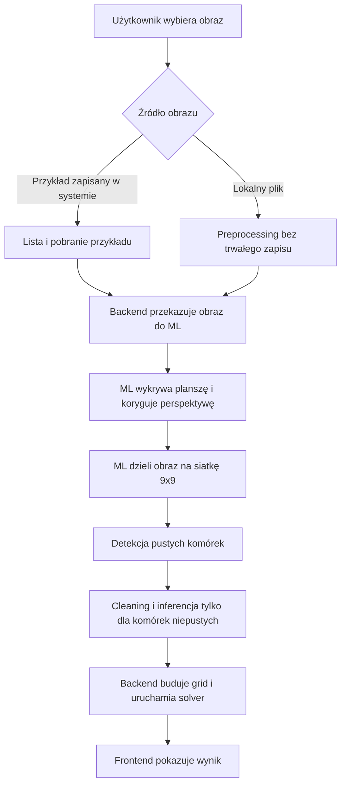

Ten przepływ obejmuje aktualną ścieżkę `UC-01 -> UC-05`, wariant lokalnego pliku z `UC-20` oraz stabilizację pustych komórek z `UC-22`.

### 2. Operator przygotowuje dane i model

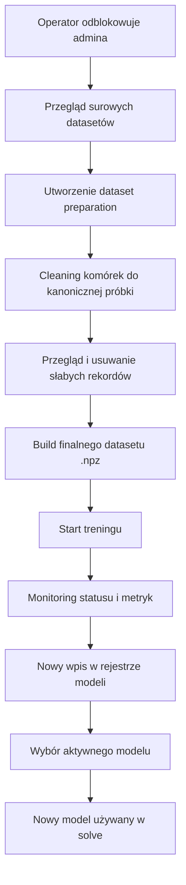

To jest docelowa oś admin/ML zgodna z `PRD`: `UC-11 -> UC-17 -> UC-21 -> UC-18 -> UC-19 -> UC-06 -> UC-10`.

### 3. Dane wejściowe do treningu

Zanim operator uruchomi workflow datasetowy, dane trzeba ręcznie umieścić w katalogach runtime. Aplikacja nie pobiera dużych datasetów sama i nie trzyma ich w repo.

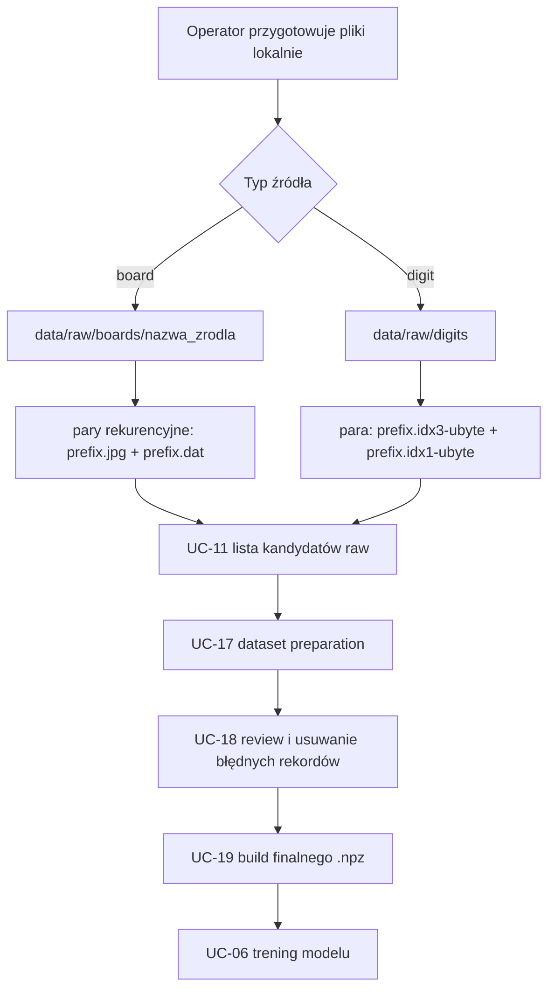

Zasady dla `board`:
- katalog źródła musi leżeć bezpośrednio pod `data/raw/boards`, np. `data/raw/boards/v1_training`,
- wewnątrz katalogu skanowanie jest rekurencyjne,
- plansza jest poprawnie rozpoznawana jako rekord tylko wtedy, gdy istnieje kompletna para `<prefix>.jpg` oraz `<prefix>.dat`,
- plik `.dat` ma co najmniej 11 linii: dwie pierwsze są metadanymi, a linie 3-11 zawierają grid `9x9`,
- każdy wiersz grida `.dat` musi mieć 9 wartości liczbowych rozdzielonych spacjami,
- wartość `0` oznacza pustą komórkę i nie jest traktowana jako klasa cyfry.

Zasady dla `digit`:
- pliki leżą bezpośrednio pod `data/raw/digits`,
- źródło jest wykrywane po wspólnym prefiksie pary `{prefix}.idx3-ubyte` oraz `{prefix}.idx1-ubyte`,
- plik `idx3-ubyte` zawiera obrazy, a `idx1-ubyte` etykiety,
- liczba obrazów i liczba etykiet musi być taka sama,
- etykiety powinny odpowiadać cyfrom, które mają trafić do klasyfikatora.

Zasady dla przykładów używanych w solve:
- obrazy przykładowe trafiają do `examples/uploads`,
- aplikacja obsługuje przede wszystkim `jpg`, `jpeg` i `png`,
- nazwa pliku jest identyfikatorem przykładu widocznym dla API i UI,
- lokalne zdjęcie z komputera użytkownika może przejść przez preprocessing bez trwałego zapisu po stronie serwera (`UC-20`).

Przykładowy układ:

```text
examples/
  uploads/
    sudoku_demo_01.jpg
    sudoku_demo_02.png

data/raw/
  boards/
    v1_training/
      board_001.jpg
      board_001.dat
      nested/
        board_002.jpg
        board_002.dat
  digits/
    train.idx3-ubyte
    train.idx1-ubyte
    t10k.idx3-ubyte
    t10k.idx1-ubyte
```

### 4. Dataset preparation

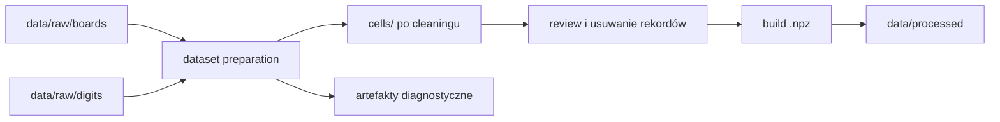

Ważne rozróżnienie: w workflow datasetowym zapis do `cells/` wynika z labela `1..9`, a nie z runtime'owej detekcji pustej komórki. Detekcja pustych pól jest elementem ścieżki solve.

### 5. Szukanie ramki planszy

W aktualnym runtime szukanie planszy skupia się na znalezieniu ramki Sudoku i poprawnym warpingu całego boardu. Pełne wykrywanie każdej linii wewnętrznej siatki było rozwijane w draftach, ale okazało się zbyt niestabilne dla wszystkich obrazów.

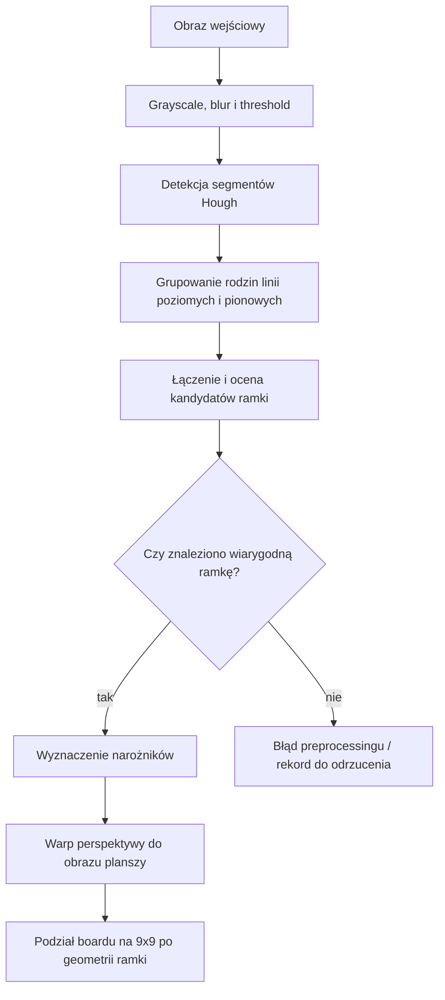

Konsekwencją tego podejścia jest to, że komórki są wycinane z podziału całej ramki, a nie z osobno wykrytych pól siatki. Działa to szybciej i stabilniej dla MVP, ale przy mocno przekrzywionych, niewyraźnych albo zlewających się liniach może zahaczać o fragmenty sąsiednich komórek.

### 6. Pipeline pojedynczej komórki w runtime

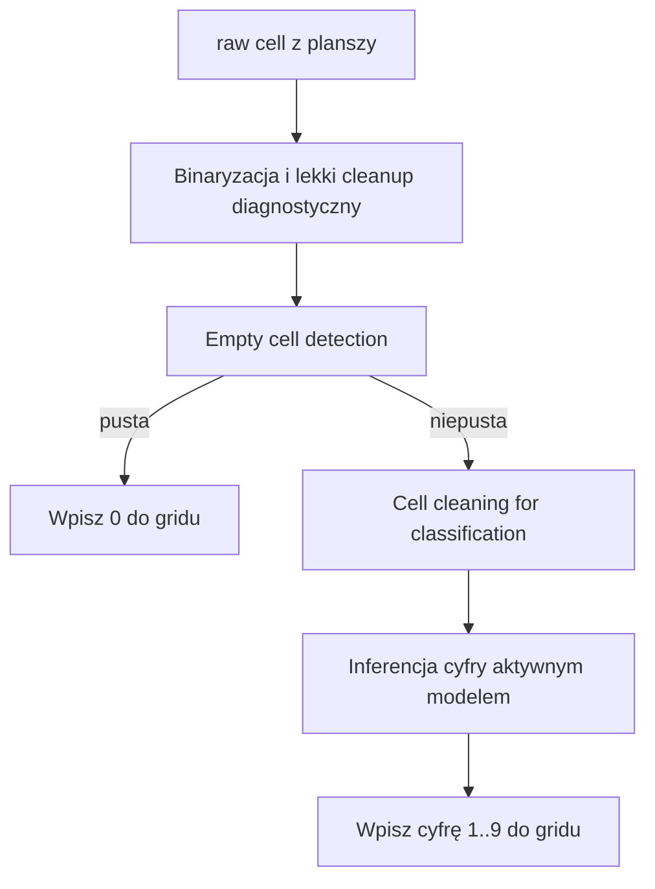

`UC-22` rozdziela decyzję „czy komórka jest pusta” od przygotowania próbki pod klasyfikator. Dzięki temu artefakty diagnostyczne, takie jak `center composite` czy overlaye segmentów, nie są mylone z próbką produkcyjną dla modelu.

### 7. Detekcja pustej komórki

W eksperymentach lepiej sprawdziła się heurystyka łącząca analizę pikseli i segmentów niż proste liczenie udziału ciemnych pikseli w całej komórce.

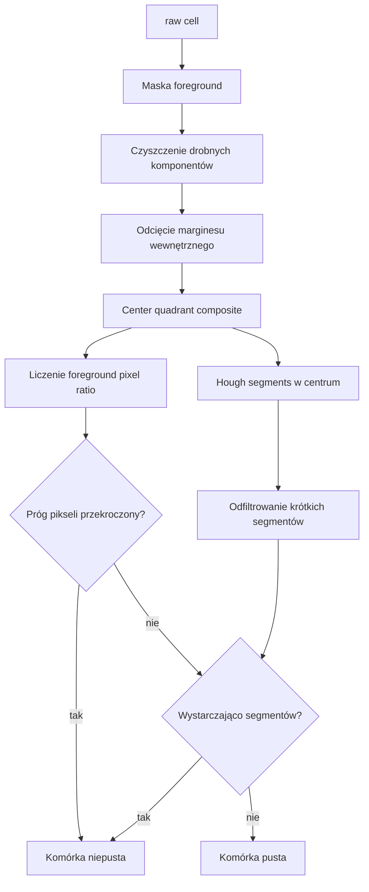

Logika wykorzystuje centralny obszar komórki, budowany jako `center composite`, a następnie sprawdza dwa sygnały:
- udział ciemnych pikseli w centrum,
- liczbę istotnych segmentów Hough po odfiltrowaniu krótkich odcinków.

Ten wariant jest odporniejszy na część artefaktów siatki niż samo liczenie pikseli, ale nadal ma ograniczenia. Cyfra `1` jest szczególnie trudna, bo bywa cienka, pionowa i podobna do pozostałości linii siatki.

### 8. Parametry solve i detekcji pustych pól

Frontend ma bogaty panel parametrów z opisem edukacyjnym: dla każdego parametru opisano jego cel, efekt zmiany, kiedy warto go ruszać i jak testować korekty. To jest element `UC-14` i ma pomagać w świadomym dostrajaniu pipeline'u, a nie w losowym klikaniu wartości.

Najważniejsze parametry dla pustej komórki:
- `emptyCellDarkPixelRatioThreshold` - próg udziału foreground pixels w centrum,
- `emptyCellMinSegmentLengthPx` - minimalna długość segmentu Hough liczona jako istotny sygnał,
- `emptyCellFilteredSegmentCountThreshold` - liczba odfiltrowanych segmentów potrzebna do uznania komórki za niepustą.

Domyślne wartości w kodzie są zachowawcze:

```text
emptyCellDarkPixelRatioThreshold = 0.02
emptyCellMinSegmentLengthPx = 8
emptyCellFilteredSegmentCountThreshold = 2
```

W praktycznych testach lepiej sprawdzał się ostrzejszy zestaw dla trudniejszych obrazów:

```text
emptyCellDarkPixelRatioThreshold = 0.15
emptyCellMinSegmentLengthPx = 18
emptyCellFilteredSegmentCountThreshold = 5
```

Te wartości nie są uniwersalnym optimum dla każdego zdjęcia. Są dobrym punktem startu, gdy puste komórki są zbyt często brane za cyfry przez resztki siatki, szum lub artefakty po warpie.

### 9. Trening, rejestr i aktywny model

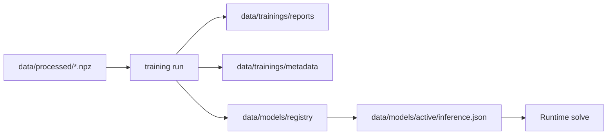

Lokalnie rejestr modeli i aktywny model trzeba zainicjalizować przez `src/MachineLearning/init_bootstrap` zgodnie z `INSTALL.md`. Na serwerze ten bootstrap jest częścią automatyzacji deployu.

## Aktualny flow danych i modeli

Docelowy workflow projektu to:

```text
raw -> preparation -> cleanup/review -> build .npz -> training -> active model -> solve
```

To jest aktualny kierunek zgodny z `PRD`. W szczególności:
- ciężki preprocessing nie powinien być powtarzany przy każdej przebudowie datasetu,
- `dataset preparation` jest trwałym etapem pośrednim,
- cleaning komórki powinien być wspólny dla treningu i runtime,
- stare ścieżki bezpośredniego builda `.npz` z `raw` są migracyjne,
- lokalne uruchomienie i bootstrap runtime są opisane w `INSTALL.md`.

## Podział odpowiedzialności i historyjki

`README.md` pokazuje mapę projektu, a nie zastępuje szczegółowych opisów `UC`. Pełny backlog i status koncepcyjny są w `.ai/prd.md`, a dokumenty per funkcjonalność są w `.ai/feature/`.

Poniższa tabela utrzymuje roboczy podział odpowiedzialności. Dla nowszych `UC`, które doszły po pierwszym podziale prac, wpisany jest `Wojtek` w każdej warstwie, która była potrzebna do realizacji danej funkcjonalności.

| ID | Zakres | INFRA | FE | BE | ML |
| --- | --- | --- | --- | --- | --- |
| `INF-01` | Szkielet repo, README, przykłady do demo | `Wojtek` | — | — | — |
| `INF-02` | Uruchomienie lokalne całego systemu | `Wojtek` | — | — | — |
| `INF-03` | Środowisko serwerowe, SSL, reverse proxy, layout runtime | `Wojtek` | — | — | — |
| `INF-04` | Standardy jakości i zasady pracy | `Wojtek` | — | — | — |
| `INF-05` | Notebooki, drafty i środowisko eksperymentalne | `Wojtek` | — | — | `Wojtek` |
| `INF-06` | Workflow jakości i CI | `Wojtek` | `Wojtek` | `Wojtek` | `Wojtek` |
| `INF-07` | CD i deploy na serwer | `Wojtek` | `Wojtek` | `Wojtek` | `Wojtek` |
| `INF-08` | Bootstrap rejestru modeli i manifestów | `Wojtek` | — | `Wojtek` | `Wojtek` |
| `UC-00` | Smoke test `FE -> BE -> ML` | — | `Wojtek` | `Wojtek` | `Wojtek` |
| `UC-01` | Upload pliku Sudoku do `examples` | — | `Adam` | `Wojtek` | — |
| `UC-02` | Lista przykładów Sudoku | — | `Adam` | `Wojtek` | — |
| `UC-03` | Pobranie przykładu Sudoku | — | `Adam` | `Wojtek` | — |
| `UC-04` | Wstępna obróbka wybranego przykładu | — | `Adam` | `Wojtek` | `Wojtek` / `Michał` |
| `UC-05` | Rozpoznanie cyfr, solve i prezentacja wyniku | — | `Wojtek` | `Wojtek` | `Wojtek` |
| `UC-06` | Uruchomienie treningu na `.npz` | — | `Adam` | `Wojtek` | `Wojtek` |
| `UC-07` | Postęp treningu i status zakończenia | — | `Adam` | `Wojtek` | `Wojtek` |
| `UC-08` | Lista treningów i modeli | — | `Adam` | `Wojtek` | `Wojtek` |
| `UC-09` | Szczegóły treningu i metryki | — | `Adam` | `Wojtek` | `Wojtek` |
| `UC-10` | Wybór aktywnego modelu | — | `Adam` | `Wojtek` | `Wojtek` |
| `UC-11` | Lista surowych datasetów | — | `Adam` | `Wojtek` | — |
| `UC-12` | Dawny workflow bezpośredniej budowy `.npz` | — | `Adam` | `Wojtek` | `Wojtek` |
| `UC-13` | Prosta autoryzacja administracyjna | — | `Adam` | `Wojtek` | — |
| `UC-14` | Parametryzacja funkcjonalności z UI | — | `Wojtek` | `Wojtek` | `Wojtek` |
| `UC-15` | Spowolnienie live solve | — | `Wojtek` | `Wojtek` | — |
| `UC-16` | Dawny przegląd preview po przygotowaniu | — | — | — | `Wojtek` |
| `UC-17` | Utwórz `dataset preparation` | — | `Wojtek` | `Wojtek` | `Wojtek` |
| `UC-18` | Przeglądaj i usuwaj elementy z przygotowania | — | `Wojtek` | `Wojtek` | — |
| `UC-19` | Zbuduj finalny `.npz` z przygotowania | — | `Wojtek` | `Wojtek` | `Wojtek` |
| `UC-20` | Preprocess lokalnego zdjęcia bez zapisu | — | `Wojtek` | `Wojtek` | `Wojtek` |
| `UC-21` | Cleaning komórki podczas przygotowania danych | — | — | `Wojtek` | `Wojtek` |
| `UC-22` | Detekcja pustej komórki i cleaning runtime | — | `Wojtek` | `Wojtek` | `Wojtek` |
| `EXP-04` | Testowa inferencja pojedynczej cyfry | — | — | — | `Wojtek` |

Najważniejsze grupy historyjek:

- `UC-01` do `UC-05` - podstawowa ścieżka użytkownika od przykładu do rozwiązania Sudoku.
- `UC-20` i `UC-22` - aktualne rozszerzenia runtime solve: lokalny plik bez zapisu oraz stabilna detekcja pustych komórek.
- `UC-11`, `UC-17`, `UC-21`, `UC-18`, `UC-19` - docelowy workflow datasetowy.
- `UC-06` do `UC-10` - trening, monitoring, rejestr modeli i aktywny model.
- `UC-12`, `UC-15`, `UC-16` - elementy migracyjne lub techniczne, nie główna oś produktu.

## Jak poruszać się po repozytorium

Najwygodniej czytać repo w kolejności:

1. `README.md`
2. `INSTALL.md`
3. `TECH-STACK.md`
4. `.ai/prd.md`
5. `.ai/feature/...`
6. `.ai/implementation-plan/...`
7. kod w `src/...`

### Główne katalogi

- `src/Frontend` - aplikacja `React/Vite`
- `src/Backend/Sudoku` - backend `.NET` z podziałem na `Models`, `Application`, `Infrastructure` i projekt startowy `Sudoku`
- `src/MachineLearning` - warstwa `Python/FastAPI`, preprocessing, inferencja, trening i testy
- `src/MachineLearning/draft` - drafty, notebooki i eksperymenty związane z wykrywaniem ramki planszy, dzieleniem siatki i diagnostyką pipeline'u
- `.ai` - dokumentacja produktowa, feature docs, implementation plans, bugi i eksperymenty
- `.github/workflows` - workflow CI/CD i release dla warstw systemu
- `data` - lokalne artefakty runtime: datasety, przygotowania, modele i treningi
- `examples` - przykładowe obrazy Sudoku widoczne w aplikacji
- `tmp` - artefakty tymczasowe tworzone podczas preprocessingów, buildów datasetów i treningów

### System plików projektowy

To jest układ repo z punktu widzenia pracy nad projektem:

```text
.
  README.md                         # mapa produktu, architektury i workflow
  INSTALL.md                        # lokalna instalacja, konfiguracja i uruchomienie
  TECH-STACK.md                     # katalog technologii i zależności

  .cursor/
    rules/                          # trwałe zasady architektury, kontraktów i stylu

  .ai/
    prd.md                          # zakres produktu i mapa UC
    feature/                        # opisy funkcjonalności per UC
    implementation-plan/            # techniczne plany realizacji
    DokumentacjaDeployuRuntimeSerwera.md

  .github/
    workflows/                      # CI/CD, release i deploy

  src/
    Backend/Sudoku/                 # backend clean architecture
    MachineLearning/                # wewnętrzny serwis ML clean architecture
    Frontend/                       # frontend React/Vite w układzie MVVC

  examples/                         # runtime examples, poza kodem aplikacji
  data/                             # runtime datasets, preparations, trainings, models
  tmp/                              # runtime workspace dla operacji tymczasowych
```

`src/Backend/Sudoku`, `src/MachineLearning` i `src/Frontend` mają własne wewnętrzne podziały opisane w sekcji `Architektura modułów`. Katalogi `data`, `examples` i `tmp` są częścią runtime, a nie miejscem na logikę aplikacyjną.

### System plików runtime

Lokalne katalogi runtime nie są tylko „śmietnikiem plików”. Każdy z nich odpowiada konkretnemu etapowi workflow:

```text
examples/
  uploads/                  # obrazy Sudoku dodane jako przykłady do aplikacji

data/
  raw/
    boards/                 # surowe datasety plansz, pary *.jpg + *.dat
    digits/                 # surowe datasety cyfr, pliki idx3/idx1
  preparations/             # trwałe dataset preparation po UC-17
  processed/                # finalne datasety .npz po UC-19
  models/
    registry/               # rejestr modeli i manifesty
    active/                 # aktywny model inferencyjny, m.in. inference.json
  trainings/
    runs/                   # artefakty uruchomień treningowych
    reports/                # raporty i metryki
    metadata/               # statusy i metadane widoczne dla backendu

tmp/
  datasets/                 # tymczasowe artefakty builda datasetów
  solve-sessions/metadata/  # tymczasowe metadane sesji solve
  trainings/                # katalog roboczy treningów
```

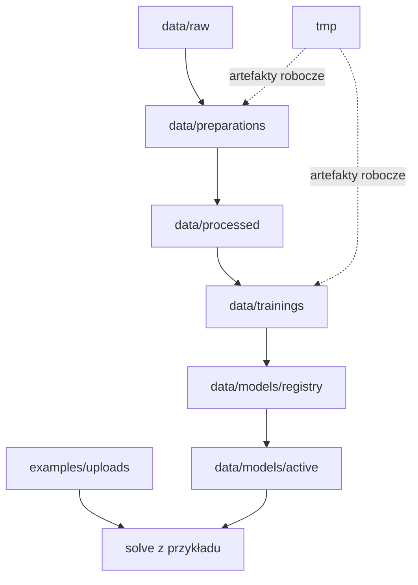

`Backend` decyduje, które rekordy i statusy są widoczne dla UI. `MachineLearning` może tworzyć pliki techniczne, ale ich znaczenie w workflow powinno przechodzić przez backend.

### Drafty i notebooki

W projekcie istnieją drafty i notebooki wspierające rozwój algorytmów vision, w szczególności:
- `src/MachineLearning/draft/FinalApi/final_api_uc04_uc06_preview.ipynb`
- `src/MachineLearning/draft/raw_line_family_only/experiment.ipynb`

Te materiały dotyczą m.in. prób znalezienia ramki planszy, podziału planszy na siatkę, diagnostyki segmentów, logical lines i warpingu. To zaplecze eksperymentalne, a nie główna ścieżka runtime.

## Wnioski z eksperymentów

Najważniejsze decyzje projektowe wynikające z eksperymentów vision/ML:

- Sam preprocessing obrazu nie wystarczał jako stabilny kontrakt produktu. Potrzebne okazało się rozdzielenie wykrywania planszy, podziału na komórki, diagnostyki linii i późniejszej inferencji.
- Detekcja pustej komórki musi być osobnym etapem przed czyszczeniem próbki pod klasyfikator. W przeciwnym razie artefakty diagnostyczne, szum i linie siatki zaczynają mieszać się z danymi produkcyjnymi dla modelu.
- `Cell cleaning` powinien być wspólny dla runtime solve i przygotowania danych treningowych. To ogranicza ryzyko rozjazdu między tym, co model widzi w treningu, a tym, co dostaje podczas inferencji.
- Ciężki preprocessing datasetów nie powinien być powtarzany przy każdej budowie `.npz`. Dlatego docelowy workflow ma trwały etap `dataset preparation`, a finalny `.npz` jest artefaktem budowanym z przygotowania.
- Rejestr modeli i aktywny model muszą być jawne. Sam fakt, że plik modelu istnieje na dysku, nie wystarcza do kontrolowanego runtime; backend musi wiedzieć, który model jest aktywny i jakie ma metadane.
- ML powinien wystawiać usługi obliczeniowe i techniczne artefakty, ale nie powinien stawać się drugim źródłem prawdy dla workflow. Statusy widoczne dla użytkownika i admina należą do backendu.
- Flow użytkownika i flow admina mają inne potrzeby UX. Solve wymaga prostego wyniku i szybkiej diagnostyki błędu, a workflow datasetowy wymaga trwałych kroków, przeglądu jakości danych i możliwości powtórzenia builda/treningu.
- Dane wejściowe muszą mieć ściśle kontrolowany format już na poziomie katalogów runtime. `board` jako pary `.jpg + .dat`, `digit` jako pary `idx3/idx1` i przykłady w `examples/uploads` nie są detalem instalacyjnym, tylko warunkiem poprawnego działania pipeline'u.
- Workflow datasetowy musi zakładać, że część danych przejdzie preprocessing źle. Dlatego `dataset preparation`, review i usuwanie rekordów są częścią jakości danych, a nie dodatkiem do UI.
- Wykrywanie ramki planszy okazało się praktyczniejszym kompromisem niż próba polegania na pełnym, stabilnym wykryciu wszystkich linii siatki. To uprościło runtime, ale przeniosło część ryzyka na jakość wyciętych komórek.
- Parametryzacja solve jest potrzebna, bo jeden zestaw progów nie działa idealnie dla wszystkich obrazów. Panel parametrów z opisem edukacyjnym stał się narzędziem diagnostycznym i demonstracyjnym, a nie tylko konfiguracją techniczną.
- Heurystyka pustej komórki oparta o `center composite`, foreground ratio i segmenty Hough jest lepsza od samego liczenia pikseli, ale wymaga świadomego strojenia. W praktyce wartości `0.15`, `18 px` i `5 segmentów` były użytecznym punktem startu dla trudniejszych obrazów.

### Ograniczenia i czego nie udało się dopracować

Projekt ma działający pełny workflow, ale nie wszystkie problemy vision/ML udało się domknąć w czasie dostępnej pracy:

- W notebookach i draftach widać, że dla części obrazów `.jpg` nie udało się stabilnie znaleźć wszystkich linii wewnętrznej siatki Sudoku. To wymusiło ograniczenie runtime do wykrycia ramki planszy i podziału komórek geometrycznie po ramce.
- Brak stabilnego wykrywania każdej linii siatki oznacza, że nie dało się ciąć idealnie po realnych granicach pojedynczych komórek. Nawet po warpie wycinek komórki może zahaczać o sąsiednie pola albo resztki linii.
- Nie wszystkie ramki z dostępnych datasetów są poprawnie obrysowywane. Problem pojawia się szczególnie przy dużym kącie zdjęcia, niewyraźnych krawędziach, zlewaniu się linii siatki z tłem albo bliskimi liniami z obrazu.
- Z tego powodu w `dataset preparation` potrzebny jest etap review i możliwość usuwania rekordów, które przeszły cleaning niepoprawnie. To nie jest tylko wygoda UI, ale mechanizm kontroli jakości danych.
- Model cyfr nie rozpoznaje dowolnego pisma. Testy z ręcznie wpisanymi cyframi pokazały, że niektóre znaki trzeba było poprawić, a model najlepiej działa dla formy pisma podobnej do danych treningowych. Dalsza poprawa wymagałaby dotrenowania na własnym piśmie i lepszego oczyszczenia próbek.
- Detekcja pustej komórki nadal może mylić się na nieoczyszczonych danych. Artefakty po siatce, szum i cienkie kreski mogą zostać uznane za cyfrę, a cyfra `1` bywa podobna do pionowego fragmentu linii.
- Część modeli widocznych w rejestrze lub możliwych do zbootstrapowania nie jest pełnoprawnie obsłużona jako wybór operacyjny. Wyższe modele `resnet` są cięższe od lokalnego `CNN`, a nie wszystkie mają gotowe profile i ścieżki runtime.
- Modele typu `resnet`, nawet mniejsze warianty jak `resnet18`, są znacznie cięższe od własnego `CNN`. To ma znaczenie dla czasu treningu, inferencji, zasobów serwera i sensowności użycia w MVP.
- Oczyszczanie danych i przygotowanie większego datasetu na serwerze może trwać długo, nawet powyżej 2 godzin, zależnie od rozmiaru danych i jakości obrazów.
- Frontend może mieć jeszcze drobne błędy lub miejsca niedopracowane responsywnie. W niektórych przypadkach obejściem może być kliknięcie w inne miejsce, ponowienie akcji albo odświeżenie widoku.
- Projekt ma potencjał do dalszego rozwoju, ale ograniczenie czasu nie pozwoliło dopracować stabilnego i wydajnego znajdowania każdej linii siatki ani pełnej optymalizacji przeszukiwania geometrycznego.
- Nie każdy algorytm w takim projekcie da się skutecznie „wygenerować przez AI”. Duża część matematyki obrazu, geometrii, progowania i heurystyk wymagała ręcznego projektowania, testowania oraz korekt wspieranych eksperymentami.

## Dokumentacja projektowa

Najważniejsze źródła wiedzy:

- `INSTALL.md` - jak zainstalować i uruchomić system lokalnie
- `TECH-STACK.md` - lista technologii i zależności projektowych
- `.ai/prd.md` - pełny zakres produktu, backlog i docelowy model workflow
- `.cursor/rules/architecture_backend.mdc` - zasady architektury backendu
- `.cursor/rules/architecture_ml.mdc` - zasady architektury ML
- `.ai/feature/` - szczegóły historyjek oraz rozbicie per warstwa
- `.ai/implementation-plan/` - techniczne plany realizacji endpointów i kroków implementacyjnych
- `.github/workflows/` - workflow budowy, testów i deployu
- `.ai/DokumentacjaDeployuRuntimeSerwera.md` - szczegóły runtime i deployu serwerowego

### Workflow GitHub

Repo korzysta obecnie z:
- `frontend-cd.yml`
- `backend-cd.yml`
- `ml-cd.yml`
- `only-dev-to-main.yml`

To właśnie w `.github/workflows/` utrzymywany jest pipeline budowy, walidacji i release'u poszczególnych warstw.

### Pipeline deployu serwerowego

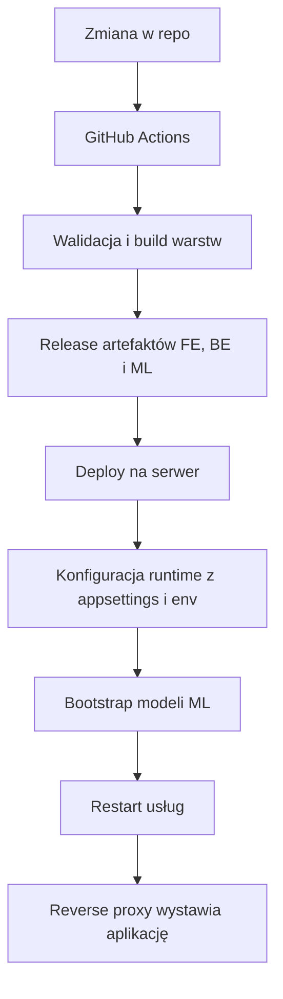

Szczegóły operacyjne deployu, ścieżek produkcyjnych i runtime serwera są utrzymywane w `.ai/DokumentacjaDeployuRuntimeSerwera.md`. `README.md` zostawia tylko mapę przepływu.

## Testy

Backend:

```bash
dotnet test src/Backend/Sudoku/Application.Tests/Application.Tests.csproj
```

MachineLearning:

```bash
source .ml-venv/bin/activate
pytest src/MachineLearning/tests
```

