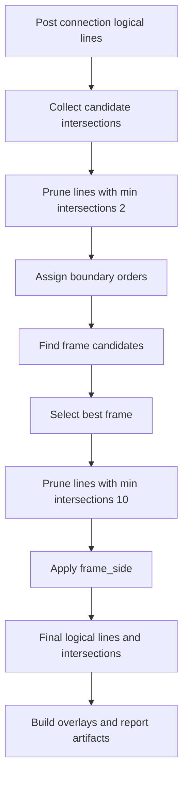

# Raw Line Family Only - intersections, ramka i wizualizacje

## Cel

Ten plik jest teraz krótkim indeksem końcowej części pipeline'u
`raw_line_family_only`.

Po refaktorze i dołożeniu nowych overlayów jeden dokument łączący
intersections, frame selection i wszystkie wizualizacje stał się zbyt szeroki.

## Zakres końcowego etapu

Końcowa część pipeline'u obejmuje dziś:

- analizę przecięć między poziomymi i pionowymi `LogicalLine`,
- pruning linii na podstawie liczby przecięć,
- budowę kandydatów ramki,
- wybór najlepszej ramki i przypisanie `frame_side`,
- wizualizacje i raportowanie artefaktów notebooka.

Budowa `LogicalLine`, containment, vertex merge i pixel connection są opisane w:

- `logical_line_build_and_grouping.md`
- `logical_line_containment_and_vertex_merge.md`
- `logical_line_pixel_connection.md`

## Mapa dokumentów

### 1. Analiza przecięć i wybór ramki

Plik: `intersection_analysis_and_frame_selection.md`

Zakres:

- wejście ze stanu `post_connection`,
- modele intersections,
- pruning `2 -> ordering -> frame candidates -> best frame -> pruning 10`,
- `border_pairs`,
- przypisanie `frame_side`.

### 2. Wizualizacje i artefakty

Plik: `visualization_and_artifacts.md`

Zakres:

- agregacja renderów z `visualization.py`,
- boardy i overlaye dla etapów pośrednich,
- finalne overlaye intersections, frames i tolerance rectangles,
- związek z `pipeline_report.py` i `pipeline_plots.py`.

## Aktualny flow końcowego etapu

## Najważniejsze założenia aktualnej wersji

1. Analiza przecięć działa na liniach po pixel connection, czyli na stanie
   `post_connection`.
2. Pruning intersections jest dwuetapowy: najpierw próg `2`, potem próg `10`.
3. `frame_side` jest nadawane dopiero po wyborze najlepszej ramki.
4. Wizualizacje i raport są częścią eksperymentu, a nie pobocznym dodatkiem.
