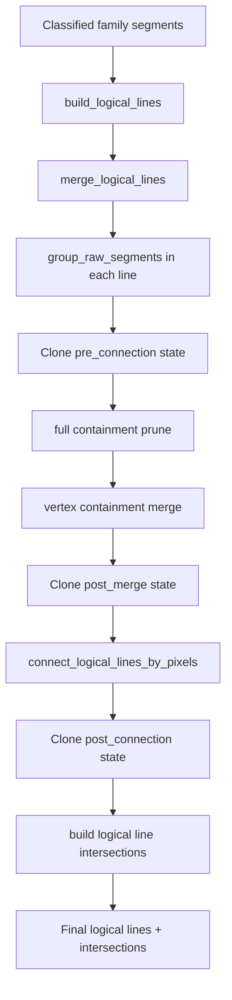

# Raw Line Family Only - lifecycle `LogicalLine`

## Cel

Ten plik jest teraz krótkim indeksem dokumentacji dla etapu `LogicalLine`.

Po refaktorze i rozbudowie heurystyk lifecycle linii logicznych jest już zbyt
duży, żeby utrzymywać cały opis w jednym pliku bez niepotrzebnego kontekstu.

## Zakres tego etapu

Lifecycle `LogicalLine` obejmuje dziś:

- budowę linii z segmentów rodzin poziomych i pionowych,
- merge geometryczny segmentów i całych linii,
- grouping segmentów `RAW`,
- full containment prune,
- vertex containment merge,
- pixel-validated connection,
- zbieranie przecięć między rodziną poziomą i pionową,
- snapshoty stanów `pre_connection`, `post_merge` i `post_connection`,
- finalne kolekcje linii po connection.

Preprocessing, notebook, artefakty i pełna orkiestracja są opisane w
`pipeline_overview.md`.

Finalne wizualizacje i artefakty są opisane w:

- `visualization_and_artifacts.md`

## Mapa dokumentów

### 1. Budowa linii i grouping `RAW`

Plik: `logical_line_build_and_grouping.md`

Zakres:

- modele bazowe i `LogicalLine`,
- budowa wstępnych linii,
- merge geometryczny,
- grouping segmentów `RAW`,
- znaczenie stanu `pre_connection`.

### 2. Containment i merge po wierzchołku

Plik: `logical_line_containment_and_vertex_merge.md`

Zakres:

- full containment prune,
- grupowanie po ciągłości osi poprzecznej,
- vertex containment merge,
- znaczenie stanu `post_merge`.

### 3. Pixel connection

Plik: `logical_line_pixel_connection.md`

Zakres:

- `ToleranceRectangle`,
- `ConnectionKind`,
- wyszukiwanie ścieżki po białych pikselach,
- rozróżnienie między connection tej samej osi i connection cross-axis,
- segmenty `SAME_AXIS_CONNECTION` i `CROSS_AXIS_CONNECTION`,
- znaczenie stanu `post_connection`.

### 4. Intersections

Plik: `intersections_and_visualization.md`

Zakres:

- model `LogicalLineIntersection`,
- niezależne pole `kind` oraz pola `horizontal_order` / `vertical_order`,
- wybór referencyjnej pary segmentów dla przecięcia,
- znaczenie aktywnego etapu intersections po connection.

## Aktualny flow

## Najważniejsze założenia aktualnej wersji

1. `LogicalLine` jest głównym nośnikiem stanu domenowego dla etapu linii.
2. `logical_lines.py` jest publiczną fasadą, a logika jest rozbita na mniejsze
   wyspecjalizowane moduły `logical_line_*`.
3. Grouping `RAW`, containment, vertex merge i pixel connection to cztery różne
   etapy i nie należy ich mieszać w dokumentacji.
4. Segmenty connection są częścią finalnej linii, a nie tylko wizualnym
   dodatkiem.
5. `SAME_AXIS` i `CROSS_AXIS` nie mają już tej samej semantyki wykonania:
   `same-axis` może materializować ścieżkę BFS, a `cross-axis` używa BFS tylko
   do walidacji kontaktu i później buduje prostszy connector minimalizujący
   skręt.
6. Końcowa geometria linii nie przechodzi już przez osobny etap
   `intersection/frame`; finalne `horizontal_logical_lines` i
   `vertical_logical_lines` są dziś stanem po connection.
7. Po connection działa aktywne zbieranie `logical_line_intersections`, ale nie
   wrócił dawny etap analizy ramki ani przypisywania `frame_side`.
