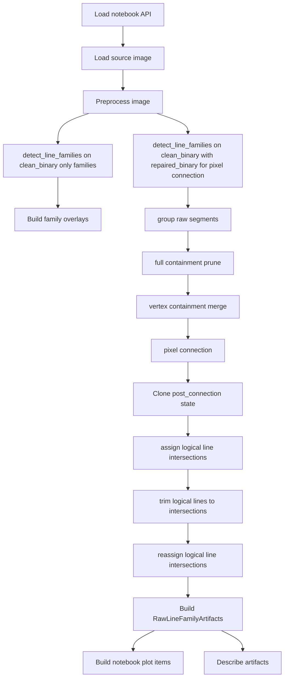

# Raw Line Family Only - pipeline i artefakty

## Cel

Ten dokument opisuje aktualną orkiestrację eksperymentu
`raw_line_family_only` z perspektywy notebooka i pipeline'u.

Zakres obejmuje:

- bootstrap API do notebooka,
- preprocessing obrazu,
- sposób wywołania `detect_line_families(...)`,
- budowę `RawLineFamilyArtifacts`,
- raport tekstowy i listę plotów.

Szczegóły domenowe `LogicalLine`, containment i connection są opisane w:

- `logical_line_lifecycle.md`
- `logical_line_build_and_grouping.md`
- `logical_line_containment_and_vertex_merge.md`
- `logical_line_pixel_connection.md`
- `intersections_and_visualization.md`
- `visualization_and_artifacts.md`

## Główne pliki

- `bootstrap.py`
- `pipeline/pipeline.py`
- `pipeline/pipeline_artifacts.py`
- `pipeline/pipeline_report.py`
- `pipeline/pipeline_plots.py`
- `pipeline/pipeline_selection.py`
- `detection.py`
- `visualization/visualization.py`

## Rola notebooka i bootstrapu

Aktualny notebook eksperymentalny to `experiment.ipynb`.

Notebook korzysta z API budowanego przez `load_api()` z `bootstrap.py`.

Bootstrap odpowiada za:

- dodanie katalogu wariantu oraz podkatalogów `pipeline/` i `visualization/`
  do `sys.path`,
- wyczyszczenie wcześniej załadowanych modułów z bieżącego wariantu,
- ponowny import modułów we właściwej kolejności,
- złożenie jednego obiektu `Api`.

Najważniejsze elementy `Api`:

- `ExperimentConfig`
- funkcje preprocessingu:
  - `apply_median_denoise`
  - `apply_gaussian_threshold`
  - `apply_soft_component_cleanup`
  - `apply_directional_close_repair`
- `detect_line_families`
- funkcje renderujące z `visualization/visualization.py`
- narzędzia pomocnicze notebooka:
  - `resolve_active_image_path`
  - `path_for_display`
  - `plot_named_images`

To API jest stabilnym punktem wejścia dla notebooka po refaktorze nazw plików i
po rozdzieleniu helperów do podkatalogów `pipeline/` oraz `visualization/`.

## Importy w notebooku

Notebook powinien używać lokalnych importów:

- `import bootstrap`
- `import pipeline`

Zamiast importów od repo root typu `from src.MachineLearning...`, bo aktywny
kernel działa na ścieżkach dodawanych dynamicznie przez `bootstrap.py`.

## Wejście pipeline

Publiczny entrypoint w warstwie pipeline'u:

- `run_raw_line_family_pipeline(...)` z `pipeline/pipeline.py`

Wejście:

- `active_image_path`
- `config`
- `notebook_api`

Wyjście:

- `RawLineFamilyArtifacts`

## Etapy preprocessingu

Aktualna kolejność w `run_raw_line_family_pipeline(...)`:

1. wczytanie obrazu przez `load_image_bgr(...)`
2. przygotowanie obrazu do pracy i wyświetlania przez `resize_for_display(...)`
3. konwersja do skali szarości:
   - `gray_image`
4. median denoise:
   - `denoised_image`
   - `denoise_name = median_{kernel}`
5. adaptacyjna binaryzacja Gaussa:
   - `binary_image`
   - `threshold_name = gaussian_block{...}_c{...}`
6. soft cleanup komponentów:
   - `clean_binary`
   - `cleanup_name = adaptive_plus_components_soft`
   - `min_component_area_px`
7. directional close repair:
   - `repaired_binary`
   - `repair_name = directional_close`

Znaczenie obrazów:

- `clean_binary` jest używane do detekcji rodzin i wejściowych segmentów Hougha,
- `repaired_binary` jest używane jako obraz do pixel connection i do większości
  finalnych overlayów debugowych.

## Dwa przebiegi `detect_line_families(...)`

Pipeline wywołuje `detect_line_families(...)` dwa razy.

### Przebieg 1: tylko rodziny

Wywołanie:

- `detect_line_families(clean_binary, config, include_logical_lines=False)`

Cel:

- dostać `horizontal_segments` i `vertical_segments`,
- zbudować overlay rodzin linii na `clean_binary` i na obrazie źródłowym,
- nie uruchamiać cięższych etapów `LogicalLine`.

To jest czysto diagnostyczny przebieg do wizualizacji segmentów rodzin.

### Przebieg 2: pełna detekcja

Wywołanie:

- `detect_line_families(
  clean_binary,
  config,
  pixel_connection_binary_image=repaired_binary,
  )`

Cel:

- zbudować komplet stanów pośrednich i finalnych,
- uruchomić grouping `RAW`,
- wykonać full containment prune,
- wykonać vertex containment merge,
- wykonać pixel connection,
- przypisać przecięcia między rodzinami linii,
- przyciąć linie do przecięć i ponownie przeliczyć intersections,
- zwrócić wynik do raportu i renderów notebooka.

Ważne rozdzielenie odpowiedzialności:

- rodziny i wejściowe segmenty pochodzą z `clean_binary`,
- walidacja przejść po pikselach odbywa się na `repaired_binary`.

## Co zwraca `detect_line_families(...)`

Główny wynik domenowy to `RawLineFamilyResult` z `detection.py`.

Najważniejsze pola:

- `raw_segment_count`
- `orientation_offset_degrees`
- `horizontal_angle_degrees`
- `vertical_angle_degrees`
- `horizontal_segments`
- `vertical_segments`
- `horizontal_pre_connection_logical_lines`
- `vertical_pre_connection_logical_lines`
- `horizontal_containment_prune_result`
- `vertical_containment_prune_result`
- `horizontal_vertex_containment_merge_result`
- `vertical_vertex_containment_merge_result`
- `horizontal_post_merge_logical_lines`
- `vertical_post_merge_logical_lines`
- `horizontal_post_connection_logical_lines`
- `vertical_post_connection_logical_lines`
- `horizontal_logical_lines`
- `vertical_logical_lines`
- `logical_line_intersections`

Interpretacja stanów:

- `pre_connection` oznacza stan po grouping segmentów `RAW`,
- `horizontal_containment_prune_result` i `vertical_containment_prune_result`
  opisują full containment prune pomiędzy grouping `RAW` a merge'em vertex,
- `horizontal_vertex_containment_merge_result` i
  `vertical_vertex_containment_merge_result` opisują diagnostykę merge'u,
- `post_merge` oznacza stan po merge'u vertex i przed pixel connection,
- `post_connection` oznacza snapshot po pixel connection, ale jeszcze przed
  trimem do przecięć,
- kolekcje finalne `horizontal_logical_lines` i `vertical_logical_lines`
  oznaczają dziś stan końcowy eksperymentu po trimie do przecięć,
- `logical_line_intersections` oznacza aktywny etap zbierania przecięć po
  connection oraz po odświeżeniu ich po trimie,
- `order` w modelu przecięcia opisuje pozycję przecięcia na linii osiowej.

## Budowa `RawLineFamilyArtifacts`

`run_raw_line_family_pipeline(...)` buduje następnie `RawLineFamilyArtifacts`
z `pipeline/pipeline_artifacts.py`.

Notebook może też zbudować te artefakty ręcznie, ale powinien zachować tę samą
semantykę pól i kolejność stanów co `pipeline/pipeline.py`.

Artefakty można podzielić na cztery grupy.

### 1. Obrazy preprocessingu

- `source_bgr`
- `display_bgr`
- `gray_image`
- `denoised_image`
- `binary_image`
- `clean_binary`
- `repaired_binary`

### 2. Wynik domenowy

- `line_family_result`

### 3. Overlaye i boardy

- `binary_family_overlay`
- `source_family_overlay`
- `raw_segment_group_board`
- `containment_prune_board`
- `vertex_containment_merge_board`
- `binary_post_connection_logical_line_overlay`
- `source_post_connection_logical_line_overlay`
- `binary_logical_line_overlay`
- `source_logical_line_overlay`
- `source_trimmed_logical_line_overlay`
- `source_logical_line_intersection_overlay`

### 4. Nazwy etapów

- `denoise_name`
- `threshold_name`
- `cleanup_name`
- `repair_name`

## Raport tekstowy

Funkcja `describe_raw_line_family_artifacts(...)` z `pipeline/pipeline_report.py`
opisuje
nie tylko finalny wynik, ale też kilka ważnych stanów pośrednich.

Raport obejmuje między innymi:

- kształty obrazów i nazwy etapów preprocessingu,
- liczbę surowych segmentów Hougha,
- liczbę segmentów rodzin poziomych i pionowych,
- finalną liczbę `LogicalLine`,
- liczbę segmentów `same_axis_connection`,
- liczbę segmentów `cross_axis_connection`,
- liczbę przecięć `cross` i `touch`,
- statystyki RAW segment grouping,
- statystyki full containment prune,
- statystyki vertex containment merge,
- stan kolekcji `post_merge`,
- stan kolekcji `post_connection`,
- finalny stan kolekcji logicznych linii po trimie,
- listę plotów generowanych dla notebooka.

To ważne, bo raport jest dzisiaj źródłem debug contextu, a nie tylko krótkim
podsumowaniem liczników.

## Plot items notebooka

Kolejność obrazów pokazywanych w notebooku jest budowana przez
`build_raw_line_family_plot_items(...)` z `pipeline/pipeline_plots.py`.

Stała część listy:

1. `source`
2. `gray`
3. `denoise: ...`
4. `binary: ...`
5. `cleanup: ...`
6. `repair: ...`
7. `raw line families on cleanup binary`
8. `raw line families on source`

Opcjonalnie, jeśli artefakty istnieją:

- `raw segment groups board`
- `containment prune board`
- `logical lines post vertex merge board`
- `logical lines post connection on repair binary`
- `logical lines post connection on source`
- `logical line intersections on source`
- `logical lines trimmed vs post connection on source`

Zawsze obecne po pełnym przebiegu:

- `logical lines final on repair binary`
- `logical lines final on source`

## Aktualny przepływ pipeline

## Najważniejsze założenia aktualnej wersji

1. Oficjalnym entrypointem orchestration jest `run_raw_line_family_pipeline(...)`.
2. `clean_binary` i `repaired_binary` pełnią różne role i nie należy ich
   traktować jako zamienników.
3. Pipeline przechowuje osobno stan po grouping, po merge'u vertex, po
   connection oraz finalny stan po trimie do przecięć.
4. Notebook może budować artefakty ręcznie, ale powinien zachowywać tę samą
   listę pól co `RawLineFamilyArtifacts`.
5. Raport i overlaye są częścią eksperymentu, a nie dodatkiem pobocznym.
6. Źródłem prawdy dla kolejności etapów jest kod w `pipeline/pipeline.py`
   i `detection.py`.
