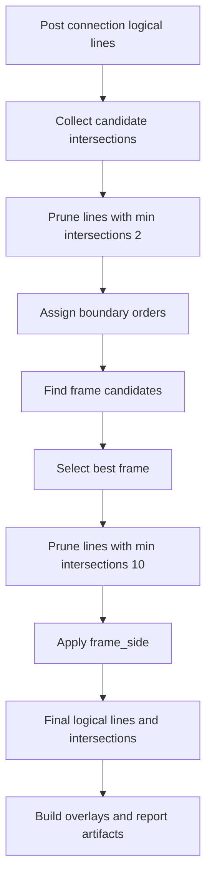

# Raw Line Family Only - intersections, ramka i wizualizacje

## Cel

Ten dokument opisuje końcową część pipeline'u `raw_line_family_only`:

- analizę przecięć między poziomymi i pionowymi `LogicalLine`,
- pruning linii na podstawie liczby przecięć,
- budowę i wybór kandydatów ramki planszy,
- przypisanie `frame_side`,
- aktualne wizualizacje i artefakty debugowe.

Budowa samych `LogicalLine` i etap connection są opisane w
`raw_line_family_only_logical_line_lifecycle.md`.

## Główne pliki

- `raw_line_family_only_intersections.py`
- `raw_line_family_only_intersection_analysis.py`
- `raw_line_family_only_intersection_candidates.py`
- `raw_line_family_only_intersection_models.py`
- `raw_line_family_only_intersection_ordering.py`
- `raw_line_family_only_intersection_pruning.py`
- `raw_line_family_only_intersection_frame.py`
- `raw_line_family_only_intersection_segment_geometry.py`
- `raw_line_family_only_visualization.py`
- `raw_line_family_only_visualization_intersections.py`
- `raw_line_family_only_visualization_frames.py`
- `raw_line_family_only_visualization_logical_lines.py`
- `raw_line_family_only_visualization_tolerance_rectangles.py`
- `raw_line_family_only_visualization_long_segments.py`

## Wejście do etapu intersections

Do `analyze_logical_line_intersections(...)` trafiają:

- `horizontal_logical_lines`
- `vertical_logical_lines`

Są to linie już po:

- merge geometrycznym,
- grouping `RAW`,
- pixel connection.

Na tym etapie pipeline ma więc gotowy stan `post_connection`, który może być
dalej redukowany przez pruning związany z przecięciami.

## Modele intersections

### `LogicalLineIntersectionKind`

Możliwe typy przecięcia:

- `CROSS`
- `TOUCH`

Interpretacja:

- `CROSS` oznacza przecięcie wewnątrz obu segmentów,
- `TOUCH` oznacza kontakt na końcu któregoś segmentu lub wspólnym punkcie
  granicznym.

### `IntersectionOrder`

Po przypisaniu kolejności przecięć wzdłuż osi linii możliwe są wartości:

- `NONE`
- `START`
- `MIDDLE`
- `END`
- `BOTH`

Wartości te są później używane do rozpoznawania przecięć brzegowych.

### `LogicalLineIntersection`

Najważniejsze pola:

- `ref_horizontal_line`
- `ref_vertical_line`
- `ref_horizontal_segment`
- `ref_vertical_segment`
- `point`
- `kind`
- `horizontal_order`
- `vertical_order`

Najważniejsze właściwości pochodne:

- `is_horizontal_boundary`
- `is_vertical_boundary`
- `is_mutual_boundary`

### `LogicalLineBorderPair`

Reprezentuje jedną linię i zbiór linii, z którymi tworzy przecięcia będące
wspólnymi granicami.

### `LogicalLineFrame`

Reprezentuje kandydata ramki przez cztery linie:

- `top_line`
- `bottom_line`
- `left_line`
- `right_line`

### `LogicalLineIntersectionAnalysis`

Finalny wynik etapu intersections:

- `frame`
- `horizontal_lines`
- `vertical_lines`
- `intersections`

## Etap 1. Zbieranie kandydatów przecięć

`analyze_logical_line_intersections(...)` zaczyna od:

- `_clear_logical_line_metadata(...)`
- `_collect_candidate_intersections(...)`

Na tym etapie kod:

- czyści stare metadata linii,
- przegląda pary pozioma linia x pionowa linia,
- znajduje kandydatów przecięć na poziomie segmentów.

Publiczna fasada modułu `raw_line_family_only_intersections.py` udostępnia też:

- `find_logical_line_intersection(...)`
- `find_logical_line_intersections(...)`
- `find_segment_intersection(...)`

## Etap 2. Wstępny pruning po minimum przecięć

Pierwszy pruning jest wykonywany w
`_prune_lines_by_minimum_intersection_count(...)` z progiem:

- `minimum_intersection_count = 2`

Znaczenie:

- linia z mniej niż dwoma przecięciami nie może sensownie uczestniczyć w dalszej
  analizie siatki,
- pruning jest iteracyjny, więc usunięcie jednej linii może obniżyć liczby
  przecięć kolejnych linii.

Wynik tego kroku:

- przefiltrowane linie poziome,
- przefiltrowane linie pionowe,
- przefiltrowane kandydaty intersections.

## Etap 3. Ordering i boundary classification

Po wstępnym pruning kod buduje lookupi:

- `_build_candidate_lookup(...)`
- `_assign_boundary_orders(...)`

Ordering jest przypisywany osobno dla:

- rodziny `HORIZONTAL`,
- rodziny `VERTICAL`.

To właśnie tutaj intersection może zostać oznaczony jako:

- `START`
- `MIDDLE`
- `END`
- `BOTH`

Na tej podstawie później wyznaczane są:

- przecięcia brzegowe w poziomie,
- przecięcia brzegowe w pionie,
- przecięcia będące wspólną granicą obu linii.

## Etap 4. Budowa kandydatów ramki

Funkcja `_find_logical_line_frames(...)` działa na grafie zbudowanym z
przecięć `is_mutual_boundary`.

Najważniejszy pomysł:

- linie są węzłami,
- sąsiedztwo między liniami istnieje wtedy, gdy mają mutual boundary
  intersection,
- kod szuka cyklu złożonego z czterech różnych linii:
  - horizontal
  - vertical
  - horizontal
  - vertical

Po znalezieniu czterech linii:

- poziome są sortowane po położeniu na osi poprzecznej na `top_line`
  i `bottom_line`,
- pionowe są sortowane po położeniu na osi poprzecznej na `left_line`
  i `right_line`.

## Etap 5. Wybór najlepszej ramki

Wśród kandydatów `_select_best_frame(...)` wybiera jedną ramkę.

Kryteria są dwa:

1. minimalizacja sumy odchyleń liczby przecięć od wartości `10` dla każdej
   linii ramki
2. przy remisie preferowana jest większa powierzchnia ramki

Formalnie:

- im bliżej każda z czterech linii ma do 10 intersections, tym lepiej,
- jeśli dwa kandydaty są równie dobre według tego kryterium, wygrywa większy
  prostokąt.

## Etap 6. Drugi pruning po wyborze ramki

Po wyborze ramki wykonywany jest drugi pruning:

- `minimum_intersection_count = 10`

W tym kroku linie należące do wybranej ramki są chronione przez
`protected_line_keys`, więc nie wypadają z wyniku nawet wtedy, gdy po redukcji
pozostałych linii ich liczba przecięć chwilowo spadnie.

Znaczenie:

- wynik finalny jest dużo bardziej zbliżony do siatki sudoku,
- ramka jest utrzymywana jako stabilny szkielet końcowego rozwiązania.

## Etap 7. Publiczne intersections i `frame_side`

Po końcowym pruning:

- `_build_public_intersections(...)` buduje finalną listę
  `LogicalLineIntersection`,
- `_apply_frame_side(...)` ustawia na liniach ramki:
  - `FrameSide.TOP`
  - `FrameSide.BOTTOM`
  - `FrameSide.LEFT`
  - `FrameSide.RIGHT`

Wszystkie pozostałe linie zachowują:

- `FrameSide.NONE`

## Border pairs

`find_logical_line_border_pairs(...)` buduje uporządkowaną listę
`LogicalLineBorderPair` na podstawie mutual boundary intersections.

To jest przydatne jako artefakt diagnostyczny, bo pokazuje, które linie są dla
siebie kandydatami sąsiedztwa brzegowego jeszcze przed wyborem jednej ramki.

## Co trafia do wyniku detekcji

Po zakończeniu etapu `detect_line_families(...)` zapisuje:

- `logical_line_intersection_analysis`
- `logical_line_intersections`
- `logical_line_border_pairs`
- `logical_line_frames`

oraz podmienia finalne kolekcje:

- `horizontal_logical_lines`
- `vertical_logical_lines`

na linie po intersection analysis i pruning.

## Wizualizacje

Agregacja funkcji renderujących jest w `raw_line_family_only_visualization.py`.

W aktualnej wersji notebook i pipeline korzystają z następujących kategorii
renderów.

### 1. Rodziny linii

Funkcja:

- `build_line_family_overlays(...)`

Pokazuje:

- surowe segmenty poziome,
- surowe segmenty pionowe.

### 2. Grouping segmentów `RAW`

Funkcje:

- `build_raw_segment_group_overlays(...)`
- `build_raw_segment_group_board(...)`

Pokazują:

- grupy zbudowane przed pixel connection,
- relacje między seedem, trial segmentem i output segmentem,
- stan `pre_connection`.

### 3. Logical lines po connection

Funkcja:

- `build_post_connection_logical_line_overlays(...)`

Pokazuje:

- stan `post_connection`,
- segmenty dodane przez connection przed intersection pruning.

### 4. Finalne logical lines

Funkcje:

- `build_logical_line_overlays(...)`
- `build_logical_line_overlays_for_lines(...)`

Pokazują:

- finalne linie po intersections,
- wszystkie segmenty linii,
- wierzchołki start i end,
- segmenty o różnych originach.

### 5. Long segment candidates

Funkcje:

- `build_long_segment_candidate_overlays(...)`
- `build_long_segment_candidate_board(...)`

To jest osobny widok diagnostyczny dla segmentów o długości co najmniej
`80%` najdłuższego segmentu w danej linii.

### 6. Intersections

Funkcja:

- `build_logical_line_intersection_overlays(...)`

Pokazuje:

- punkty `CROSS`,
- punkty `TOUCH`,
- wyróżnienie intersections boundary.

### 7. Frames

Funkcja:

- `build_frame_overlays(...)`

Pokazuje:

- wybraną ramkę,
- orientację boków przez kolory odpowiadające `TOP`, `BOTTOM`, `LEFT`, `RIGHT`.

### 8. Tolerance rectangles

Funkcja:

- `build_tolerance_rectangle_overlays(...)`

Pokazuje:

- prostokąty tolerancji dla finalnych logical lines,
- punkt referencyjny,
- wektor rozpoznawania.

## Związek z raportem notebooka

`describe_raw_line_family_artifacts(...)` raportuje końcowy etap między innymi
przez:

- liczby intersections,
- rozbicie `cross` vs `touch`,
- liczbę mutual boundary intersections,
- liczbę border pairs,
- liczbę frames,
- rozkład segmentów w stanie `post_connection`,
- opis long segment candidates.

To oznacza, że wizualizacje i raport opisują dziś ten sam pipeline, ale z dwóch
różnych perspektyw:

- obrazy,
- tekstowe statystyki i rozpiska stanów.

## Aktualny flow końcowego etapu

## Najważniejsze założenia aktualnej wersji

1. Analiza przecięć działa już na liniach po pixel connection, a nie na
   surowych segmentach.
2. Pruning jest dwuetapowy: najpierw próg `2`, potem próg `10`.
3. Ramka jest wybierana z cykli mutual boundary intersections.
4. `frame_side` jest nadawane dopiero po wyborze najlepszej ramki.
5. Finalne overlaye logical lines pokazują stan po intersection analysis,
   a nie stan tuż po connection.
