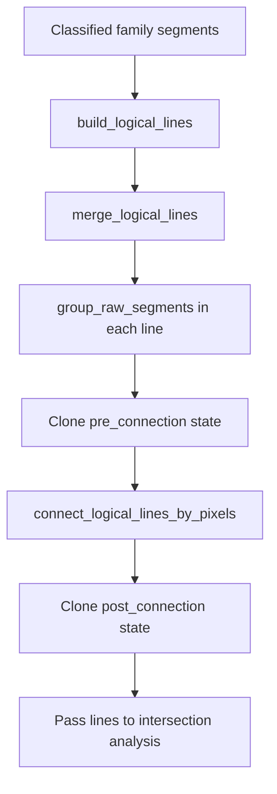

# Raw Line Family Only - lifecycle `LogicalLine`

## Cel

Ten dokument opisuje aktualny lifecycle `LogicalLine` w eksperymencie
`raw_line_family_only`.

Zakres obejmuje:

- modele i enumy używane przez etap linii logicznych,
- budowę linii z segmentów Hougha,
- merge geometryczny,
- grouping segmentów `RAW`,
- pixel-validated connection,
- znaczenie stanów `pre_connection` i `post_connection`.

Preprocessing, pipeline notebooka i raportowanie są opisane w
`raw_line_family_only_pipeline_overview.md`.

## Główne pliki

- `raw_line_family_only_models.py`
- `raw_line_family_only_geometry.py`
- `raw_line_family_only_logical_lines.py`
- `raw_line_family_only_logical_line_core.py`
- `raw_line_family_only_logical_line_merging.py`
- `raw_line_family_only_logical_line_types.py`
- `raw_line_family_only_raw_segment_grouping.py`
- `raw_line_family_only_logical_line_connections.py`
- `raw_line_family_only_logical_line_connection_candidates.py`
- `raw_line_family_only_logical_line_connection_execution.py`
- `raw_line_family_only_logical_line_connection_types.py`
- `raw_line_family_only_logical_line_search.py`

## Modele bazowe

### `ExperimentConfig`

Najważniejsze parametry dla tego etapu:

- `line_family_angle_tolerance_degrees`
- `logical_line_cross_axis_thickness_px`
- `logical_line_axis_gap_tolerance_px`
- `raw_segment_group_black_gap_tolerance_px`
- `same_axis_connection_segment_color_bgr`
- `cross_axis_connection_segment_color_bgr`
- `tolerance_rectangle_vector_length_px`
- `tolerance_rectangle_padding_px`

### `LineFamilyName`

Rodzina segmentu:

- `UNCLASSIFIED`
- `HORIZONTAL`
- `VERTICAL`

### `SegmentOrigin`

Pochodzenie segmentu:

- `RAW`
- `SAME_AXIS_CONNECTION`
- `CROSS_AXIS_CONNECTION`

W aktualnym kodzie nie ma `SegmentOrigin.TOLERANCE`.

### `LineSegment`

Podstawowy model segmentu, używany zarówno dla surowych odcinków Hougha,
jak i segmentów dodanych później przez connection.

Najważniejsze pola:

- `family_name`
- `start`
- `end`
- `length`
- `angle_degrees`
- `origin`

Najważniejsze właściwości pochodne:

- `axis_start`
- `axis_end`
- `cross_axis_start`
- `cross_axis_end`

Interpretacja osi zależy od rodziny:

- dla `HORIZONTAL`, oś główna to `x`,
- dla `VERTICAL`, oś główna to `y`.

## Główny obiekt domenowy

`LogicalLine` jest zdefiniowana w `raw_line_family_only_logical_line_core.py`.

Najważniejsze pola:

- `family_name`
- `frame_side`
- `line_segments`
- `intersections`
- `raw_segment_group_results`
- `start_segment`
- `end_segment`

Najważniejsze właściwości:

- `start_vertex`
- `end_vertex`
- `axis_start`
- `axis_end`
- `cross_axis_start`
- `cross_axis_end`
- `longest_segment`

Najważniejsze metody:

- `add_segment(...)`
- `replace_segments(...)`
- `clone()`
- `merge_logical_line(...)`
- `does_segment_touch(...)`
- `does_logical_line_touch(...)`
- `group_raw_segments(...)`
- `build_tolerance_rectangle(...)`
- `collect_long_segments(...)`

## Krok 1. Budowa rodzin segmentów

Ten dokument zakłada, że `detect_line_families(...)` ma już:

- surowe segmenty z Hougha,
- oszacowaną orientację planszy,
- segmenty sklasyfikowane do rodzin poziomej i pionowej.

Na wejściu do budowy `LogicalLine` pracujemy już na:

- `horizontal_segments`
- `vertical_segments`

Każdy segment z rodziny jest wcześniej normalizowany przez
`classify_line_segment(...)`, tak aby kierunek był spójny w ramach rodziny.

## Krok 2. Budowa wstępnych `LogicalLine`

Publiczna fasada etapu:

- `build_logical_lines(...)` z `raw_line_family_only_logical_lines.py`

Szczegóły implementacyjne:

- `raw_line_family_only_logical_line_merging.py`
- `raw_line_family_only_geometry.py`
- `raw_line_family_only_logical_line_types.py`

Algorytm:

1. segmenty są sortowane przez `segment_sort_key(...)`
2. pierwszy segment staje się seedem nowej `LogicalLine`
3. kolejne segmenty są porównywane przez `does_segment_touch(...)`
4. jeśli segment pasuje, zostaje dodany do tej samej linii
5. jeśli nie pasuje, pozostaje do późniejszego rozpatrzenia
6. po przejściu całej listy powstaje jedna linia, a proces rusza dla kolejnych
   segmentów

## Krok 3. Merge geometryczny segmentów

`LogicalLine.does_segment_touch(...)` porównuje kandydat z każdym segmentem już
należącym do linii.

Wewnętrznie używana jest funkcja:

- `line_segments_intersect(...)` z `raw_line_family_only_geometry.py`

W aktualnym eksperymencie ta funkcja nie oznacza klasycznego przecięcia 2D.
Odpowiada raczej na pytanie:

> czy dwa segmenty tej samej rodziny mogą należeć do jednej logical line?

Sprawdzane są między innymi:

- zgodność rodziny,
- odległość na osi poprzecznej,
- przerwa na osi głównej.

Wynik `LineSegmentIntersectionResult` zawiera:

- `intersects`
- `bridge_segment`

Jeżeli segmenty są blisko siebie, ale mają małą przerwę na osi głównej, kod może
utworzyć `bridge_segment` z `origin=SegmentOrigin.SAME_AXIS_CONNECTION`.

## Krok 4. Merge gotowych linii tej samej rodziny

Po zbudowaniu wstępnych linii wykonywany jest jeszcze merge całych linii:

- `merge_logical_lines(...)`
- `LogicalLine.does_logical_line_touch(...)`

Ten etap porównuje przede wszystkim pary segmentów brzegowych:

- `self.start_segment` z `other.start_segment`
- `self.start_segment` z `other.end_segment`
- `self.end_segment` z `other.start_segment`
- `self.end_segment` z `other.end_segment`

Jeżeli wykryty zostanie kontakt:

1. opcjonalny `bridge_segment` jest dodawany do linii,
2. segmenty drugiej linii są scalane przez `merge_logical_line(...)`,
3. linie są traktowane jako jedna logical line.

## Krok 5. Grouping segmentów `RAW`

To jest osobny etap, wykonywany po merge geometrycznym i przed pixel connection.

Wejście:

- lista `LogicalLine` jednej rodziny,
- `pixel_connection_binary`,
- referencyjny kąt rodziny,
- `black_gap_tolerance_px`

Implementacja:

- `raw_line_family_only_raw_segment_grouping.py`

Publiczne wejście z poziomu obiektu:

- `LogicalLine.group_raw_segments(...)`

### Co robi grouping

Etap bierze tylko segmenty o `origin=RAW` i próbuje zamienić kilka sąsiednich
krótkich surowych segmentów na bardziej reprezentatywny segment wyjściowy.

Przebieg:

1. z linii wybierane są tylko segmenty `RAW`
2. `collect_raw_candidate_window(...)` buduje okno kandydatów, które pokrywają
   ciągły zakres osi
3. `build_raw_segment_group_result(...)` buduje próbny odcinek od seed segmentu
   do najbardziej odległego poprawnego boundary segmentu
4. `find_first_invalid_black_gap_point(...)` sprawdza, czy po rastrze odcinka
   nie ma zbyt długiej czarnej przerwy
5. jeśli jest przerwa, grupa zostaje przycięta do bezpiecznej granicy
6. `repair_adjacent_raw_group_boundaries(...)` poprawia granice sąsiednich grup
7. `replace_segments(...)` zamienia oryginalne RAW segmenty na `output_segment`
   każdej grupy

### Wynik grouping

Szczegóły grup są trzymane w `raw_segment_group_results`.

Każdy `RawSegmentGroupResult` zawiera:

- `seed_segment`
- `consumed_segments`
- `used_segments`
- `deferred_segments`
- `trial_segment`
- `output_segment`
- `accepted_boundary_segment`
- `first_invalid_gap_point`
- `status`

Możliwe statusy:

- `SINGLE_SEGMENT`
- `MERGED`
- `TRIMMED_BY_BLACK_GAP`

### Znaczenie stanu `pre_connection`

`detect_line_families(...)` klonuje linie po grouping i zapisuje je jako:

- `horizontal_pre_connection_logical_lines`
- `vertical_pre_connection_logical_lines`

To jest snapshot po grouping `RAW`, ale jeszcze przed pixel connection.

## Krok 6. Pixel-validated connection

Publiczny entrypoint:

- `connect_logical_lines_by_pixels(...)`

Główne moduły:

- `raw_line_family_only_logical_line_connections.py`
- `raw_line_family_only_logical_line_connection_candidates.py`
- `raw_line_family_only_logical_line_connection_execution.py`
- `raw_line_family_only_logical_line_connection_types.py`
- `raw_line_family_only_logical_line_search.py`

Ten etap pracuje na `pixel_connection_binary`, którym w pipeline jest zwykle
`repaired_binary`.

### Cel etapu

Merge geometryczny opiera się wyłącznie na lokalnych tolerancjach osi.
Pixel connection próbuje dodatkowo udowodnić, że dwa końce linii da się połączyć
ścieżką po białych pikselach.

### Prostokąty tolerancji

Dla końców linii budowane są `ToleranceRectangle` przez
`LogicalLine.build_tolerance_rectangle(...)`.

Prostokąt zawiera:

- `reference_point`
- `recognition_vector`
- `vector_length`
- `padding`

Jest to obszar rozpoznawania kandydatów do połączenia i wyznaczania punktów celu
dla wyszukiwania ścieżki.

### `ConnectionKind`

Aktualne typy kandydatów:

- `SAME_AXIS`
- `CROSS_AXIS`
- `CROSS_AXIS_SPAN`

Priorytet sortowania kandydatów:

1. `SAME_AXIS`
2. `CROSS_AXIS`
3. `CROSS_AXIS_SPAN`

W ramach tego samego typu liczy się mniejszy `distance_px`.

### Znaczenie typów połączeń

`SAME_AXIS`
- próbuje połączyć dwa końce linii tej samej rodziny,
- po sukcesie może scalić całe logical lines.

`CROSS_AXIS`
- próbuje połączyć koniec linii z wierzchołkiem linii prostopadłej,
- dodaje segmenty połączenia, ale nie scala obu linii w jedną.

`CROSS_AXIS_SPAN`
- próbuje połączyć koniec linii z punktem na ciele linii prostopadłej,
- używa punktów celu wybranych z fragmentu linii mieszczącego się w
  prostokącie tolerancji.

### Wyszukiwanie ścieżki

Silnik wyszukiwania jest w `raw_line_family_only_logical_line_search.py`.

Najważniejsze założenia:

- ścieżka jest szukana po białych pikselach,
- wyszukiwanie odbywa się w ograniczonym `SearchArea`,
- dla części kandydatów kod próbuje najpierw prostego łącznika,
- jeśli to się nie uda, używany jest BFS.

### Wynik connection

Po znalezieniu ścieżki kod dodaje segmenty:

- `SAME_AXIS_CONNECTION`
- `CROSS_AXIS_CONNECTION`

Są to pełnoprawne `LineSegment`, które później:

- pozostają w `line_segments`,
- biorą udział w sortowaniu,
- mogą wpływać na `start_segment` i `end_segment`,
- są widoczne w overlayach i raporcie.

### Znaczenie stanu `post_connection`

Po connection kod klonuje stan linii i zapisuje:

- `horizontal_post_connection_logical_lines`
- `vertical_post_connection_logical_lines`

To jest snapshot po connection, ale jeszcze przed pruningiem driven przez
intersections.

## Krok 7. Co pozostaje po tym etapie

Po zakończeniu lifecycle opisanego w tym dokumencie każda linia ma już:

- rodzinę,
- zestaw segmentów `RAW` i opcjonalnie connection segments,
- odświeżone boundary segments,
- ewentualne `raw_segment_group_results`,
- snapshot w stanie `pre_connection` i `post_connection`.

Dopiero potem uruchamiana jest analiza przecięć, frame selection i przypisanie
`frame_side`.

## Aktualny flow tego etapu

## Najważniejsze założenia aktualnej wersji

1. `LogicalLine` jest głównym nośnikiem stanu domenowego dla etapu linii.
2. Segmenty connection nie są tylko pomocą wizualną, ale częścią finalnej linii.
3. Grouping `RAW` nie jest tym samym co pixel connection i ma własny snapshot.
4. `pre_connection` i `post_connection` są istotnymi stanami debugowymi.
5. Kod traktuje `raw_line_family_only_logical_lines.py` jako publiczną fasadę,
   ale właściwa logika jest rozbita na mniejsze wyspecjalizowane moduły.
