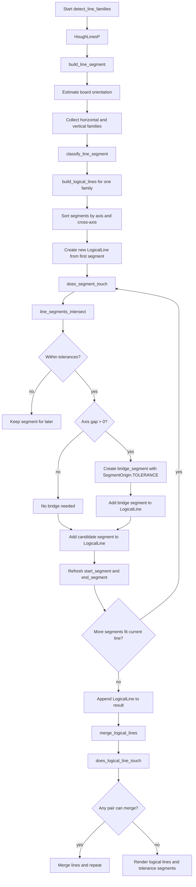

# Logical Lines Process

## Cel dokumentu

Ten dokument opisuje krok po kroku proces budowania `LogicalLine` w wariancie eksperymentalnym `raw_line_family_only`.

Opis obejmuje:
- modele danych używane w procesie,
- kolejność wywołań,
- zasady łączenia segmentów w linie logiczne,
- sposób tworzenia segmentów tolerancyjnych,
- sposób tworzenia prostokątów tolerancyjnych,
- merge linii logicznych,
- renderowanie wyniku na obrazku,
- mapowanie odpowiedzialności na konkretne pliki i metody.

## Zakres plików

Proces tworzenia linii logicznych jest rozłożony głównie na następujące pliki:

- `raw_line_family_only_models.py`
- `raw_line_family_only_geometry.py`
- `raw_line_family_only_line_families.py`
- `raw_line_family_only_logical_lines.py`
- `raw_line_family_only_detection.py`
- `raw_line_family_only_visualization.py`
- `raw_line_family_only_pipeline.py`

## Główne modele i konfiguracja

### `ExperimentConfig`

Plik: `raw_line_family_only_models.py`

Najważniejsze parametry dla procesu `LogicalLine`:

- `line_family_angle_tolerance_degrees`
  - tolerancja kąta podczas przypisywania surowych segmentów do rodzin `horizontal` i `vertical`
- `logical_line_cross_axis_thickness_px`
  - tolerancja na osi poprzecznej
  - dla `horizontal` działa na osi `y`
  - dla `vertical` działa na osi `x`
- `logical_line_axis_gap_tolerance_px`
  - maksymalna dopuszczalna przerwa na osi głównej
  - dla `horizontal` działa na osi `x`
  - dla `vertical` działa na osi `y`
- `logical_line_tolerance_segment_color_bgr`
  - kolor segmentów dodanych przez tolerancję

### `LineFamilyName`

Plik: `raw_line_family_only_models.py`

Enum opisujący rodzinę segmentu:

- `UNCLASSIFIED`
- `HORIZONTAL`
- `VERTICAL`

### `SegmentOrigin`

Plik: `raw_line_family_only_models.py`

Enum opisujący pochodzenie segmentu:

- `RAW`
  - segment pochodzi bezpośrednio z detekcji
- `SAME_AXIS_CONNECTION`
  - segment został dodany po połączeniu linii tej samej osi
- `CROSS_AXIS_CONNECTION`
  - segment został dodany po walidowanym przejściu BFS do linii osi przecinającej

### `LineSegment`

Plik: `raw_line_family_only_models.py`

To podstawowy model segmentu używany w całym procesie.

Najważniejsze pola:

- `family_name`
- `start`
- `end`
- `length`
- `angle_degrees`
- `origin`

Dodatkowo model udostępnia abstrakcję wspólnej osi:

- `axis_start`
- `axis_end`
- `cross_axis_start`
- `cross_axis_end`

Interpretacja:

- dla `HORIZONTAL`
  - `axis_*` odnosi się do `x`
  - `cross_axis_*` odnosi się do `y`
- dla `VERTICAL`
  - `axis_*` odnosi się do `y`
  - `cross_axis_*` odnosi się do `x`

### `ToleranceRectangle`

Plik: `raw_line_family_only_models.py`

Model prostokąta tolerancyjnego używanego jako następny krok po `LogicalLine`.

Najważniejsze pola:

- `reference_point`
- `recognition_vector`
- `vector_length`
- `padding`

Model wylicza też pomocniczo:

- `recognition_end_point`
- `corners`

## Ogólny przebieg procesu

Budowanie linii logicznych odbywa się w następujących etapach:

1. detekcja surowych segmentów z Hougha,
2. przypisanie segmentów do rodzin `horizontal` i `vertical`,
3. normalizacja kierunku segmentów w obrębie rodziny,
4. wyznaczenie referencyjnych kątów rodzin na `cleanup`,
5. budowa `LogicalLine` z tych samych segmentów wykrytych na `cleanup`,
6. pixel-validated merge już utworzonych linii logicznych na obrazie użytym do połączeń, na przykład na `repair`,
7. budowa prostokątów tolerancyjnych dla końców linii logicznych,
8. renderowanie linii logicznych, segmentów tolerancyjnych i prostokątów tolerancyjnych.

## Krok po kroku

### Krok 1. Detekcja surowych segmentów

Plik: `raw_line_family_only_detection.py`  
Metoda: `detect_line_families()`

Proces zaczyna się od `cv2.HoughLinesP(...)`, które zwraca surowe odcinki.

Każdy taki odcinek jest mapowany przez:

- plik: `raw_line_family_only_geometry.py`
- metoda: `build_line_segment()`

`build_line_segment()` tworzy obiekt `LineSegment` z:

- `family_name=LineFamilyName.UNCLASSIFIED`
- `origin=SegmentOrigin.RAW`

Na tym etapie segment nie należy jeszcze do żadnej rodziny.

### Krok 2. Wyznaczenie orientacji i podział na rodziny

Pliki:

- `raw_line_family_only_line_families.py`
- `raw_line_family_only_detection.py`

Za ten etap odpowiadają:

- `get_dominant_angle_degrees()`
- `collect_line_family()`
- `refine_family_angle_degrees()`
- `_estimate_orientation_offset_degrees()`
- `_collect_family_by_reference_angle()`

Cel tego kroku:

- znaleźć dominującą orientację planszy,
- podzielić segmenty na rodzinę poziomą i pionową.

Wynik:

- `horizontal_segments`
- `vertical_segments`

### Krok 3. Normalizacja segmentów w obrębie rodziny

Plik: `raw_line_family_only_geometry.py`  
Metoda: `classify_line_segment()`

Po przypisaniu do rodziny każdy segment jest normalizowany:

- dla `HORIZONTAL`
  - `start.x <= end.x`
- dla `VERTICAL`
  - `start.y <= end.y`

To jest bardzo ważne, bo późniejsze:

- sortowanie,
- wyznaczanie `start_segment`,
- wyznaczanie `end_segment`,
- budowanie mostków tolerancyjnych

zakładają spójny kierunek segmentu.

### Krok 4. Wyznaczenie referencyjnych kątów rodzin

Plik: `raw_line_family_only_detection.py`

Po przypisaniu segmentów z `cleanup` do rodzin wyznaczane są:

- `horizontal_angle_degrees`
- `vertical_angle_degrees`

Te kąty są używane dalej w tym samym przebiegu budowania rodzin i linii logicznych na `cleanup`.

### Krok 5. Start budowy `LogicalLine`

Plik: `raw_line_family_only_logical_lines.py`  
Metoda: `build_logical_lines()`

Wejście:

- lista segmentów jednej rodziny,
- `cross_axis_thickness_px`,
- `axis_gap_tolerance_px`

Najpierw segmenty są sortowane przy pomocy:

- `_segment_sort_key()`

Klucz sortowania:

- `axis_start`
- `axis_end`
- `cross_axis_start`
- `cross_axis_end`

Następnie:

1. pobierany jest pierwszy segment,
2. tworzona jest nowa `LogicalLine`,
3. segment trafia do niej przez `add_segment()`,
4. algorytm próbuje dołączać kolejne segmenty pasujące do tej linii.

### Krok 6. Dodanie segmentu do `LogicalLine`

Plik: `raw_line_family_only_logical_lines.py`  
Metoda: `LogicalLine.add_segment()`

Ta metoda:

- pilnuje zgodności `family_name`,
- wstawia segment w odpowiednie miejsce w posortowanej liście,
- odświeża `start_segment` i `end_segment`.

Ważne:

- segmenty `SegmentOrigin.RAW`
- segmenty `SegmentOrigin.TOLERANCE`

są traktowane identycznie pod względem logiki.  
Pochodzenie segmentu nie wpływa na sortowanie ani na wybór krańcowych segmentów.

### Krok 7. Sprawdzenie czy segment może zostać dołączony

Pliki:

- `raw_line_family_only_logical_lines.py`
- `raw_line_family_only_geometry.py`

Metody:

- `LogicalLine.does_segment_touch()`
- `line_segments_intersect()`

#### 7.1. `LogicalLine.does_segment_touch()`

Ta metoda:

- odrzuca segment, jeśli w całości mieści się już w zakresie istniejącej `LogicalLine`,
- w przeciwnym razie porównuje kandydat z każdym istniejącym segmentem linii.

Nie porównuje tylko skrajnych segmentów.  
Na tym etapie sprawdzane są wszystkie segmenty należące do danej `LogicalLine`.

#### 7.2. `line_segments_intersect()`

Ta funkcja nie jest już klasycznym przecięciem geometrii 2D.  
W obecnym eksperymencie odpowiada za logiczne pytanie:

"czy dwa segmenty mogą należeć do tej samej linii logicznej?"

Wejście:

- `first_segment`
- `second_segment`
- `cross_axis_thickness_px`
- `axis_gap_tolerance_px`

Wynik:

- `LineSegmentIntersectionResult`
  - `intersects`
  - `bridge_segment`

#### 7.3. Warunki uznania, że segmenty się łączą

Funkcja `line_segments_intersect()` sprawdza:

1. czy segmenty należą do tej samej rodziny,
2. czy nie są `UNCLASSIFIED`,
3. czy odległość na osi poprzecznej nie przekracza `cross_axis_thickness_px`,
4. czy przerwa na osi głównej nie przekracza `axis_gap_tolerance_px`.

Jeśli któryś z warunków nie jest spełniony:

- `intersects=False`

Jeśli wszystkie są spełnione:

- `intersects=True`
- opcjonalnie tworzony jest `bridge_segment`

### Krok 8. Tworzenie segmentu połączeniowego tej samej osi

Plik: `raw_line_family_only_geometry.py`  
Metody:

- `_build_tolerance_bridge_segment()`
- `build_line_segment_from_points()`

Jeśli dwa segmenty:

- są wystarczająco blisko na osi głównej,
- ale mają między sobą niewielką przerwę,

algorytm tworzy segment mostkujący.

Taki segment:

- ma `origin=SegmentOrigin.SAME_AXIS_CONNECTION`,
- należy do tej samej rodziny co segmenty wejściowe,
- trafia do tej samej listy `line_segments` w `LogicalLine`.

To oznacza, że później:

- bierze udział w sortowaniu,
- może zostać `start_segment`,
- może zostać `end_segment`,
- bierze udział w dalszych merge'ach.

### Krok 9. Domknięcie jednej `LogicalLine`

Plik: `raw_line_family_only_logical_lines.py`  
Metoda: `build_logical_lines()`

Jeżeli `does_segment_touch()` zwróci:

- `intersects=True`

to:

1. ewentualny `bridge_segment` jest dodawany do `LogicalLine`,
2. segment wejściowy też jest dodawany do `LogicalLine`,
3. algorytm kontynuuje iterację po pozostałych segmentach.

Jeżeli:

- `intersects=False`

segment trafia do `remaining_segments` i będzie rozpatrywany później, być może jako początek nowej linii logicznej.

### Krok 10. Pixel-validated merge gotowych linii logicznych

Pliki:

- `raw_line_family_only_detection.py`
- `raw_line_family_only_logical_line_connections.py`
- `raw_line_family_only_logical_line_search.py`

Po zbudowaniu wstępnych `LogicalLine` wykonywany jest merge walidowany pikselami.

Najważniejsze założenie obecnej wersji:

- rodziny, kąty referencyjne i segmenty wejściowe do `LogicalLine` pochodzą z jednego przebiegu Hougha na `cleanup`,
- BFS po białych pikselach może działać na innej tablicy, jeśli eksperyment tego wymaga, na przykład na `repair`.

Algorytm:

1. buduje prostokąt tolerancji dla każdego końca linii,
2. zbiera kandydatów samej osi i osi poprzecznej,
3. próbuje znaleźć ścieżkę po białych pikselach wewnątrz obszaru wyszukiwania,
4. po sukcesie dodaje segmenty ścieżki jako `SAME_AXIS_CONNECTION` albo `CROSS_AXIS_CONNECTION`,
5. powtarza przebiegi aż do stabilizacji.

### Krok 11. Budowa `ToleranceRectangle`

Pliki:

- `raw_line_family_only_logical_lines.py`
- `raw_line_family_only_detection.py`

Metoda:

- `LogicalLine.build_tolerance_rectangle()`

Dla każdej `LogicalLine` metoda obiektu wylicza prostokąt tolerancyjny na żądanie dla wskazanego wierzchołka:

1. jako `reference_vertex` przekazywany jest jawnie `logical_line.start_vertex` albo `logical_line.end_vertex`,
2. jeśli przekazany punkt nie jest jednym z granicznych wierzchołków danej linii, metoda zgłasza błąd,
3. `recognition_vector` dla `end_vertex` jest stały dla rodziny:
   - `horizontal` -> w prawo `(1, 0)`
   - `vertical` -> w dół `(0, 1)`
4. `recognition_vector` dla `start_vertex` jest odwrócony o 180 stopni względem wektora z `end_vertex`,
5. `vector_length` w warstwie debug renderu bierze się z `tolerance_rectangle_vector_length_px`,
6. `padding` w warstwie debug renderu bierze się z `tolerance_rectangle_padding_px`.

Taki prostokąt reprezentuje obszar, w którym w następnym kroku można szukać kolejnej linii do połączenia.

## Renderowanie

### Render rodzin linii

Plik: `raw_line_family_only_visualization.py`  
Metoda: `build_line_family_overlays()`

Ten etap rysuje tylko zwykłe segmenty rodzin:

- `horizontal_segments`
- `vertical_segments`

### Render linii logicznych

Plik: `raw_line_family_only_visualization.py`  
Metoda: `build_logical_line_overlays()`

Na tym etapie renderowane są:

- wszystkie segmenty `LogicalLine`,
- osobne kolory dla każdej logical line,
- osobny zarezerwowany kolor dla segmentów `SegmentOrigin.TOLERANCE`,
- wierzchołki `start_vertex` i `end_vertex`.

To pozwala debugować:

- które segmenty pochodzą z detekcji,
- które zostały dopowiedziane przez tolerancję,
- jaki jest ostateczny przebieg logical line.

### Render prostokątów tolerancyjnych

Plik: `raw_line_family_only_visualization.py`  
Metoda: `build_tolerance_rectangle_overlays()`

Na tym etapie renderowane są:

- obrys prostokąta tolerancyjnego,
- punkt odniesienia,
- strzałka wektora rozpoznawania.

## Raportowanie w pipeline

Plik: `raw_line_family_only_pipeline.py`

Za opis tekstowy odpowiada:

- `describe_raw_line_family_artifacts()`

Metoda raportuje między innymi:

- liczbę segmentów rodzin,
- liczbę linii logicznych,
- liczbę segmentów tolerancyjnych.

Za budowę zestawu obrazów do notebooka odpowiada:

- `build_raw_line_family_plot_items()`

## Flowchart

## Mapa odpowiedzialności

### `raw_line_family_only_models.py`

Odpowiada za:

- konfigurację tolerancji,
- `LineFamilyName`,
- `SegmentOrigin`,
- model `LineSegment`.

### `raw_line_family_only_geometry.py`

Odpowiada za:

- tworzenie segmentów,
- normalizację segmentów w obrębie rodziny,
- sprawdzanie logicznego łączenia segmentów,
- tworzenie segmentów mostkujących.

### `raw_line_family_only_line_families.py`

Odpowiada za:

- analizę kątów,
- wykrycie dominującej orientacji,
- wstępny podział na rodziny linii.

### `raw_line_family_only_logical_lines.py`

Odpowiada za:

- model `LogicalLine`,
- sortowanie segmentów wewnątrz linii,
- budowę pojedynczych logical lines,
- merge logical lines,
- wyznaczanie `start_segment` i `end_segment`.

### `raw_line_family_only_detection.py`

Odpowiada za:

- orkiestrację całej detekcji,
- wywołanie Hougha,
- podział na rodziny,
- wywołanie `build_logical_lines(...)`.

### `raw_line_family_only_visualization.py`

Odpowiada za:

- render rodzin,
- render linii logicznych,
- wyróżnienie segmentów tolerancyjnych osobnym kolorem.

### `raw_line_family_only_pipeline.py`

Odpowiada za:

- spięcie etapu preprocessing + detekcja,
- przygotowanie artefaktów do notebooka,
- tekstowy opis wyniku.

## Najważniejsze założenia obecnej wersji

1. Segment połączeniowy jest pełnoprawnym segmentem należącym do `LogicalLine`.
2. Segmenty `SegmentOrigin.SAME_AXIS_CONNECTION` i `SegmentOrigin.CROSS_AXIS_CONNECTION` zachowują się tak samo jak `SegmentOrigin.RAW` w:
   - sortowaniu,
   - wyznaczaniu `start_segment`,
   - wyznaczaniu `end_segment`,
   - dalszych merge'ach.
3. Jedyna różnica między `RAW` i `TOLERANCE` to pochodzenie segmentu i sposób renderowania.
4. `line_segments_intersect()` w tym eksperymencie oznacza obecnie logiczne łączenie segmentów z uwzględnieniem tolerancji, a nie klasyczne przecięcie geometrii 2D.
